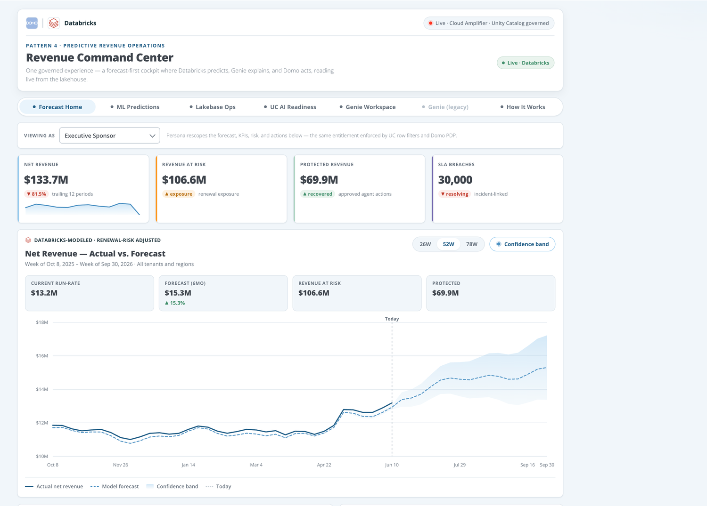
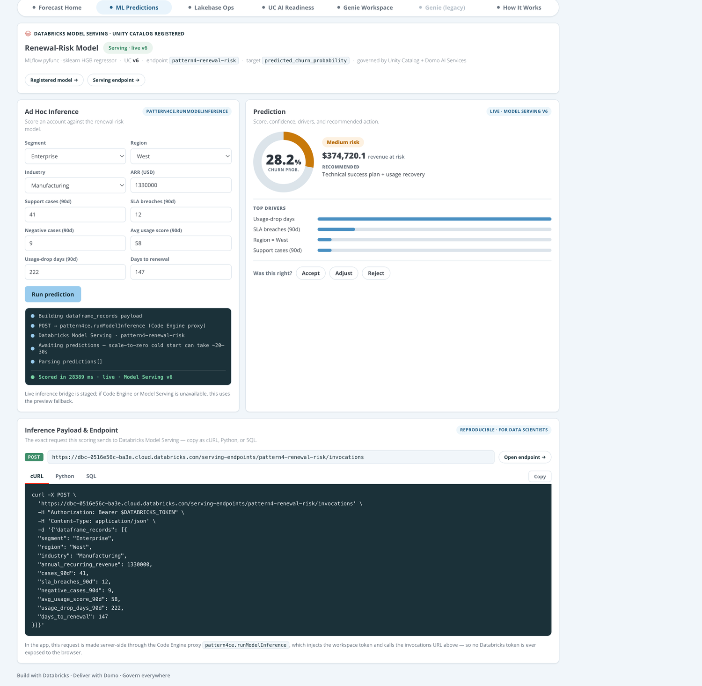
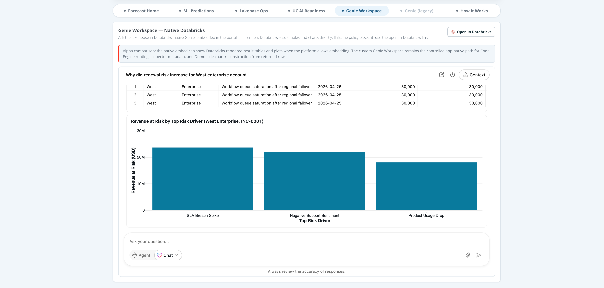
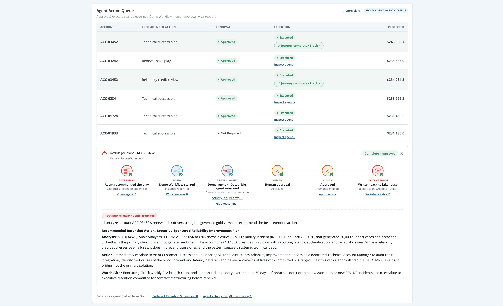
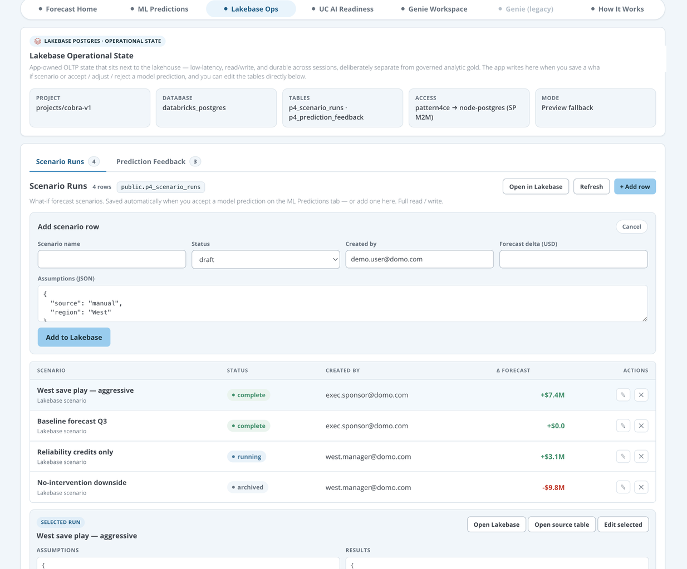
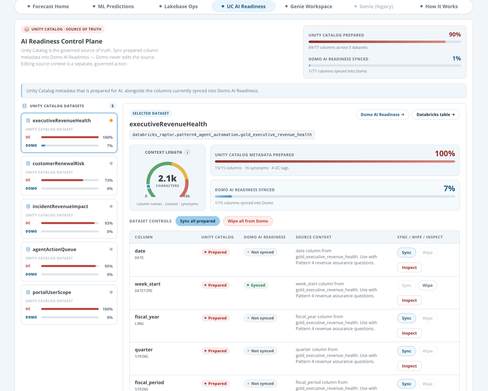
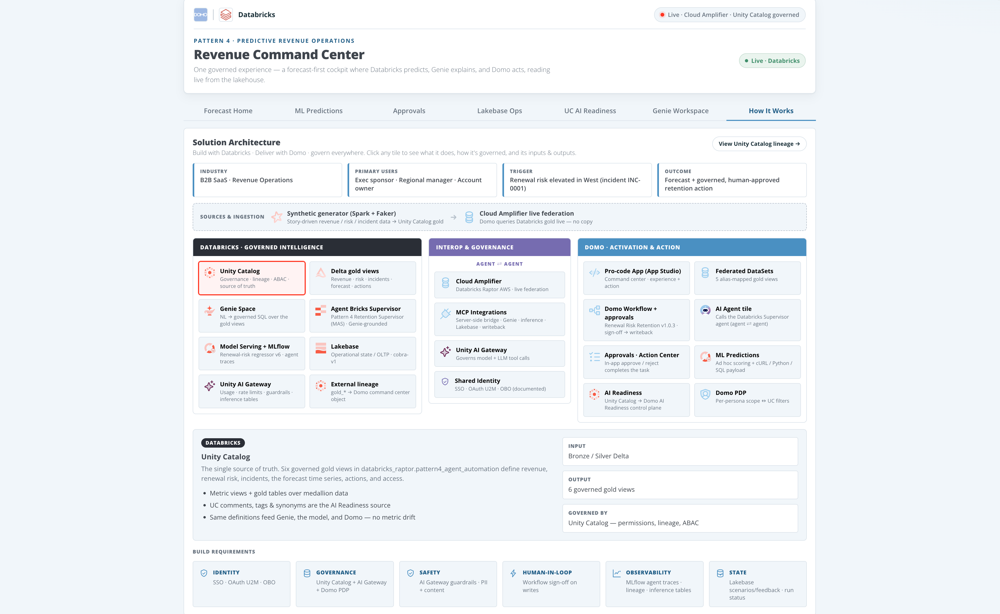
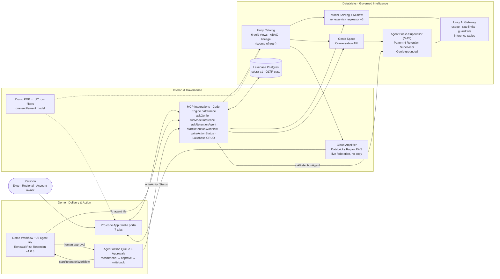

<h1 align="center">Revenue Command Center</h1>

<p align="center">
  <strong>Pattern 4 — "Genie everywhere + Domo portals" — built as a governed, agent-to-agent automation experience.</strong><br/>
  One cockpit where <em>Databricks predicts</em>, <em>Genie explains</em>, and <em>Domo acts</em> — reading live from the lakehouse, with Unity Catalog as the single source of truth.
</p>

<p align="center">
  
  
  
</p>

<p align="center">
  
  
  
  
  
  
  
  
  
  
</p>

<p align="center">
  
  
  
  
  
</p>

<p align="center">
  <a href="media/revenue-command-center-highlights-30s.mp4"></a>
</p>

<p align="center">
  <em>30-second highlights: predict → explain → score → agent-to-agent → approve → govern → prove, on one governed foundation. (<a href="media/revenue-command-center-highlights-30s.mp4">watch the MP4</a>)</em>
</p>

> **The narrative in one line:** Databricks is the governed *intelligence* plane; Domo is the business *delivery + action* plane. One identity, one governed metric layer — surfaced as an executive command center that **predicts** (ML), **explains** (Genie), **acts** (a governed Domo Workflow where a **Domo AI agent ⇄ a Databricks Agent Bricks Supervisor** reason together, a human approves, and status writes back), **remembers** (Lakebase OLTP state), and **governs** (Unity Catalog + Unity AI Gateway → Domo AI Readiness).

---

## Table of Contents

- [What it does](#what-it-does)
- [The five-act story](#the-five-act-story)
- [Capabilities](#capabilities)
  - [Forecast Home](#forecast-home)
  - [ML Predictions — Databricks predicts](#ml-predictions--databricks-predicts)
  - [Genie Workspace — Genie explains](#genie-workspace--genie-explains)
  - [Agent Action Queue — agent-to-agent + the Action Journey](#agent-action-queue--agent-to-agent--the-action-journey)
  - [Approvals · Action Center — human-in-the-loop](#approvals--action-center--human-in-the-loop)
  - [Lakebase Ops — operational state](#lakebase-ops--operational-state)
  - [UC AI Readiness — governance control plane](#uc-ai-readiness--governance-control-plane)
  - [How It Works — Solution Architecture](#how-it-works--solution-architecture)
- [Architecture](#architecture)
- [Component inventory](#component-inventory)
- [Repository layout](#repository-layout)
- [Live environment](#live-environment)
- [Build &amp; deploy](#build--deploy)
- [Governance &amp; security posture](#governance--security-posture)
- [What's next](#whats-next)

---

## What it does

A regional operations leader opens **one** governed portal and sees a Domo executive cockpit powered live by Databricks. A KPI shows elevated renewal risk in the West. They **ask Genie why**, **score a specific account** against a Databricks-served ML model, **approve an agent action** that writes status back to the lakehouse, and watch **Protected Revenue** update — all without leaving the portal, and all enforced by the same Unity Catalog governance that scopes both Domo and Genie.

The demo proves that **the governance never forks**: the same metric definitions, row access, and AI-readiness metadata feed the dashboards, the model, and Genie. Databricks reasons; Domo delivers and acts.

---

## The five-act story

| Act | Plane | Surface | What happens |
| --- | --- | --- | --- |
| **1 · Predict** | Databricks | ML Predictions | An MLflow/Unity-Catalog renewal-risk model, served on Model Serving (governed by **Unity AI Gateway**), scores an account live. |
| **2 · Explain** | Databricks | Genie Workspace | Genie answers *"why did renewal risk increase for West enterprise accounts?"* over the same governed gold views. |
| **3 · Act (agent ⇄ agent)** | Both | Agent Action Queue → Approvals | *Approve & execute* starts a **live, governed Domo Workflow**; inside it a **Domo AI agent calls a Databricks Agent Bricks Supervisor** (Genie-grounded) to produce a recommendation, a **human approves** in-app, and status writes back to the lakehouse — visualized live as an **animated Action Journey** timeline. |
| **4 · Remember** | Databricks | Lakebase Ops | Saved what-if scenarios and prediction feedback persist in Lakebase Postgres — app-owned OLTP state next to the lakehouse. |
| **5 · Govern** | Both | UC AI Readiness + Unity AI Gateway | Unity Catalog metadata (comments, tags, synonyms) is the source of truth, synced into Domo AI Readiness; Unity AI Gateway governs the model + LLM calls (usage, rate limits, guardrails, inference tables). |

---

## Capabilities

### Forecast Home

A persona-scoped executive cockpit: Net Revenue / Revenue at Risk / Protected Revenue / SLA Breaches KPIs, an **Actual-vs-Forecast** hero with a confidence band, a 2-up **Regional Renewal Risk** hotspot + **Insight Rail**, the full-width **Agent Action Queue** (with the live Action Journey timeline), and a governed-lineage strip. The **Viewing as** persona rescopes the page — the same entitlement enforced by Unity Catalog row filters and Domo PDP. (The incident root cause now lives where it belongs — in Genie's cited answer.)

<p align="center"></p>

### ML Predictions — Databricks predicts

Score any account against the renewal-risk model **live**. The request runs server-side through the Code Engine proxy `pattern4ce.runModelInference` → Databricks **Model Serving** (no token in the browser). A staged **run-log** keeps the user engaged through scale-to-zero cold starts, and an **Inference Payload &amp; Endpoint** panel renders the exact request as **cURL / Python / SQL** for data scientists — plus deep links to the registered model and serving endpoint.

> The model is an HGB **regressor** (`pattern4_renewal_risk` v6) trained on `gold_customer_renewal_risk`, returning a smooth churn probability (~0.10–0.60) that tracks the inputs — not a saturated 0/1 classifier.

<p align="center"></p>

### Genie Workspace — Genie explains

Ask the lakehouse in natural language. The native Databricks **Genie** room is embedded directly, rendering Databricks result tables and charts; a legacy Code Engine–routed panel (with an API-call inspector and Domo-side chart reconstruction) is kept for SQL deep-dives.

<p align="center"></p>

### Agent Action Queue — agent-to-agent + the Action Journey

Genie- and model-informed recommendations flow into a full-width queue with **human approval gates**. *Approve &amp; execute* starts a **live, governed Domo Workflow** (`Pattern 4 - Renewal Risk Retention`, v1.0.3) server-side via `pattern4ce.startRetentionWorkflow`. Inside the workflow, a **Domo AI agent tile calls a Databricks Agent Bricks Supervisor (MAS)** — Genie-grounded — to produce the retention recommendation: a true **agent ⇄ agent** call across the two platforms.

Each action renders an **animated, multi-colored Action Journey timeline** driven by the *real* workflow instance + Task Center state (not sleep timers): `Agent recommended → Domo Workflow started → Domo agent ⇄ Databricks agent reasoned → Awaiting approval → Approved/Rejected → Written back to lakehouse`. Steps carry official **Databricks / Domo product marks**, a live "working" animation while the agent reasons, and **go-to-source** on every step (Open agent, Workflow run, MLflow activity log, Writeback table) with styled tooltips. *Inspect agent* shows the Databricks agent's live reasoning in-app.

<p align="center"></p>

### Approvals · Action Center — human-in-the-loop

A dedicated tab listing the workflow's approval queue (open / completed / voided). **Approve or reject in-app** — the decision completes the Domo task over the Task Center API (`pattern4ce.completeApprovalTask`), resumes the workflow, and writes status back to `agent_action_writeback`. The action's Journey timeline auto-completes and **Protected Revenue** ticks up. Each task links to source in the Domo Queues console, and the queue links to the writeback table + the agent's MLflow activity log.

### Lakebase Ops — operational state

A `lakebase-explorer`-style table workspace over **Lakebase Postgres** (`cobra-v1`): browse / add / edit / delete rows in `p4_scenario_runs` and `p4_prediction_feedback` with a typed form. Accepting a prediction on the ML tab **seeds a reviewable scenario** here — app-owned, low-latency state that survives sessions, deliberately separate from the governed analytic gold.

<p align="center"></p>

### UC AI Readiness — governance control plane

A control plane that compares **Unity Catalog metadata prepared** vs **Domo AI Readiness synced**, column by column, with per-column and per-dataset sync/wipe. A Domo-native **Context Length** gauge mirrors Domo's own AI Readiness metric (column names + context + synonyms), and a governed **Inspect / Edit UC** drawer is the only path that writes back to the source of truth.

<p align="center"></p>

### How It Works — Solution Architecture

An interactive **Solution Architecture** diagram (context strip → ingestion → three planes → build requirements). Every tile is **clickable** for a detail panel (lead, bullets, inputs/outputs, "governed by") and carries the **official product mark** for what it represents — Unity Catalog, Delta Lake, Genie, Agent Bricks, MLflow, Lakebase, Unity AI Gateway on the Databricks plane; Cloud Amplifier, MCP Integrations, AI Gateway on the interop plane; App Studio, Domo Workflow, AI Agent tile, Approvals, ML Predictions, AI Readiness, PDP on the Domo plane.

<p align="center"></p>

---

## Architecture



| Plane | Owns | Doesn't |
| --- | --- | --- |
| **Databricks** | Governed gold views &amp; metric definitions, Genie context, the ML model + serving endpoint, Lakebase OLTP, lineage | Business UI / action execution |
| **Interop** | Live federation (Cloud Amplifier), the server-side Code Engine bridge (token never hits the browser), one entitlement model | Holding business state long-term |
| **Domo** | The pro-code experience, persona scoping, the action queue + human approval + writeback | Editing the Unity Catalog source of truth |

---

## Component inventory

| Layer | Components |
| --- | --- |
| **Databricks** | Unity Catalog (`databricks_raptor.pattern4_agent_automation`, 6 `gold_*` views), Genie Space, **Agent Bricks Supervisor (MAS)** `Pattern 4 Retention Supervisor` (`mas-77bd204b-endpoint`, Genie-grounded), MLflow model `pattern4_renewal_risk` v6 → Model Serving `pattern4-renewal-risk`, **Unity AI Gateway** (on the model endpoint + a guardrailed `pattern4-reasoning-gateway`), Lakebase Postgres (`cobra-v1`), external lineage object |
| **Interop** | Cloud Amplifier (`Databricks Raptor AWS`), Domo Code Engine package `pattern4ce` v1.0.19 (Genie / inference / **askRetentionAgent** / **startRetentionWorkflow** / approval tasks / writeback / Lakebase / AI Readiness) — the **MCP-direction** server-side bridge; shared SSO/OAuth identity (per-user OBO documented) |
| **Domo** | Pro-code App Studio app (**7 tabs**), **live Domo Workflow** `Pattern 4 - Renewal Risk Retention` v1.0.3 with a **Domo AI agent tile** (agent ⇄ agent), Agent Action Queue + animated Action Journey, **Approvals · Action Center**, AI Readiness control plane, Cloud Amplifier datasets (5 alias-mapped gold views) |
| **App stack** | Vanilla JS + `ryuu.js` (domo.js), Open Sans + Roboto Mono, native-Domo "analyzer" design system, official Databricks/Domo brand SVGs (`public/brand/`); Python (scikit-learn + MLflow) for model training |

---

## Repository layout

```text
pattern4-agent-portal/         Pro-code Domo App Studio app
  index.html                   App shell (loads ryuu.js + app.js)
  src/app.js                   All app logic (tabs, charts, CE calls)
  src/styles.css               Native-Domo design system
  codeengine/functions.js      pattern4ce Code Engine source (consolidated)
  manifest.json + dist/        Publishable build (datasetsMapping + packageMapping)
  public/brand/                Official Databricks/Domo product SVGs (icon registry)
  docs/images/                 README screenshots
scripts/                       Synthetic data gen, model training, Lakebase seed, CE build
pattern-4-*.md                 Build plan, shaping docs, demo runbook, model/data reports
pattern-4-project-manager.html Project tracker UI (reads pattern-4-plan-data.js)
```

---

## Live environment

> Demo instance identifiers (synthetic data; no secrets are committed).

| Thing | Value |
| --- | --- |
| Domo instance | `databricks-demo.domo.com` · App Studio app `105910661` / view `1913185115` |
| Databricks | `dbc-0516e56c-ba3e.cloud.databricks.com` · catalog/schema `databricks_raptor.pattern4_agent_automation` |
| Genie Space | `01f1642295b61d6b8849e106f52fc781` |
| Model / endpoint | `pattern4_renewal_risk` v6 → `pattern4-renewal-risk` (Unity AI Gateway-governed) |
| Agent Bricks Supervisor | `Pattern 4 Retention Supervisor` → `mas-77bd204b-endpoint` (Genie-grounded) |
| Reasoning gateway | `pattern4-reasoning-gateway` (guardrailed LLM via Unity AI Gateway) |
| Domo Workflow | `Pattern 4 - Renewal Risk Retention` · model `6cbd5ecb-1036-410a-b188-60a49820d264` · v1.0.3 · approvals queue `55c37364-…` |
| Lakebase | project `cobra-v1` · `public.p4_scenario_runs`, `public.p4_prediction_feedback` |
| Code Engine | `pattern4ce` · released **`v1.0.19`** (proxyId routing) |

---

## Build &amp; deploy

The app is a **static pro-code bundle** — no build step beyond mirroring `src/` into `dist/`.

```bash
# 1) Validate locally (from pattern4-agent-portal/)
node --check src/app.js
# render any tab headless to verify (optional)

# 2) dist/ mirrors src/ (index.html, src/app.js, src/styles.css, public/, manifest.json)

# 3) Publish to Domo from the dist/ target
domo publish        # run from pattern4-agent-portal/dist
```

- Server-side logic lives in **Code Engine** (`pattern4ce`); the app calls it via `domo.post('/domo/codeengine/v2/packages/<fn>', …)` and routes by `proxyId` to the released version — **no Databricks token ever reaches the browser**.
- Databricks-side assets (gold views, model, endpoint, Lakebase, Genie) are provisioned via the scripts in `scripts/` using the Databricks CLI.

---

## Governance &amp; security posture

- **Unity Catalog is the source of truth.** UC → Domo AI Readiness is the only sanctioned sync direction; editing UC source context is a deliberate, governed exception (confirm-gated drawer).
- **One entitlement model** — Domo PDP mirrors Unity Catalog row filters so Domo content and Genie answers are scoped to the same persona.
- **Human-in-the-loop** — material agent actions require approval before execution (the in-app Approvals tab completes the Domo task); rejected/failed actions stay visible and auditable.
- **Governed AI calls** — Unity AI Gateway fronts the model + LLM endpoints (usage, rate limits, guardrails, inference tables); the Databricks agent reasons only over governed Genie/gold views, and every agent run is traced in MLflow.
- **No secrets in the client or repo** — the workspace token lives only in Code Engine; `databricks token` and the Lakebase service-principal bundle are gitignored.

---

## What's next

| Item | Status | Notes |
| --- | --- | --- |
| Live Domo **Workflow + agent ⇄ agent** | Delivered | *Approve &amp; execute* starts the governed `Renewal Risk Retention` workflow; a Domo AI agent tile calls the Databricks Agent Bricks Supervisor; human approval → writeback, visualized as the Action Journey |
| **Unity AI Gateway** | Delivered | Usage tracking, rate limits, guardrails + inference tables on the model endpoint and a guardrailed reasoning endpoint |
| **Per-user OBO** | Documented | On-behalf-of identity into Databricks (U2M OAuth / token federation) — the embedded app carries a Domo identity today; the governed service principal bridges the call |
| Prediction-feedback **edit/delete** | Staged | Full table CRUD in Lakebase Ops |
| Domo **AI Services** model registration | Blocked | A confirmed supported route registers the model in Domo's governance/catalog layer |
| **MCP** for the integration layer | In progress | Migrating the Code Engine bridge toward an MCP-based contract |

---

<p align="center">
  <strong>Build with Databricks · Deliver with Domo · Govern everywhere.</strong><br/>
  <sub>Synthetic demo data · <code>databricks_raptor.pattern4_agent_automation</code></sub>
</p>
