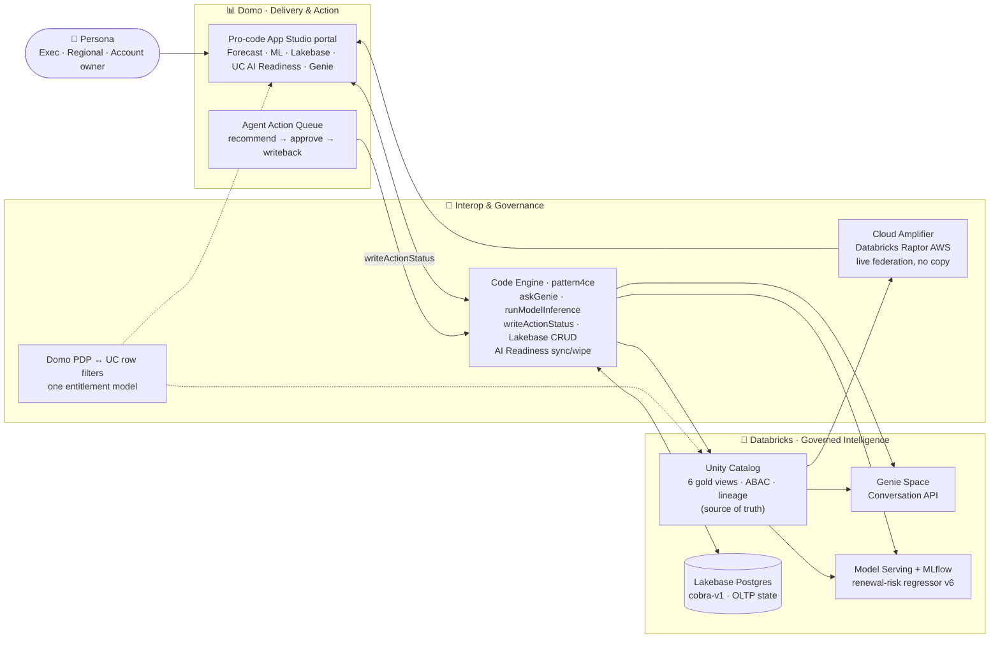

<h1 align="center">📊 Revenue Command Center</h1>

<p align="center">
  <strong>Pattern 4 — "Genie everywhere + Domo portals" — built as a governed, agent-to-agent automation experience.</strong><br/>
  One cockpit where <em>Databricks predicts</em>, <em>Genie explains</em>, and <em>Domo acts</em> — reading live from the lakehouse, with Unity Catalog as the single source of truth.
</p>

<p align="center">
  
  
  
</p>

<p align="center">
  
  
  
  
  
  
  
</p>

<p align="center">
  
  
  
  
  
</p>

<p align="center">
  
</p>

> **The narrative in one line:** Databricks is the governed *intelligence* plane; Domo is the business *delivery + action* plane. One identity, one governed metric layer — surfaced as an executive command center that **predicts** (ML), **explains** (Genie), **acts** (human-approved agent actions with writeback), **remembers** (Lakebase OLTP state), and **governs** (Unity Catalog → Domo AI Readiness).

---

## Table of Contents

- [What it does](#what-it-does)
- [The five-act story](#the-five-act-story)
- [Capabilities](#capabilities)
  - [Forecast Home](#forecast-home)
  - [ML Predictions — Databricks predicts](#ml-predictions--databricks-predicts)
  - [Genie Workspace — Genie explains](#genie-workspace--genie-explains)
  - [Agent Action Queue — Domo acts](#agent-action-queue--domo-acts)
  - [Lakebase Ops — operational state](#lakebase-ops--operational-state)
  - [UC AI Readiness — governance control plane](#uc-ai-readiness--governance-control-plane)
- [Architecture](#architecture)
- [Component inventory](#component-inventory)
- [Repository layout](#repository-layout)
- [Live environment](#live-environment)
- [Build &amp; deploy](#build--deploy)
- [Governance &amp; security posture](#governance--security-posture)
- [What's next](#whats-next)

---

## What it does

A regional operations leader opens **one** governed portal and sees a Domo executive cockpit powered live by Databricks. A KPI shows elevated renewal risk in the West. They **ask Genie why**, **score a specific account** against a Databricks-served ML model, **approve an agent action** that writes status back to the lakehouse, and watch **Protected Revenue** update — all without leaving the portal, and all enforced by the same Unity Catalog governance that scopes both Domo and Genie.

The demo proves that **the governance never forks**: the same metric definitions, row access, and AI-readiness metadata feed the dashboards, the model, and Genie. Databricks reasons; Domo delivers and acts.

---

## The five-act story

| Act | Plane | Surface | What happens |
| --- | --- | --- | --- |
| **1 · Predict** | Databricks | ML Predictions | An MLflow/Unity-Catalog renewal-risk model, served on Model Serving, scores an account live. |
| **2 · Explain** | Databricks | Genie Workspace | Genie answers *"why did renewal risk increase for West enterprise accounts?"* over the same governed gold views. |
| **3 · Act** | Domo | Agent Action Queue | A Genie- and model-informed recommendation is **approved by a human**, executed, and status is written back to the lakehouse. |
| **4 · Remember** | Databricks | Lakebase Ops | Saved what-if scenarios and prediction feedback persist in Lakebase Postgres — app-owned OLTP state next to the lakehouse. |
| **5 · Govern** | Both | UC AI Readiness | Unity Catalog metadata (comments, tags, synonyms) is the source of truth, synced into Domo AI Readiness — never the other way around. |

---

## Capabilities

### Forecast Home

A persona-scoped executive cockpit: Net Revenue / Revenue at Risk / Protected Revenue / SLA Breaches KPIs, an **Actual-vs-Forecast** hero with a confidence band, a Regional Renewal Risk hotspot, an insight rail, the incident root-cause panel, the Agent Action Queue, and a governed-lineage strip. The **Viewing as** persona rescopes the page — the same entitlement enforced by Unity Catalog row filters and Domo PDP.

<p align="center"></p>

### ML Predictions — Databricks predicts

Score any account against the renewal-risk model **live**. The request runs server-side through the Code Engine proxy `pattern4ce.runModelInference` → Databricks **Model Serving** (no token in the browser). A staged **run-log** keeps the user engaged through scale-to-zero cold starts, and an **Inference Payload &amp; Endpoint** panel renders the exact request as **cURL / Python / SQL** for data scientists — plus deep links to the registered model and serving endpoint.

> The model is an HGB **regressor** (`pattern4_renewal_risk` v6) trained on `gold_customer_renewal_risk`, returning a smooth churn probability (~0.10–0.60) that tracks the inputs — not a saturated 0/1 classifier.

<p align="center"></p>

### Genie Workspace — Genie explains

Ask the lakehouse in natural language. The native Databricks **Genie** room is embedded directly, rendering Databricks result tables and charts; a legacy Code Engine–routed panel (with an API-call inspector and Domo-side chart reconstruction) is kept for SQL deep-dives.

<p align="center"></p>

### Agent Action Queue — Domo acts

Genie- and model-informed recommendations flow into a queue with **human approval gates**. *Approve &amp; execute* calls `pattern4ce.writeActionStatus`, which writes a row to the `agent_action_writeback` Delta table in Unity Catalog; the portal's **Protected Revenue** ticks up and the action shows an auditable writeback. (Live Domo **Agent Catalyst + Workflow** orchestration and **Unity AI Gateway / OBO** are documented follow-ons — see [What's next](#whats-next).)

### Lakebase Ops — operational state

A `lakebase-explorer`-style table workspace over **Lakebase Postgres** (`cobra-v1`): browse / add / edit / delete rows in `p4_scenario_runs` and `p4_prediction_feedback` with a typed form. Accepting a prediction on the ML tab **seeds a reviewable scenario** here — app-owned, low-latency state that survives sessions, deliberately separate from the governed analytic gold.

<p align="center"></p>

### UC AI Readiness — governance control plane

A control plane that compares **Unity Catalog metadata prepared** vs **Domo AI Readiness synced**, column by column, with per-column and per-dataset sync/wipe. A Domo-native **Context Length** gauge mirrors Domo's own AI Readiness metric (column names + context + synonyms), and a governed **Inspect / Edit UC** drawer is the only path that writes back to the source of truth.

<p align="center"></p>

---

## Architecture



| Plane | Owns | Doesn't |
| --- | --- | --- |
| **Databricks** | Governed gold views &amp; metric definitions, Genie context, the ML model + serving endpoint, Lakebase OLTP, lineage | Business UI / action execution |
| **Interop** | Live federation (Cloud Amplifier), the server-side Code Engine bridge (token never hits the browser), one entitlement model | Holding business state long-term |
| **Domo** | The pro-code experience, persona scoping, the action queue + human approval + writeback | Editing the Unity Catalog source of truth |

---

## Component inventory

| Layer | Components |
| --- | --- |
| **Databricks** | Unity Catalog (`databricks_raptor.pattern4_agent_automation`, 6 `gold_*` views), Genie Space, MLflow model `pattern4_renewal_risk` v6 → Model Serving `pattern4-renewal-risk`, Lakebase Postgres (`cobra-v1`), external lineage object `domo_pattern4_revenue_command_center` |
| **Interop** | Cloud Amplifier (`Databricks Raptor AWS`), Domo Code Engine package `pattern4ce` (Genie / inference / writeback / Lakebase / AI Readiness), shared SSO/OAuth identity |
| **Domo** | Pro-code App Studio app (6 tabs), Agent Action Queue + approval + writeback, AI Readiness control plane, Cloud Amplifier datasets (5 alias-mapped gold views) |
| **App stack** | Vanilla JS + `ryuu.js` (domo.js), Open Sans + Roboto Mono, native-Domo "analyzer" design system; Python (scikit-learn + MLflow) for model training |

---

## Repository layout

```text
pattern4-agent-portal/         Pro-code Domo App Studio app
  index.html                   App shell (loads ryuu.js + app.js)
  src/app.js                   All app logic (tabs, charts, CE calls)
  src/styles.css               Native-Domo design system
  codeengine/functions.js      pattern4ce Code Engine source (consolidated)
  manifest.json + dist/        Publishable build (datasetsMapping + packageMapping)
  docs/images/                 README screenshots
scripts/                       Synthetic data gen, model training, Lakebase seed, CE build
pattern-4-*.md                 Build plan, shaping docs, demo runbook, model/data reports
pattern-4-project-manager.html Project tracker UI (reads pattern-4-plan-data.js)
```

---

## Live environment

> Demo instance identifiers (synthetic data; no secrets are committed).

| Thing | Value |
| --- | --- |
| Domo instance | `databricks-demo.domo.com` · App Studio app `105910661` / view `1913185115` |
| Databricks | `dbc-0516e56c-ba3e.cloud.databricks.com` · catalog/schema `databricks_raptor.pattern4_agent_automation` |
| Genie Space | `01f1642295b61d6b8849e106f52fc781` |
| Model / endpoint | `pattern4_renewal_risk` v6 → `pattern4-renewal-risk` |
| Lakebase | project `cobra-v1` · `public.p4_scenario_runs`, `public.p4_prediction_feedback` |
| Code Engine | `pattern4ce` · released `v1.0.12` (proxyId routing) |

---

## Build &amp; deploy

The app is a **static pro-code bundle** — no build step beyond mirroring `src/` into `dist/`.

```bash
# 1) Validate locally (from pattern4-agent-portal/)
node --check src/app.js
# render any tab headless to verify (optional)

# 2) dist/ mirrors src/ (index.html, src/app.js, src/styles.css, public/, manifest.json)

# 3) Publish to Domo from the dist/ target
domo publish        # run from pattern4-agent-portal/dist
```

- Server-side logic lives in **Code Engine** (`pattern4ce`); the app calls it via `domo.post('/domo/codeengine/v2/packages/<fn>', …)` and routes by `proxyId` to the released version — **no Databricks token ever reaches the browser**.
- Databricks-side assets (gold views, model, endpoint, Lakebase, Genie) are provisioned via the scripts in `scripts/` using the Databricks CLI.

---

## Governance &amp; security posture

- **Unity Catalog is the source of truth.** UC → Domo AI Readiness is the only sanctioned sync direction; editing UC source context is a deliberate, governed exception (confirm-gated drawer).
- **One entitlement model** — Domo PDP mirrors Unity Catalog row filters so Domo content and Genie answers are scoped to the same persona.
- **Human-in-the-loop** — material agent actions require approval before execution; rejected/failed actions stay visible and auditable.
- **No secrets in the client or repo** — the workspace token lives only in Code Engine; `databricks token` and the Lakebase service-principal bundle are gitignored.

---

## What's next

| Item | Status | Adds |
| --- | --- | --- |
| Live Domo **Agent Catalyst + Workflow** objects | Planned | Real approval routing, notifications, and a Workflows audit trail behind *Approve &amp; execute* |
| **Unity AI Gateway / OBO** | Planned | On-behalf-of identity, rate limits, and guardrails governing the Genie + model calls |
| Prediction-feedback **edit/delete** | Staged | Full table CRUD in Lakebase Ops (one approved `pattern4ce` release away) |
| Domo **AI Services** model registration | Blocked | A confirmed supported route registers the model in Domo's governance/catalog layer |

---

<p align="center">
  <strong>Build with Databricks · Deliver with Domo · Govern everywhere.</strong><br/>
  <sub>Synthetic demo data · <code>databricks_raptor.pattern4_agent_automation</code></sub>
</p>
