# Databricks Genie + Domo — Solution Architectures & Detailed Scenarios

A buildable, sellable reference for tying Databricks Genie (Spaces, Genie everywhere, Genie Code, external knowledge) and Unity Catalog to Domo's activation, experience, and AI‑delivery layers.

**Core positioning thesis:** Databricks is the governed lakehouse and AI *development* plane. Domo is the *delivery* plane — the orchestration, activation, experience, and last‑mile AI layer that turns lakehouse data and models into governed dashboards, apps, embedded products, alerts, and autonomous agents. Unity Catalog governs the data; Genie makes it conversational inside Databricks; Domo operationalizes it everywhere the business actually works. *No rip‑and‑replace — Domo increases Databricks consumption (compute, refreshed tables, model serving, AI workloads).*

> **Anchor line:** "One governed semantic layer in Unity Catalog. Two consumption planes: conversational Genie inside Databricks, and governed activation + AI delivery inside Domo — with no metric drift."

---

## How to read this document

- **Part 1** deepens the original 7 scenarios with specific components, architecture diagrams, data/control flow, governance model, buyer, and a demo script.
- **Part 2** adds 8 new solution ideas at the same level of detail.
- **Part 3** is a buyer/sequencing matrix to decide what to productize first.
- Each scenario references the **shared reference architecture** and **component glossary** below using shorthand (e.g., `Cloud Amplifier`, `UC metric view`, `Genie Conversation API`).

### Legend for all diagrams

```
[ Databricks plane ]  governed lakehouse + Genie + Mosaic AI
[ Domo plane ]        activation, experience, AI delivery, agents
──▶  data / query flow        ⇢  control / action / API call
UC = Unity Catalog governance boundary (applies across both planes)
```

---

## Shared reference architecture

Every scenario is a specialization of this pattern. Memorize this; the scenarios just light up different edges.

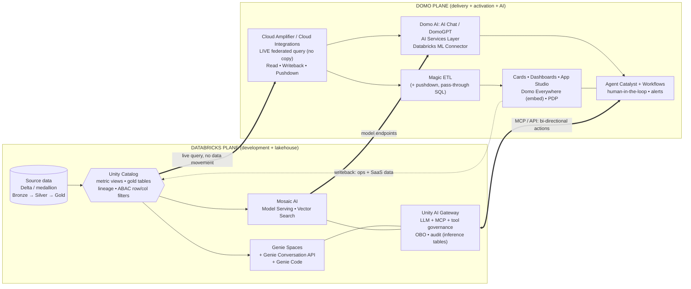

**Read it as four edges:**
1. **UC → Cloud Amplifier (live):** Domo queries governed UC gold tables/metric views live — no copy — so Genie and Domo read the *same* numbers.
2. **Mosaic AI → Domo AI:** Databricks‑hosted models (via the Databricks ML Connector / AI Services Layer) score inside Domo apps and agents.
3. **Unity AI Gateway ⇄ Agent Catalyst (MCP/API):** governed, bi‑directional actions — Genie can call Domo; Domo agents can call Genie/UC tools.
4. **Domo → UC (writeback):** Domo's 1,000+ connectors and Magic ETL hydrate the lakehouse, enriching what Genie can answer.

---

## Component glossary (shorthand used throughout)

### Databricks side
| Component | What it does in these scenarios |
| --- | --- |
| **Unity Catalog (UC)** | Single governance boundary: catalogs/schemas, **metric views**, gold tables, lineage, **ABAC row/column filters**, permissions. The semantic source of truth. |
| **Genie Spaces** | Analyst‑facing NLQ surface over UC tables/metric views; curated instructions + trusted assets. |
| **Genie Conversation API** (GA, 2026) | Programmatic NLQ: `POST /api/2.0/genie/spaces/{id}/start-conversation` and `.../messages`. Returns generated SQL + results. |
| **Genie embed / "Genie everywhere"** | iframe embed (GA) and OAuth (U2M/M2M) access from Teams, Slack, Copilot Studio, custom apps, MCP. |
| **Genie Code** | Generates SQL, charts, filters, multi‑page layouts from NL — "BI as code." |
| **Mosaic AI Model Serving** | Hosted ML/LLM endpoints (forecast, churn, anomaly, scoring). |
| **Mosaic AI Vector Search** | Embeddings + retrieval for RAG over governed content. |
| **Unity AI Gateway** (2026) | Governs LLM calls, **MCP servers**, and tools as UC objects; **on‑behalf‑of (OBO)** execution; MLflow tracing; audit to inference tables. |
| **Lakeflow / DLT** | Batch + streaming pipelines feeding the medallion architecture. |
| **Databricks SQL warehouse** | Compute that serves both Genie and Domo live queries. |

### Domo side
| Component | What it does in these scenarios |
| --- | --- |
| **Cloud Amplifier / Cloud Integrations** | **Live federated query to Databricks — no data copied to Domo.** Supports Read, **Writeback**, **Magic ETL Pushdown (Beta)**, and OAuth (read‑only). Metadata polled every ~15 min via `LAST_ALTERED`. |
| **Magic ETL** | Visual + SQL transform orchestration; **pushdown** executes natively in Databricks; **pass‑through SQL tile**; Append/Upsert/Partition; writes ETL output back to Databricks. |
| **Beast Modes** | Calculated fields/metrics in cards/datasets. *Caveat: against Databricks sources use Spark SQL syntax, not MySQL.* |
| **Cards / Dashboards** | Pixel‑perfect governed visualization + alerts + mobile. |
| **App Studio / pro‑code apps** | Custom multi‑page apps that query Databricks directly (no data movement). |
| **Domo AI: AI Chat / DomoGPT** | NL‑to‑data, text‑to‑SQL, AI‑powered insights, embedded chat. |
| **AI Services Layer / AI Model Management** | Governed multi‑model orchestration; **Databricks ML Connector** hosts/manages Mosaic AI models inside Domo. |
| **Agent Catalyst + Workflows** | Build/deploy autonomous agents (can be powered by Mosaic AI), human‑in‑the‑loop, deploy as apps on desktop/mobile/embedded. |
| **Domo Everywhere** | Embed dashboards/apps into external portals/products. |
| **PDP (Personalized Data Permissions)** | Row‑level security aligned to IdP groups — the Domo mirror of UC row filters. |
| **AI Readiness** | Data Subtypes, **AI Dictionary**, Sample Values — prep data so models answer accurately. |
| **Connectors (1,000+) / Workbench** | Hydration engine into the lakehouse (incl. writeback / create+manage Databricks tables). |

---

# Part 1 — The original 7 scenarios, deepened

---

## Scenario 1 — UC‑governed "Genie → Domo AI Hub" semantic layer

**10‑second positioning:** Define metrics once in Unity Catalog; consume them two ways — conversational Genie in Databricks and governed dashboards + AI chat in Domo — with zero metric drift.

**Databricks components:** UC catalogs/schemas, **UC metric views** (Revenue, margin, LTV, churn, attribution), Gold star/snowflake views, lineage; Genie Space pointed at those metric views; Databricks SQL warehouse.

**Domo components:** **Cloud Amplifier** live connection to the same gold tables/metric views; DataSet Views; **Beast Modes** derived from the *same* SQL expressions; Cards/Dashboards; **AI Chat/DomoGPT** over the certified datasets; certification + lineage.

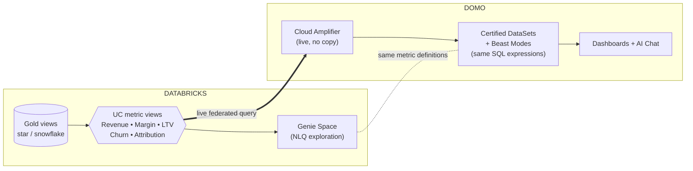

**Flow:** (1) Business logic lands as UC metric views over gold. (2) Genie answers NLQ off those views. (3) Domo Cloud Amplifier queries the *same* views live; Beast Modes reuse the identical SQL expressions. (4) Both planes report identical numbers; certification + UC lineage prove it.

**Governance:** UC permissions + ABAC are the master; Domo certification + PDP mirror them via shared IdP groups. Metric definitions live once in UC — Domo inherits, doesn't fork.

**Buyer:** Data & analytics leadership (kill metric drift / BI sprawl).
**Talk track:** "Your KPI definition lives in Unity Catalog. Genie uses it. Domo uses it. Nobody re‑defines revenue in a spreadsheet ever again."
**Demo:** Ask Genie "Q3 net revenue by region," then show the identical number on a Domo dashboard sourced live from the same metric view.

---

## Scenario 2 — Genie Spaces as analyst workbench, Domo as executive UX

**10‑second positioning:** Genie accelerates BI development 5–10x for analysts; Domo operationalizes the winning insights with governed refresh, pixel‑perfect dashboards, mobile, and wide distribution.

**Databricks components:** Genie Space (hypothesis/pattern discovery), **Genie‑generated SQL** captured as trusted assets, promoted to **UC Gold** views/metric views; lineage.

**Domo components:** **Cloud Amplifier** (live) or scheduled DataSets off the promoted gold; Cards/Dashboards; **Alerts**; mobile distribution; certification.

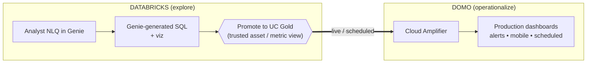

**Flow:** (1) Analyst iterates in Genie until SQL + viz match business expectations. (2) Trusted query is promoted to a governed UC gold view/metric view. (3) Domo binds to it and hardens it into branded, certified, alert‑driven, mobile dashboards.

**Governance:** Only *promoted* (governed) assets cross into production Domo — exploration stays sandboxed in Genie. UC lineage shows which Genie query became which Domo card.

**Buyer:** Analytics leaders + LoB analysts (dev velocity + trust).
**Talk track:** "Genie is the whiteboard; Domo is the boardroom. Discover fast in Genie, ship governed in Domo."
**Demo:** Discover an insight in Genie, promote the SQL to gold, then publish a Domo dashboard with a mobile alert in minutes.

---

## Scenario 3 — Actionable Genie with Domo writeback agents ("insight → action")

**10‑second positioning:** Genie finds the problem; Unity AI Gateway gates and logs the decision; Domo executes the operational change via Agent Catalyst + Workflows.

**Databricks components:** Genie Space; **Unity AI Gateway** with a **registered MCP/tool connection to Domo's APIs** (dataset refresh, alert tweaks, workflow/agent triggers); **OBO** execution under the calling user's identity; audit to inference tables.

**Domo components:** **Agent Catalyst + Domo Workflows** (the action runtime), Domo APIs/Code Engine endpoints exposed as governed tools, **Alerts**, writeback via Cloud Amplifier, human‑in‑the‑loop approvals.

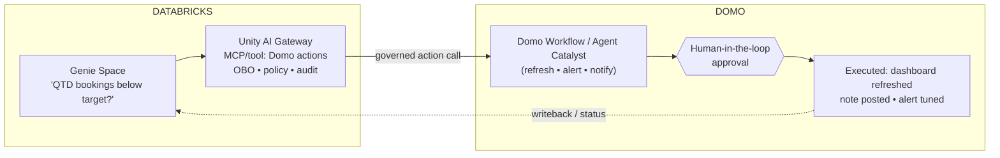

**Flow:** (1) User asks Genie to detect a condition and act. (2) Genie invokes the Domo action tool through Unity AI Gateway (governed, OBO, logged). (3) Domo Workflow/Agent executes — with optional human approval — refreshing dashboards, posting notes, tuning alerts, or triggering downstream automation. (4) Status flows back.

**Governance:** UC AI Gateway decides *which identities/Genie Spaces may call which Domo actions*; every call is OBO and audited. Domo enforces its own RBAC + approval gates on execution.

**Buyer:** Ops leaders + data platform (close the loop, safely).
**Talk track:** "From AI that informs to AI that operates — governed at the gateway, executed in Domo, with a human in the loop where it matters."
**Demo:** In Genie: "If QTD bookings are below target, refresh the exec dashboard and notify the VP." Watch the governed Domo workflow fire.

---

## Scenario 4 — Enterprise "Genie everywhere" chat unified with Domo portals

**10‑second positioning:** One conversational copilot, two knowledge homes — Genie for live lakehouse questions, Domo for curated stories — co‑embedded in one portal under consistent identity and row‑level security.

**Databricks components:** **Genie embed (iframe, GA)** and/or **Genie Conversation API** with **Enterprise OAuth (U2M)**; UC ABAC row filters; space‑level knowledge/instructions.

**Domo components:** **Domo Everywhere** embedded dashboards/cards; **PDP** row‑level security; shared IdP/SSO; optional custom portal (App Studio / pro‑code).

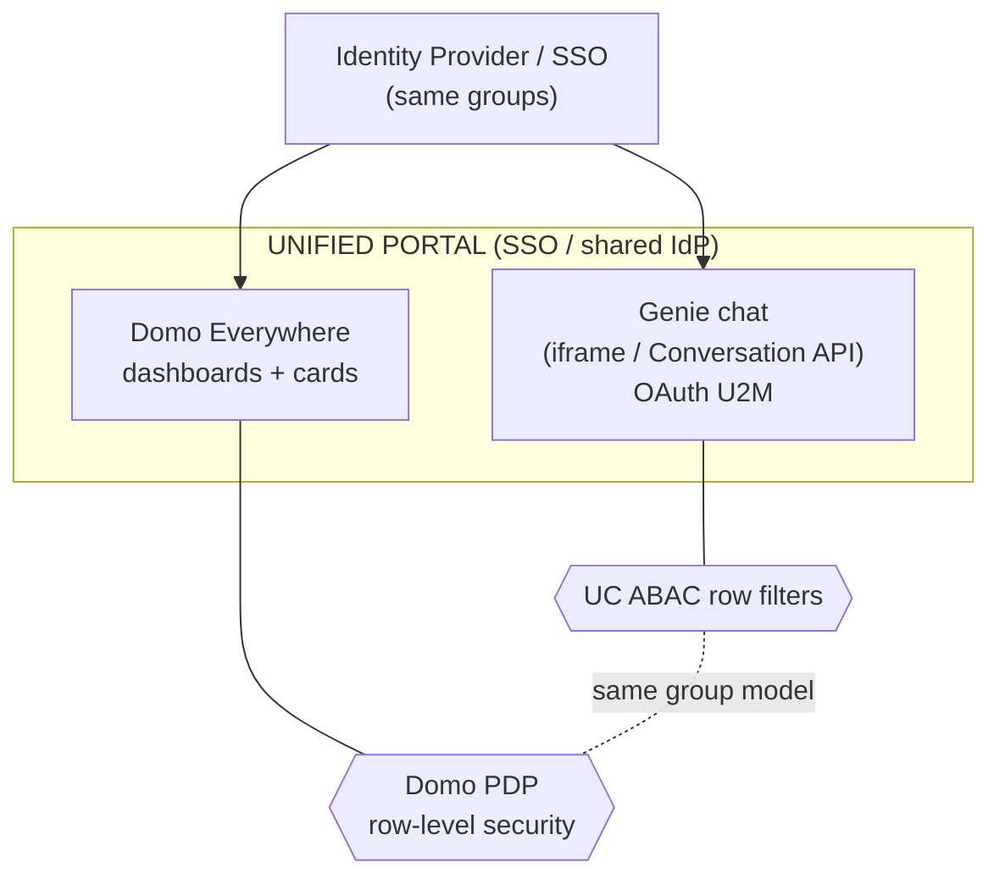

**Flow:** (1) User signs in once (shared IdP). (2) They ask Genie live questions (OAuth scopes their data via UC). (3) Genie links to / sits beside Domo cards for deeper, curated exploration. (4) Domo PDP enforces the *same* entitlements as UC, keyed to the same IdP groups.

**Governance:** Identity is the join key. UC row filters and Domo PDP both resolve off the same IdP group membership, so a user sees exactly the same slice in both surfaces.

**Buyer:** Business executives + IT/security.
**Talk track:** "One chat surface that knows where both your *data* (Databricks) and your *curated stories* (Domo) live — governed end‑to‑end by Unity Catalog and your IdP."
**Demo:** A regional manager logs in once, asks Genie an ad‑hoc question, clicks into the matching Domo card — same data scope, no second login.

---

## Scenario 5 — Genie Code → Domo dashboards "as infrastructure" (BI as code)

**10‑second positioning:** Prototype analytic experiences in natural language with Genie Code; capture the SQL/filters/layout as code; port the validated skeleton into a hardened, branded Domo production app.

**Databricks components:** **Genie Code** (generates SQL, charts, filters, multi‑page layouts); UC stores/governs the semantic objects and metric views; the generated SQL/structure as the portable spec.

**Domo components:** Domo **APIs / Code Engine / CLI** to materialize cards, App Studio modules, and collections from the captured spec; **Cloud Amplifier** binds them live to UC; branding/theme; certification.

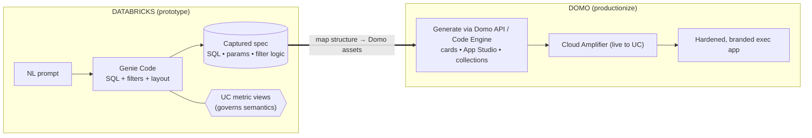

**Flow:** (1) Describe the experience in NL → Genie Code emits SQL + layout. (2) Capture that as a spec. (3) Map it to Domo assets programmatically. (4) Domo binds live to UC and hardens the look, distribution, and governance.

**Governance:** UC governs the semantic + metric layer; Domo governs the production UI, branding, distribution, and certification. The "skeleton" is reproducible/versionable.

**Buyer:** Data platform + FDE/builder teams.
**Talk track:** "Genie Code and UC define the semantic and layout skeleton; Domo implements the hardened, branded, executive experience adapted from it — BI as code, productionized."
**Demo:** Generate a 3‑page analytic layout with Genie Code, then stamp out the equivalent App Studio app wired live to UC.

### Flagship build pattern: Genie Code + Domo MCP + Skills

This is the strongest scenario for Domo MCP and the local skills/rules system because the agent is not merely answering questions — it is compiling Databricks analytic intent into real Domo assets.

**Expanded positioning:** Genie Code creates the analytic specification; Domo MCP provides the live tool surface; Domo skills/rules provide the build grammar. Together they become an agentic BI/app factory: generate, validate, publish, and maintain governed Domo assets from UC-backed Databricks semantics.

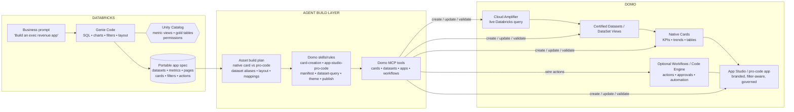

#### What Domo MCP should expose

For this scenario, the useful MCP surface is not one generic "create dashboard" tool. It should expose small, composable operations that the skills/rules can orchestrate safely:

| MCP capability | What the agent does with it | Skill/rule that governs usage |
| --- | --- | --- |
| Search/list datasets and schemas | Match UC/Databricks outputs to Domo datasets; verify columns before creating cards | `dataset-query`, `manifest` |
| Create/update certified datasets or DataSet Views | Bind Domo assets to Cloud Amplifier / Databricks-backed sources | `manifest`, `performance` |
| Create/update Beast Modes | Port metric expressions from UC/Genie SQL into Domo calculated fields when needed | `card-creation`; Spark SQL compatibility caveat |
| Create/update native cards | Generate KPI, trend, bar, table, and selector cards from the spec | `card-creation`, `basic-app-build` data-to-card contract |
| Create/update App Studio apps/pages/layouts | Assemble production UX from generated cards and pro-code cards | `app-studio-pro-code`, `domo-app-theme` |
| Publish pro-code apps | Deploy custom cards for chat, multi-step forms, custom visuals, or complex interactivity | `basic-app-build`, `publish`, `manifest` |
| Map workflows/packages | Wire generated app actions to Domo Workflows or Code Engine | `workflow`, `manifest`, `code-engine` |
| Validate/read back assets | Confirm created cards query correctly, use the intended fields, and render with expected filters | `dataset-query`, `card-creation`, `performance` |

#### Portable app spec

The handoff from Genie Code to Domo should be explicit. Treat the Genie output as a structured spec the agent can reason over, not a blob of SQL.

```json
{
  "name": "Executive Revenue Command Center",
  "source": {
    "databricksCatalog": "main",
    "schema": "gold_sales",
    "unityCatalogObjects": [
      "main.gold_sales.revenue_metric_view",
      "main.gold_sales.customer_health_view"
    ]
  },
  "pages": [
    {
      "title": "Executive Overview",
      "filters": ["region", "segment", "fiscal_period"],
      "assets": [
        {
          "type": "native_card",
          "title": "Net Revenue",
          "chartType": "badge_pop_multi_value",
          "datasetAlias": "revenueMetrics",
          "metric": "net_revenue",
          "comparison": "prior_year"
        },
        {
          "type": "native_card",
          "title": "Revenue Trend",
          "chartType": "line",
          "datasetAlias": "revenueMetrics",
          "dimensions": ["fiscal_month"],
          "measures": ["net_revenue", "gross_margin"]
        },
        {
          "type": "pro_code",
          "title": "Opportunity Drill Path",
          "reason": "cross-card drill path and custom stateful interaction"
        }
      ]
    }
  ],
  "actions": [
    {
      "label": "Escalate revenue risk",
      "workflowAlias": "escalateRevenueRisk",
      "inputs": {
        "region": "string",
        "riskScore": "decimal",
        "ownerEmail": "string"
      }
    }
  ]
}
```

#### Agent build phases

1. **Interpret Genie output:** Parse generated SQL, chart intent, filters, and layout into the portable app spec.
2. **Resolve Databricks source:** Confirm the UC objects, SQL warehouse, Cloud Amplifier connection, and target Domo datasets/DataSet Views.
3. **Validate data-to-card contract:** Check date columns, historical depth, filter column naming, and Spark SQL expression compatibility before any cards are created.
4. **Choose native vs. pro-code:** Use native cards for standard KPIs/trends/tables/selectors. Use pro-code for chat, multi-step action flows, custom drill paths, complex formatting, or visuals beyond native cards.
5. **Create manifest mappings:** Define dataset aliases, workflow aliases, and Code Engine package aliases first so generated code has stable names.
6. **Generate assets through MCP:** Create/update datasets, Beast Modes, cards, App Studio pages, pro-code card instances, workflow mappings, and layouts.
7. **Apply theme and certification:** Use the Domo theme rules so native and pro-code assets look like one product, then certify the production datasets/cards.
8. **Read back and validate:** Query each card/dataset, verify filters, validate formulas, confirm layout placement, and capture build logs.

#### Best demo script

1. In Databricks, ask Genie Code: "Create a three-page executive revenue app with overview, customer health, and regional drill-down."
2. Show Genie Code generating SQL, suggested visuals, filters, and layout against UC metric views.
3. Hand the generated spec to the Domo agent.
4. The Domo agent uses MCP and skills to create the App Studio app: native KPI cards, trend cards, selector cards, and one pro-code drill path.
5. Open the finished Domo app; show that it queries Databricks live through Cloud Amplifier.
6. Change or refine the Genie spec, then run the agent again to update the Domo assets instead of rebuilding manually.

#### Why this is the most differentiated joint story

- **Databricks value:** Genie Code and UC become the upstream semantic and app-spec generator, driving more SQL warehouse and governance usage.
- **Domo value:** Domo becomes the governed production compiler for business-facing analytics, not just the presentation layer.
- **Customer value:** Teams move from prompt → governed app without rebuilding metrics, charts, filters, or layout by hand.
- **Partner story:** Build with Databricks. Deliver with Domo. Govern through Unity Catalog and Domo's AI/service layer controls.

---

## Scenario 6 — Unified FinOps & governance hub across UC lineage + Domo usage

**10‑second positioning:** Join Unity Catalog metadata/lineage with Domo usage telemetry, ask it questions in plain English via Genie, and surface a rationalization/FinOps cockpit back in Domo for executives.

**Databricks components:** **UC system tables / lineage** (tables, models, dashboards, permissions, access history); a Genie Space over the combined governance dataset; Databricks SQL.

**Domo components:** **Connectors** pulling Domo usage/activity (card views, owner, last access, page views, data volume); **Magic ETL** to join UC metadata + Domo usage in Databricks (pushdown); executive **governance/FinOps app**; remediation **Workflows**.

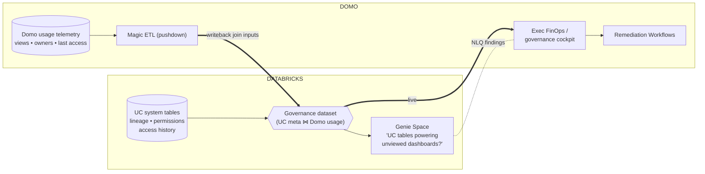

**Flow:** (1) Domo usage telemetry is written back / joined with UC metadata + lineage in Databricks (Magic ETL pushdown). (2) Genie sits over the combined dataset for NLQ ("which costly tables feed dashboards nobody viewed in 90 days?"). (3) Domo surfaces the cockpit to execs and triggers remediation (archive, deprecate, re‑own).

**Governance:** Read‑heavy, but remediation actions run through governed Domo Workflows / UC AI Gateway with approvals + audit.

**Buyer:** CFO / COO / FinOps / platform owners.
**Talk track:** "In plain English, see which Databricks assets and Domo dashboards are actually used — and rationalize them proactively."
**Demo:** Ask Genie for stale, expensive assets; click into the Domo cockpit; trigger an approved deprecation workflow.

---

## Scenario 7 — Cross‑platform RAG: Genie over UC + Domo narrative content

**10‑second positioning:** Blend the quantitative ground truth in UC with the "why/how" narrative around Domo assets (docs, runbooks, change logs) so the copilot answers with both numbers and context.

**Databricks components:** Genie Space over UC metric views/tables (quantitative truth); **external knowledge sources** (SharePoint/Drive/Confluence) and/or **Mosaic AI Vector Search** over Domo documentation; curated knowledge store/instructions.

**Domo components:** Domo report documentation, metric definitions, runbooks, **change logs**; AI Chat surfacing the blended answer; links back into the relevant Domo cards.

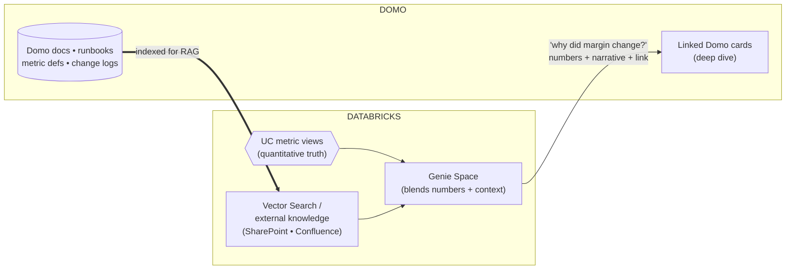

**Flow:** (1) Domo narrative content is indexed (Vector Search / external knowledge). (2) User asks "why did the margin KPI change last quarter?" (3) Genie returns UC‑sourced numbers *plus* the narrative/SOP context, and links to the relevant Domo card for the deep dive.

**Governance:** UC governs the quantitative layer; knowledge sources are permissioned; answers respect the user's data entitlements (OAuth/UC). Domo cards enforce PDP on click‑through.

**Buyer:** Business execs + analytics leaders (context‑aware decisions).
**Talk track:** "Not just numbers from Databricks — the narrative context and operational SOPs that live around your Domo assets, in one answer."
**Demo:** Ask the margin question; show the blended answer with citations and a one‑click jump into the Domo exec card.

---

# Part 2 — New solution ideas (8)

These extend the original seven into the integration surfaces that are strongest in 2026: live federation, model operationalization, the agent mesh, reverse hydration, embedded products, streaming, observability, and governed RAG.

---

## Scenario 8 — Zero‑copy live lakehouse dashboards (Cloud Amplifier federation)

**10‑second positioning:** Domo dashboards and Genie read the exact same UC gold tables *live* — no ETL, no copy, no drift — because Cloud Amplifier federates queries straight into Databricks.

**Why it's new vs. #1:** #1 is about the *semantic* contract (metric definitions). This is the *physical* architecture proof: no data lands in Domo storage; Databricks SQL serves both planes; you can demo a write in Databricks appearing in Domo within the refresh window.

**Databricks components:** UC gold tables / metric views; Databricks SQL warehouse (serves the live queries); lineage.

**Domo components:** **Cloud Amplifier / Cloud Integrations** (Read; live federated query, *no data copied to Domo*); Domo auto‑caching for card performance; metadata polling (~15 min via `LAST_ALTERED`) to drive dataset/card **Alerts** and trigger downstream Magic ETL; DataSet Views; Beast Modes (Spark SQL).

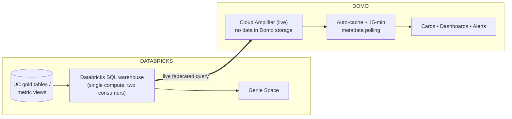

**Flow:** (1) UC gold/metric views are the only physical source. (2) Both Genie and Domo issue live queries to the same Databricks SQL warehouse. (3) Domo caches for UI speed and polls metadata to fire alerts + trigger dependent flows. (4) A change in Databricks shows up in Domo without a pipeline.

**Governance:** UC governs at the source; nothing to re‑secure in a Domo copy. Compute attribution stays in Databricks (a partner‑value selling point — more warehouse usage).
**Buyer:** Data platform / architecture (no‑duplication mandate, governance, cost).
**Talk track:** "Domo activates your lakehouse without copying it. Your data never leaves Databricks; your governance never forks."
**Demo:** Edit a row in a Databricks gold table; show it surface in a Domo card after refresh — same source Genie just queried.

---

## Scenario 9 — Operationalize Databricks (Mosaic AI) models in Domo apps & agents

**10‑second positioning:** The predictive last mile. Models trained/served in Databricks (churn, forecast, anomaly, scoring) run *inside* governed Domo apps, alerts, and agents — where the business actually acts on them.

**Databricks components:** **Mosaic AI Model Serving** endpoints; UC‑registered models + features; (optional) feature tables.

**Domo components:** **Databricks ML Connector** (part of Domo AI Model Management / AI Services Layer) to host/manage the Mosaic AI model in Domo; **Magic ETL** to feed features and write scores; Cards/Apps to display predictions; **Alerts** on threshold breaches; **Agent Catalyst** to act on scores.

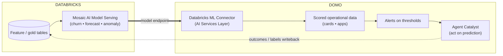

**Flow:** (1) Model is served in Databricks. (2) Domo's Databricks ML Connector calls the endpoint and scores governed operational data. (3) Predictions render in apps/cards; alerts fire on thresholds. (4) Agent Catalyst takes the next best action; outcomes/labels are written back to feed retraining.

**Governance:** Model governed in UC; Domo AI Services Layer governs access/credentials/audit on the delivery side — IT's "how is this governed?" answer.
**Buyer:** Data science + LoB ops (models that finally reach production).
**Talk track:** "The model is the engine; Domo is the transmission. Your Mosaic AI model stops being a notebook artifact and starts running the business."
**Demo:** Score live accounts with a Databricks churn model inside a Domo app; trigger a retention workflow on high‑risk accounts.

---

## Scenario 10 — Bi‑directional agent mesh (Agent Catalyst ⇄ Genie via MCP / Unity AI Gateway)

**10‑second positioning:** A governed two‑way agent mesh: Domo's Agent Catalyst calls Genie/UC as a tool for live lakehouse reasoning, and Genie calls Domo as a tool for action — all brokered and audited by Unity AI Gateway.

**Why it's new vs. #3:** #3 is one direction (Genie → Domo action). This is the full mesh: Domo agents *consuming* Genie as a reasoning tool **and** Genie *consuming* Domo as an action tool, with MCP as the shared protocol.

**Databricks components:** **Unity AI Gateway** (registers MCP servers/tools as UC objects, OBO, audit, MLflow tracing); **Genie Conversation API** exposed as a tool; UC governance.

**Domo components:** **Agent Catalyst + Workflows** (orchestration runtime); Domo as an **MCP‑accessible governed data/action layer**; Code Engine endpoints as tools; human‑in‑the‑loop.

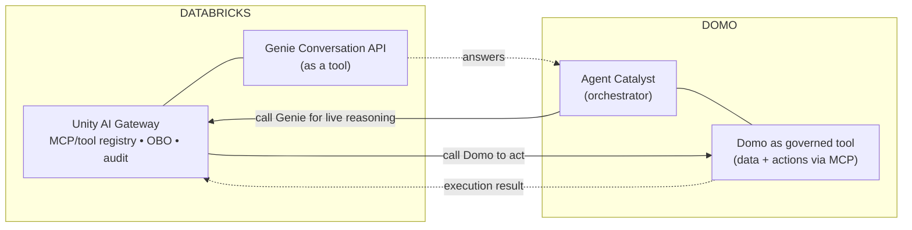

**Flow:** (1) A Domo agent needs a live lakehouse answer → calls Genie via the gateway (governed, OBO, traced). (2) Conversely, a Genie‑initiated agent needs to act → calls Domo tools via MCP through the gateway. (3) Every hop is permission‑checked and logged in both planes.

**Governance:** Unity AI Gateway is the enforcement fabric (which agent may call which tool, under what conditions, on whose behalf); Domo enforces RBAC + approval on execution. Dual audit trail.
**Buyer:** Chief AI Officer / platform (agentic architecture, governed).
**Talk track:** "Agents anywhere can talk to Domo — and Domo's agents can talk to Genie. Two planes, one governed mesh, no shadow agents."
**Demo:** A Domo supply agent asks Genie for live inventory, then executes a reorder workflow — both calls visible in the UC audit table.

---

## Scenario 11 — Reverse hydration loop (Domo connectors → lakehouse → better Genie)

**10‑second positioning:** Domo's 1,000+ connectors pull operational + SaaS data the lakehouse doesn't have, write it back into Databricks, and instantly widen what Genie can answer.

**Databricks components:** UC Bronze/Silver landing zones; medallion promotion; metric views over the enriched model; Genie Space (now smarter).

**Domo components:** **Connectors (1,000+) / Workbench**; **Magic ETL** with **native writeback to Databricks** (and create/manage Databricks tables); scheduling, monitoring, schema awareness, alerts; **AI Readiness** (Data Subtypes, AI Dictionary, Sample Values) to prep tables for accurate Genie answers.

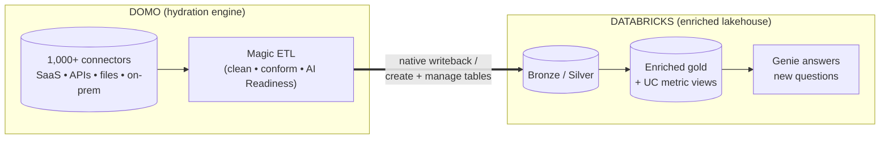

**Flow:** (1) Domo connects to systems outside the lakehouse. (2) Magic ETL conforms + applies AI Readiness metadata. (3) It writes governed tables back into Databricks. (4) UC promotes to gold; Genie can now answer questions it physically couldn't before.

**Governance:** Domo manages ingestion lineage/scheduling/alerts; UC governs once landed. AI Dictionary terms align Genie + Domo semantics.
**Buyer:** Data engineering / platform (fill the lakehouse gaps fast).
**Talk track:** "Domo hydrates Databricks. More governed tables in, more questions Genie can answer out — and more warehouse workloads for Databricks."
**Demo:** Connect a SaaS source in Domo, write it to a new Databricks table, then ask Genie a question that was impossible 10 minutes earlier.

---

## Scenario 12 — Embedded, multi‑tenant analytics for ISVs (Domo Everywhere + Genie + UC)

**10‑second positioning:** Ship a customer‑facing product where each tenant sees governed dashboards (Domo Everywhere) *and* a conversational Genie pane — both isolated per tenant by UC row filters + Domo PDP.

**Databricks components:** UC with **ABAC row filters / tenant isolation**; **Genie embed for external users** (GA) or Conversation API with per‑tenant identity (tenant‑mirror / OBO pattern); Databricks SQL.

**Domo components:** **Domo Everywhere** (embedded dashboards/apps, brand control); **PDP** per tenant; App Studio / pro‑code product shell; usage metering.

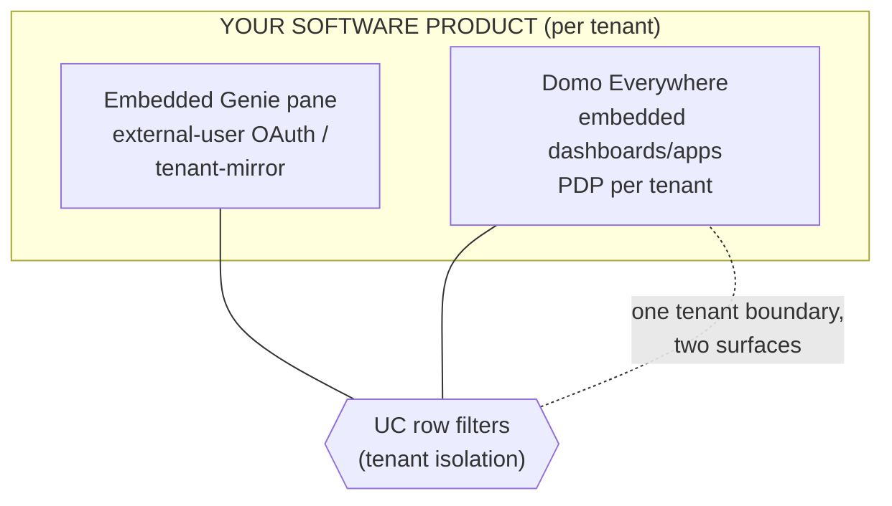

**Flow:** (1) Each tenant logs into your product. (2) Domo Everywhere renders their branded, PDP‑filtered dashboards. (3) The embedded Genie pane answers ad‑hoc questions scoped by UC row filters to that tenant. (4) One isolation model, two embedded surfaces.

**Governance:** Tenant isolation enforced at UC (row filters) and mirrored in Domo PDP; external‑user embedding keeps identity correct (OBO / tenant‑mirror). Note the Genie iframe rate limit (~20 q/min/workspace) for multi‑tenant scale planning.
**Buyer:** ISV / product teams (monetize analytics without building the stack).
**Talk track:** "Ship premium, governed, conversational analytics inside your product in weeks — tenant isolation handled by Unity Catalog and Domo PDP."
**Demo:** Log in as two tenants; show each sees only their data in both the dashboard and the Genie pane.

---

## Scenario 13 — Streaming insight‑to‑action (Lakeflow/DLT → Domo real‑time → agent)

**10‑second positioning:** Streaming pipelines in Databricks feed near‑real‑time Domo cards and alerts; threshold breaches trigger an Agent Catalyst response — anomaly to action in minutes.

**Databricks components:** **Lakeflow / DLT** streaming tables; UC gold streaming views; (optional) Mosaic AI anomaly model; Genie for ad‑hoc "what just happened?" queries.

**Domo components:** **Cloud Amplifier** live read with frequent metadata polling; real‑time **Cards + Alerts**; **Agent Catalyst + Workflows** for automated response; mobile push.

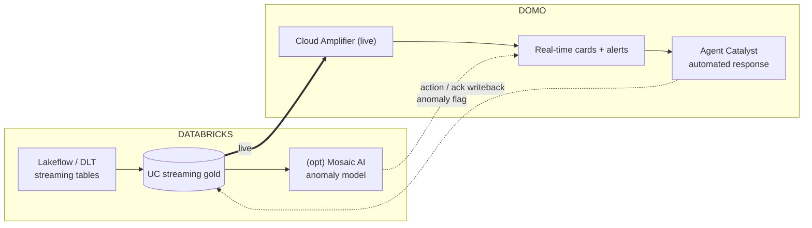

**Flow:** (1) Streaming data lands in UC gold. (2) Domo reads live and renders real‑time cards/alerts. (3) On breach/anomaly, Agent Catalyst executes a response (notify, throttle, dispatch). (4) Acknowledgement writes back. The real **Domo + Databricks fleet‑health monitoring agent** (real‑time vibration/anomaly detection → automated repair alerts) is a concrete proof point for this pattern.

**Governance:** UC governs the stream; Domo governs alerting + the action workflow with audit.
**Buyer:** Operations / IoT / manufacturing.
**Talk track:** "Lakehouse streaming becomes a real‑time operations cockpit that doesn't just alert — it acts."
**Demo:** Spike a metric in the stream; watch a Domo alert fire and an agent dispatch a response.

---

## Scenario 14 — Data quality & lineage observability cockpit

**10‑second positioning:** Surface Databricks data‑quality + lineage signals in a Domo executive cockpit, with Genie NLQ over the quality dataset and Domo workflows to remediate.

**Databricks components:** **Lakehouse Monitoring** + DLT expectations (quality metrics, drift), UC lineage + access history; Genie Space over the quality dataset.

**Domo components:** **Cloud Amplifier** live read of quality tables; **Cards/Dashboards** (freshness, completeness, drift, SLA); **Alerts**; **Workflows** to open tickets / pause downstream / notify owners.

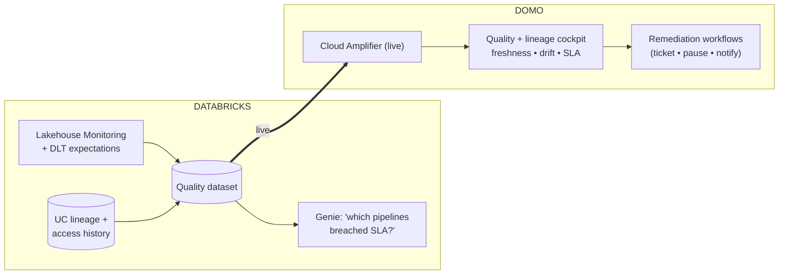

**Flow:** (1) Monitoring + lineage produce a quality dataset. (2) Genie answers NLQ over it; Domo renders the cockpit. (3) SLA/drift breaches trigger remediation workflows with owner notification.

**Governance:** Read of governed quality tables; remediation actions audited via Domo Workflows / UC AI Gateway.
**Buyer:** Data platform / data engineering leadership.
**Talk track:** "Trust isn't a vibe — it's a dashboard. See freshness, drift, and lineage in one cockpit and fix issues before the business notices."
**Demo:** Break an expectation; show the cockpit flag it and auto‑open a ticket.

---

## Scenario 15 — Governed knowledge copilot with UC Vector Search (productionized RAG)

**10‑second positioning:** A production RAG copilot: UC Vector Search over governed unstructured content + Genie's structured metrics, delivered to business users through Domo AI Chat with citations and click‑through to cards.

**Why it's new vs. #7:** #7 is the *concept*; this is the *productionized build* — Vector Search index, retrieval governance, multi‑model routing in Domo's AI Services Layer, and a hardened delivery surface.

**Databricks components:** **Mosaic AI Vector Search** index over governed docs/contracts/tickets; UC metric views for the numbers; Mosaic AI Model Serving (embeddings + LLM); Genie for structured queries.

**Domo components:** **AI Services Layer** (multi‑model routing, credentials, audit), **AI Chat / DomoGPT** delivery surface, **AI Readiness** (AI Dictionary) for term alignment, links into governed cards.

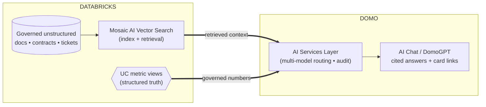

**Flow:** (1) Content is embedded/indexed in Vector Search. (2) A question retrieves governed context + pulls governed numbers from UC. (3) Domo's AI Services Layer routes the model call (multi‑model, audited) and AI Chat returns a cited answer with links into Domo cards.

**Governance:** Retrieval respects content permissions + user entitlements; AI Services Layer governs model access, credentials, and audit on delivery.
**Buyer:** Chief AI Officer / knowledge‑heavy LoBs (legal, support, finance).
**Talk track:** "Numbers from Unity Catalog, context from your documents, delivered to business users in a governed, multi‑model copilot — no vendor lock‑in."
**Demo:** Ask a policy‑plus‑numbers question; show the cited answer routing through a chosen model and linking to the source card.

---

# Part 3 — Buyer matrix & sequencing

## Scenario → buyer → integration surface

| # | Scenario | Primary buyer | Key integration surface | Build effort |
| --- | --- | --- | --- | --- |
| 1 | UC‑governed semantic hub | Data/analytics leadership | Cloud Amplifier + UC metric views | Low |
| 2 | Genie workbench → Domo exec UX | Analytics leaders/analysts | Promote‑to‑gold + Cloud Amplifier | Low |
| 3 | Actionable Genie → Domo writeback | Ops + platform | UC AI Gateway → Domo Workflows | Med |
| 4 | "Genie everywhere" + Domo portals | Business execs + IT | Genie embed/OAuth + Domo Everywhere + PDP | Med |
| 5 | Genie Code → Domo "as infrastructure" | Platform + builders/FDE | Genie Code spec → Domo API/Code Engine | Med |
| 6 | FinOps/governance hub | CFO/COO/FinOps | UC system tables ⋈ Domo usage (Magic ETL) | Med |
| 7 | Cross‑platform RAG | Execs + analytics | External knowledge/Vector Search + Genie | Med |
| 8 | Zero‑copy live federation | Architecture/platform | Cloud Amplifier live read | **Low** |
| 9 | Operationalize Mosaic AI models | Data science + LoB ops | Databricks ML Connector | Med |
| 10 | Bi‑directional agent mesh | Chief AI Officer | UC AI Gateway ⇄ Agent Catalyst (MCP) | High |
| 11 | Reverse hydration loop | Data engineering | Connectors + Magic ETL writeback | Low |
| 12 | Embedded multi‑tenant analytics | ISV/product teams | Domo Everywhere + Genie external embed + UC RLS | Med |
| 13 | Streaming insight‑to‑action | Ops/IoT/manufacturing | Lakeflow/DLT → Cloud Amplifier → Agent Catalyst | High |
| 14 | Data quality/lineage cockpit | Data platform leadership | Lakehouse Monitoring → Cloud Amplifier | Med |
| 15 | Governed RAG copilot | Chief AI Officer / knowledge LoBs | Vector Search + AI Services Layer | High |

## What to productize first (by buyer you most want in 90 days)

- **Data platform leadership →** lead with **#8 (zero‑copy live federation)** then **#1 (semantic hub)**. Fastest to stand up, proves "no duplication / no drift," and immediately increases Databricks SQL consumption.
- **Business executives →** lead with **#4 (Genie everywhere + Domo portals)** then **#2 (workbench → exec UX)**. One login, one chat, governed numbers, familiar dashboards.
- **FinOps / platform owners →** lead with **#6 (FinOps/governance hub)** then **#14 (quality cockpit)**. Plain‑English cost + usage rationalization is a board‑level story.
- **Chief AI Officer / agentic →** lead with **#9 (operationalize models)** as the credibility builder, then **#10 (agent mesh)** as the flagship. #9 proves last‑mile delivery; #10 proves governed autonomy.

## Recommended flagship demo (one narrative, four scenarios)

A single end‑to‑end story that touches the strongest surfaces:
1. **#1/#8** — Ask Genie a question; show the identical number live in Domo (no copy, no drift).
2. **#9** — A Domo app scores the same data with a Mosaic AI model.
3. **#3/#10** — A governed agent acts on the score via Unity AI Gateway with a human approval.
4. **#4** — All of it embedded in one SSO portal, scoped by UC row filters + Domo PDP.

> "One governed semantic layer in Unity Catalog. Conversational in Genie, operational in Domo. Build with Databricks, deliver with Domo, govern everywhere."

---

## Notes, caveats & sources

- **Syntax:** Beast Modes over Databricks sources use **Spark SQL**, not MySQL — flag in any migration from federated/connector‑based setups.
- **Refresh cadence:** Cloud Amplifier polls source metadata ~every 15 minutes (`LAST_ALTERED`); use Domo auto‑cache for UI speed. Truly sub‑minute needs lean on streaming (#13) + alerting design.
- **Capability maturity (as of 2026):** Databricks **Pushdown** is Beta on Domo's side; Genie **Conversation API**, **iframe embed**, and **external‑user embedding** are GA; **Unity AI Gateway** MCP governance shipped in 2026. Re‑verify GA/Beta status at build time.
- **Genie iframe rate limit:** ~20 questions/min/workspace across all Genie Spaces — design multi‑tenant (#12) accordingly (Conversation API + scaling pattern).
- **Real proof point:** the **Domo + Databricks fleet‑health monitoring agent** (real‑time vibration/anomaly detection → automated repair alerts) is a shipped example for #9/#13.

Primary sources: Domo Cloud Integrations / Cloud Amplifier docs & release notes; Domo + Databricks partner page; Domo Databricks ML Connector; Domo Agent Catalyst; Databricks "Access Genie everywhere," Genie embed & Conversation API docs (2026 release notes); Databricks Unity AI Gateway / MCP governance blogs (2026).

