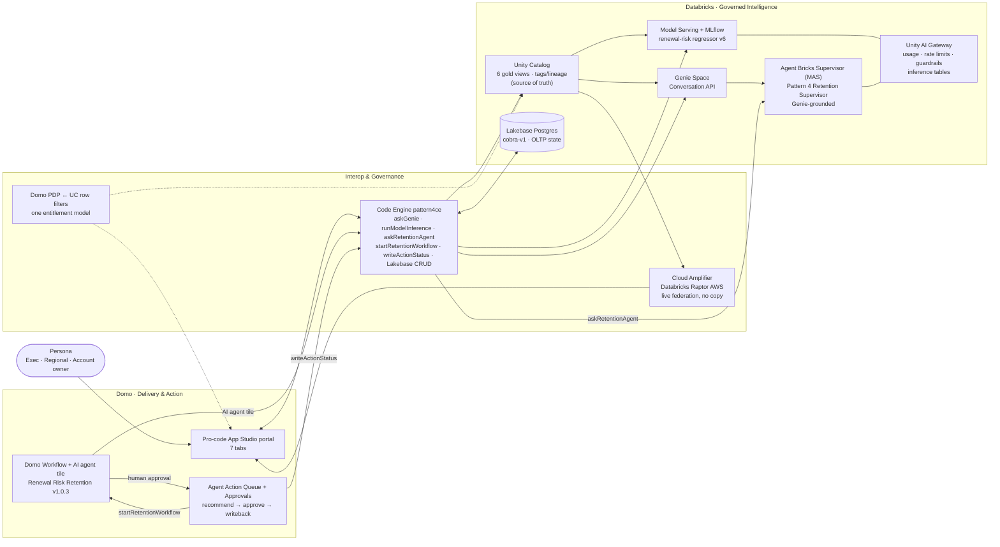

# Pattern 4 — Revenue Command Center: Solution Summary

> **One line:** Databricks is the governed *intelligence* plane; Domo is the business *delivery + action* plane. One identity and one governed metric layer, surfaced as an executive command center that **predicts**, **explains**, **acts**, **remembers**, and **governs** — without the governance ever forking.

This document is an in-depth summary of the Pattern 4 solution ("Genie everywhere + Domo portals," built as an agent-to-agent automation experience). For the working sprint tracker and decision log, see `pattern-4-agent-to-agent-automation-scope-build-plan.md`; for the product-facing overview see `README.md`.

---

## 1. The business problem

Enterprises increasingly run their *governed intelligence* in a lakehouse (Databricks) but deliver day-to-day decisions and operational action in a business platform (Domo). The risk is that **governance forks**: the metric definitions, row-level access, and AI-readiness metadata that protect the lakehouse get re-implemented (and drift) inside the BI/action layer.

Pattern 4 answers this by keeping **Unity Catalog as the single source of truth** and treating Domo as a live, governed *delivery and action* surface on top of it. The same metric layer, the same entitlement model, and the same AI-readiness metadata feed the dashboards, the ML model, and Genie — and a governed agent-to-agent loop turns insight into approved, auditable action.

---

## 2. The narrative (five acts)

A regional operations leader opens **one** governed portal and sees a Domo executive cockpit powered live by Databricks. A KPI shows elevated renewal risk in the West. From the same portal they ask why, score the account, approve an action, and watch protected revenue update — all enforced by the same Unity Catalog governance that scopes both Domo and Genie.

| Act | Plane | Surface | What happens |
| --- | --- | --- | --- |
| **1 · Predict** | Databricks | ML Predictions | An MLflow / Unity Catalog renewal-risk model, served on Model Serving and governed by **Unity AI Gateway**, scores an account live. |
| **2 · Explain** | Databricks | Genie Workspace | Genie answers *"why did renewal risk increase for West enterprise accounts this month?"* over the same governed gold views. |
| **3 · Act (agent ⇄ agent)** | Both | Agent Action Queue → Approvals | *Approve & execute* starts a **live, governed Domo Workflow**; inside it a **Domo AI agent calls a Databricks Agent Bricks Supervisor** (Genie-grounded) to produce a recommendation, a **human approves** in-app, and status writes back to the lakehouse — visualized as an animated **Action Journey** timeline. |
| **4 · Remember** | Databricks | Lakebase Ops | Saved what-if scenarios and prediction feedback persist in **Lakebase Postgres** — app-owned OLTP state next to the lakehouse. |
| **5 · Govern** | Both | UC AI Readiness + Unity AI Gateway | Unity Catalog metadata (comments, tags, synonyms) is the source of truth, synced into Domo AI Readiness; Unity AI Gateway governs the model + LLM calls (usage, rate limits, guardrails, inference tables). |

---

## 3. Architecture

### Plane responsibilities

| Plane | Owns | Does not own |
| --- | --- | --- |
| **Databricks** | Governed gold views & metric definitions, Genie context, the ML model + serving endpoint, Lakebase OLTP, lineage | Business UI / action execution |
| **Interop** | Live federation (Cloud Amplifier), the server-side Code Engine bridge (token never hits the browser), one entitlement model | Holding business state long-term |
| **Domo** | The pro-code experience, persona scoping, the action queue + human approval + writeback | Editing the Unity Catalog source of truth |

---

## 4. The agent-to-agent loop (the centerpiece)

The differentiator over a "Genie + dashboards" demo is that **two agents on two platforms reason together inside a governed, human-approved workflow**, and the result is written back to the lakehouse and reflected as protected revenue.

1. A model- and Genie-informed recommendation lands in the **Agent Action Queue**.
2. *Approve & execute* calls `pattern4ce.startRetentionWorkflow`, which starts the live Domo Workflow **`Pattern 4 - Renewal Risk Retention`** (v1.0.3) server-side (immune to App Studio stale-context issues).
3. Inside the workflow, a **Domo AI agent tile** calls `pattern4ce.askRetentionAgent`, which invokes the **Databricks Agent Bricks Supervisor (MAS)** `Pattern 4 Retention Supervisor` — a Genie-grounded multi-agent endpoint. This is the literal **agent ⇄ agent** call across platforms. (The agent call is time-bounded with a fast, Unity AI Gateway-guardrailed fallback so the tile never hangs on cold/slow runs.)
4. The recommendation routes to a **human approval** task. The user approves/rejects **in-app** on the Approvals · Action Center tab (`pattern4ce.completeApprovalTask` over the Task Center API), resuming the workflow.
5. On approval, `pattern4ce.writeActionStatus` writes the decision + trace into the `agent_action_writeback` Delta table, and **Protected Revenue** ticks up in the cockpit.
6. The whole thing renders as an **animated Action Journey timeline** driven by *real* workflow-instance + Task Center signals (not sleep timers): `recommended → workflow started → Domo agent ⇄ Databricks agent reasoned → awaiting approval → approved/rejected → written back`, with go-to-source links on every step (open agent, workflow run, MLflow trace, writeback table).

Every action record carries actor/persona, source question, recommendation, approval state, execution result, and timestamps — so the demo always distinguishes **recommendation** from **execution**.

---

## 5. Application surface (7 tabs)

A single **pro-code Domo App Studio app** (vanilla JS + `ryuu.js`), styled with a native-Domo "analyzer" design system and official Databricks/Domo brand marks.

| Tab | Purpose |
| --- | --- |
| **Forecast Home** | Persona-scoped cockpit: Net Revenue / Revenue at Risk / Protected Revenue / SLA Breach KPIs, an Actual-vs-Forecast hero with a confidence band, Regional Renewal Risk + Insight Rail, the full-width Agent Action Queue with the live Action Journey, and a governed-lineage strip. |
| **ML Predictions** | Score any account live via `runModelInference` → Databricks Model Serving. Staged run-log for scale-to-zero cold starts; an Inference Payload panel renders the exact request as cURL / Python / SQL; deep links to the registered model + endpoint. |
| **Genie Workspace** | The native Databricks Genie room embedded directly (renders Databricks tables/charts). A legacy Code Engine–routed panel with an API-call inspector + Domo-side chart reconstruction is kept for SQL deep-dives. |
| **Agent Action Queue** | Recommendations with human approval gates and the animated agent ⇄ agent Action Journey timeline. |
| **Approvals · Action Center** | The workflow's approval queue (open/completed/voided) with in-app Approve/Reject that resumes the workflow → writeback. |
| **Lakebase Ops** | A `lakebase-explorer`-style table workspace over Lakebase Postgres (`cobra-v1`): browse/add/edit/delete `p4_scenario_runs` and `p4_prediction_feedback`. Accepting an ML prediction seeds a reviewable scenario. |
| **UC AI Readiness** | A control plane comparing **Unity Catalog metadata prepared** vs **Domo AI Readiness synced**, column by column, with per-column/per-dataset sync/wipe, a Domo-native Context Length gauge, and a governed Inspect/Edit-UC drawer (the only path that writes the source of truth). |
| **How It Works** | Interactive Solution Architecture + Technical Architecture diagrams and a user guide; every node is clickable for contract/governed-by/I-O detail and carries the official product mark. |

---

## 6. Data model

Synthetic, story-driven B2B revenue-operations data in `databricks_raptor.pattern4_agent_automation`, with a deliberate incident pattern (a West-enterprise reliability incident drives SLA breaches → renewal risk → revenue at risk → agent remediation).

**Dimensions:** `dim_tenant`, `dim_product`, `dim_user_entitlement`, `dim_account`
**Facts:** `fact_incidents`, `fact_revenue_daily`, `fact_product_usage_daily`, `fact_support_cases`, `fact_renewal_risk`, `fact_agent_actions`
**Gold views (Domo + Genie consumption):**

- `gold_executive_revenue_health`
- `gold_customer_renewal_risk`
- `gold_incident_revenue_impact`
- `gold_agent_action_queue`
- `gold_portal_user_scope`
- `gold_revenue_forecast_time_series` (weekly seasonal series for the forecast hero)

**Key metrics:** Net revenue, ARR, expansion ARR, churned ARR, revenue at risk, renewal-risk score, SLA breach rate, open high-priority cases, protected revenue, agent-action approval rate, agent-action cycle time.

All six gold views carry fully populated Unity Catalog **table comments, table tags, column comments, and column tags** (semantic type, units, PII classification, governance facets) to drive Genie answer quality and Domo AI Readiness.

---

## 7. The integration bridge (Code Engine `pattern4ce`)

A single consolidated Domo **Code Engine** package (`pattern4ce`, released **v1.0.19**, `proxyId` routing) is the server-side bridge — the **MCP-direction** integration layer. It is the only place the Databricks workspace token lives; the browser never sees it. The app calls it via `domo.post('/domo/codeengine/v2/packages/<fn>', …)`.

Function families:

- **Genie** — `askGenie` (Conversation API; returns text + generated SQL + `columns`/`dataRows` for Domo-side chart reconstruction).
- **Inference** — `runModelInference` → Model Serving `invocations` (normalizes scalar and `[c0,c1]` responses).
- **Agent ⇄ agent + workflow** — `askRetentionAgent` (→ MAS), `startRetentionWorkflow`, `getRetentionWorkflowResult`, `listApprovalTasks`, `completeApprovalTask`, `writeActionStatus`.
- **Reasoning** — `askReasoningModel` (→ guardrailed `pattern4-reasoning-gateway`).
- **Lakebase** — `listScenarios` / `createScenario` / `updateScenario` / `deleteScenario` / `listPredictionFeedback` / `savePredictionFeedback` (self-contained Postgres bundle via M2M service principal).
- **AI Readiness** — `getUcReadinessState`, `getDomoAiReadiness`, `syncDomoAiReadiness`, `wipeDomoAiReadiness`, `updateUcColumnContext`.

> **Hard-won implementation lessons** (full detail in the build plan): Domo only proxy-routes Code Engine functions that declare ≥1 parameter and reject empty request bodies; the manifest must use top-level `proxyId` + singular `packageMapping`; object-list payloads must be typed as `object`/`object-list` (not `text`/`string`); and `require()` of native modules must be lazy/self-contained because the CE Lambda has no `pg`. Release is always rebuilt from the *full* `functions.js`.

---

## 8. Governance & security posture

- **Unity Catalog is the source of truth.** UC → Domo AI Readiness is the only sanctioned sync direction; editing UC source context is a deliberate, confirm-gated exception via the Inspect/Edit-UC drawer.
- **One entitlement model.** Domo PDP is designed to mirror Unity Catalog row filters so Domo content and Genie answers scope to the same persona. (PDP↔UC parity is currently shaped — see `pattern-4-domo-pdp-rls-shaping.md`.)
- **Human-in-the-loop.** Material agent actions require approval before execution; rejected/failed actions stay visible and auditable.
- **Governed AI calls.** Unity AI Gateway fronts the model endpoint (`pattern4-renewal-risk`: usage, 120/min rate limit, inference table) and a guardrailed LLM endpoint (`pattern4-reasoning-gateway`: input/output safety + PII block/mask); every agent run is traced in MLflow.
- **No secrets in the client or repo.** The workspace token lives only in Code Engine; `databricks token` and the Lakebase service-principal bundle are gitignored.

---

## 9. Tech stack

| Layer | Technology |
| --- | --- |
| **Databricks** | Unity Catalog, Delta gold views, Genie Space (Conversation API), Agent Bricks Supervisor (MAS), MLflow + Model Serving (HGB regressor v6), Unity AI Gateway, Lakebase Postgres, external lineage |
| **Interop** | Domo Cloud Amplifier (`Databricks Raptor AWS`), Domo Code Engine (`pattern4ce`), shared SSO/OAuth identity (per-user OBO documented) |
| **Domo** | Pro-code App Studio app, live Domo Workflow + AI agent tile, Task Center approvals, AI Readiness, Cloud Amplifier federated datasets |
| **App / build** | Vanilla JS + `ryuu.js` (domo.js), Open Sans + Roboto Mono, native-Domo design system, official brand SVGs; Python (scikit-learn + MLflow) for training; static `src/` → `dist/` publish via `domo publish` |

---

## 10. Live environment

> Demo instance identifiers; synthetic data only, no secrets committed.

| Thing | Value |
| --- | --- |
| Domo instance | `databricks-demo.domo.com` · App Studio app `105910661` / view `1913185115` |
| Databricks | catalog/schema `databricks_raptor.pattern4_agent_automation` |
| Cloud integration | `Databricks Raptor AWS` (`a83b5bbc-fc3f-43c0-8ea5-f15117de997d`) |
| Genie Space | `01f1642295b61d6b8849e106f52fc781` |
| Model / endpoint | `pattern4_renewal_risk` v6 → `pattern4-renewal-risk` (Unity AI Gateway-governed) |
| Agent Bricks Supervisor | `Pattern 4 Retention Supervisor` → `mas-77bd204b-endpoint` (Genie-grounded) |
| Reasoning gateway | `pattern4-reasoning-gateway` (guardrailed LLM) |
| Domo Workflow | `Pattern 4 - Renewal Risk Retention` · model `6cbd5ecb-1036-410a-b188-60a49820d264` · v1.0.3 · approvals queue `55c37364-…` |
| Lakebase | project `cobra-v1` · `public.p4_scenario_runs`, `public.p4_prediction_feedback` |
| Code Engine | `pattern4ce` · released **v1.0.19** (proxyId routing) |

---

## 11. Status & what's next

All sprints (0–8) are complete at demo grade. The build is feature-complete; the remaining items are the user's **publish + live click-test** and optional live-platform follow-ons.

| Item | Status | Notes |
| --- | --- | --- |
| Live Domo Workflow + agent ⇄ agent | ✅ Delivered | Approve & execute → governed workflow → Domo AI agent calls Databricks Supervisor → human approval → writeback, visualized as the Action Journey |
| Unity AI Gateway | ✅ Delivered | Usage, rate limits, guardrails + inference tables on the model and a guardrailed reasoning endpoint |
| Live Genie + ML inference + Lakebase CRUD + AI Readiness sync/wipe | ✅ Delivered | End-to-end through `pattern4ce` |
| External lineage (6 gold tables → Domo app object) | ✅ Delivered | `domo_pattern4_revenue_command_center` |
| Per-user OBO into Databricks | 📄 Documented | App carries a Domo identity; governed service principal bridges the call (U2M OAuth / token federation is the supported route) |
| Domo PDP ↔ UC row-filter parity | 🟡 Shaped | `pattern-4-domo-pdp-rls-shaping.md` |
| Domo AI Services model registration | ⛔ Blocked | Awaiting a confirmed supported route/payload; runtime path stays direct Model Serving |
| Prediction-feedback edit/delete | 🟡 Staged | Full Lakebase table CRUD on next approved CE release |
| MCP-based integration contract | 🔄 In progress | Migrating the Code Engine bridge toward an MCP contract |

**Definition of done (presenter flow):** select a scoped persona → view a Domo portal backed live by Databricks → ask Genie why a KPI changed → see a governed answer tied to the same scope → trigger a Domo agent recommendation → approve a workflow action → watch action status and protected revenue update → explain where governance is enforced (UC, Domo PDP, Unity AI Gateway, Domo Workflow approvals).

---

## 12. Key project artifacts

| Artifact | Purpose |
| --- | --- |
| `pattern-4-agent-to-agent-automation-scope-build-plan.md` | Source-of-truth scope, sprint tracker, decisions, blockers |
| `README.md` | Product-facing overview with screenshots |
| `pattern-4-demo-runbook.md` | Talk track, pre-demo checklist, reset procedure, fallbacks |
| `pattern-4-demo-vignettes.md` | Scripted demo moments |
| `pattern-4-*-shaping.md` | Shaping docs (Genie chat, ML/Lakebase, workflow + gateway, AI Readiness, iconography, technical architecture, PDP/RLS) |
| `pattern-4-synthetic-data-*` / `pattern-4-renewal-risk-model-report.json` | Data generation spec, validation, model report |
| `pattern4-agent-portal/` | The pro-code app + Code Engine source + publishable `dist/` |
| `scripts/` | Data gen, model training, Lakebase seed, Code Engine build/release |

---

<strong>Build with Databricks · Deliver with Domo · Govern everywhere.</strong> 
Synthetic demo data · <code>databricks_raptor.pattern4_agent_automation</code>

