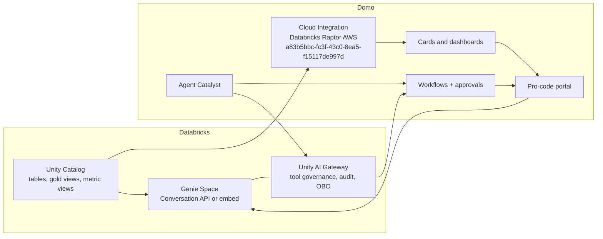

# Pattern 4 Build Plan: Agent-to-Agent Automation

## Executive Scope

Build a governed Databricks + Domo demo project that turns Pattern 4, "Genie everywhere + Domo portals," into an agent-to-agent automation experience.

The target experience is a unified business portal where a user signs in once, sees Domo dashboards powered by Databricks, asks Genie live questions, and triggers or receives automated actions from Domo agents. The demo should prove that Databricks remains the governed intelligence plane while Domo becomes the business delivery and action plane.

Core narrative:

1. Databricks Unity Catalog defines governed data, metrics, row access, and Genie context.
2. Domo Cloud Integration reads Databricks live through the `Databricks Raptor AWS` integration (`a83b5bbc-fc3f-43c0-8ea5-f15117de997d`).
3. A pro-code portal embeds curated Domo dashboard content beside a Genie chat surface.
4. Domo Agent Catalyst and Workflows call Genie for live reasoning and execute governed business actions.
5. Unity AI Gateway governs the Databricks-side tool calls, and Domo governs the operational execution.

## Build Progress Tracker

Update this section whenever project work changes scope, status, dependencies, risks, or sprint completion.

### Sprint Status

- [x] Sprint 0: Project Framing and Environment Readiness
- [x] Sprint 1: Synthetic Data and Databricks Semantic Layer
- [x] Sprint 2: Domo Cloud Integration and Dashboard Assets
- [x] Sprint 3: Portal Experience
- [ ] Sprint 4: Agent Catalyst and Workflow Automation
- [ ] Sprint 5: Agent-to-Agent Mesh
- [ ] Sprint 6: Hardening, Demo Packaging, and Executive Polish
- [ ] Sprint 7: ML Model, Domo AI Services, and Ad Hoc Inference
- [ ] Sprint 8: Lakebase Operations and Predictive UX Redesign

### Current Progress Notes

- 2026-06-09: Initial scope and sprint build plan created.
- 2026-06-09: Project-level Cursor rule requested to keep this plan updated during the build.
- 2026-06-09: Basic HTML project manager UI requested to read this Markdown file as its source of truth.
- 2026-06-09: Added file-protocol fallback data for the HTML project manager because browsers block local Markdown fetches.
- 2026-06-09: User provided answers to open decisions; plan updated with resolved decisions and remaining questions.
- 2026-06-09: Added a Gantt-style project timeline to the HTML project manager for one-view sprint status.
- 2026-06-09: Sprint 0 started. Verified `community-domo-cli`, `domo`, Python, and Node are available.
- 2026-06-09: Domo API access confirmed for `databricks-demo` using `DOMO_INSTANCE=databricks-demo` and `DOMO_AUTH_MODE=ryuu-session`.
- 2026-06-09: Installed Databricks CLI v1.2.1 at `~/bin/databricks`; no Databricks profile/config is present yet.
- 2026-06-09: Found `Databricks Raptor AWS` (`a83b5bbc-fc3f-43c0-8ea5-f15117de997d`) in Domo dataset metadata, but visible datasets on that cloud ID are currently AWS EC2 Monitoring/API datasets in `ERROR` state, so live Databricks query readiness still needs validation.
- 2026-06-09: Configured Databricks CLI profile `pattern4` from the provided token and validated workspace access as `cassidy.hilton@domo.com`.
- 2026-06-09: Validated `databricks_raptor` catalog access and listed available schemas; `pattern4_agent_automation` does not exist yet.
- 2026-06-09: Identified `Main SQL Warehouse` (`ea829ba58bcae093`) as a running candidate warehouse for SQL validation and live query work.
- 2026-06-09: Added `databricks token` to `.gitignore` so the local token file is not committed.
- 2026-06-09: Confirmed Databricks CLI exposes Genie commands (`list-spaces`, `start-conversation`, `create-message`) and existing Genie Spaces on `Main SQL Warehouse`.
- 2026-06-09: Confirmed Databricks CLI exposes Beta `supervisor-agents` and `knowledge-assistants` surfaces; no explicit Unity AI Gateway command group was visible in CLI help.
- 2026-06-09: Created `databricks_raptor.pattern4_agent_automation` and verified it through `Main SQL Warehouse` with a SQL statement smoke test.
- 2026-06-09: Drafted Sprint 1 synthetic data generation spec in `pattern-4-synthetic-data-generation-spec.md`; awaiting approval before writing tables.
- 2026-06-09: User approved Sprint 1 data generation by saying "proceed"; generated 10 Delta tables/fact tables and 5 gold views in `databricks_raptor.pattern4_agent_automation`.
- 2026-06-09: Wrote generation assets: `scripts/run_databricks_sql.py`, `sql/pattern4_generate_synthetic_data.sql`, and `sql/pattern4_fix_incident_view.sql`.
- 2026-06-09: Validation report created at `pattern-4-synthetic-data-validation-report.md`; row counts and story checks passed after correcting incident revenue-at-risk aggregation.
- 2026-06-09: Sprint 2 discovery confirmed Domo can query existing Databricks-backed datasets and that `Databricks Raptor AWS` is a DATABRICKS Cloud Amplifier integration.
- 2026-06-09: Public/API surfaces did not expose supported creation of new Databricks Cloud Amplifier datasets; created `pattern-4-domo-cloud-integration-report.md` with manual registration steps for the five gold views.
- 2026-06-09: Created pro-code portal scaffold in `pattern4-agent-portal/` with mock-mode UI, fixed dataset aliases, and Domo alias fetch logic.
- 2026-06-09: Added `scripts/discover_pattern4_domo_datasets.py`; current discovery found 0/5 Pattern 4 Domo datasets registered.
- 2026-06-09: User registered all Pattern 4 Databricks tables/views in Domo. Discovery found all 5 required gold-view datasets on `Databricks Raptor AWS`.
- 2026-06-09: Updated `pattern4-agent-portal/manifest.json` with real Domo dataset IDs and validated all 5 as `direct_federated` with successful sample queries.
- 2026-06-09: Published `pattern4-agent-portal/` as Domo design `e8a0b5da-d20b-450d-8790-de7ef1634ea7` and added a 300x300 thumbnail.
- 2026-06-09: Created Domo page `1097826706` and placed pro-code card `1022760405` titled `Pattern 4 Agent Portal`.
- 2026-06-09: Redesigned the portal from the ground up against `snowflake-summary/domo-styleguide.mdc` (Domo Blue primary, orange secondary, neutral grays, Open Sans) with sparing, elegant Databricks branding (lakehouse glyph lockup, governed-lineage ribbon, Genie red accent). Rebuilt `index.html`, `src/styles.css`, `src/app.js`; added net-revenue sparkline, persona scoping, interactive Genie panel, governed-lineage grid; regenerated an on-brand thumbnail and republished design `e8a0b5da-d20b-450d-8790-de7ef1634ea7`.
- 2026-06-09: Design revision per user feedback: replaced placeholder glyphs with the real Domo and Databricks logos (`public/domo-logo.png`, `public/databricks-logo.png`; Databricks marks use mix-blend multiply to drop the white box on light surfaces); tightened the whole UI to a daintier scale (smaller type, objects, spacing); and replaced the native macOS `<select>` with a fully custom-styled dropdown (branded panel, sublabels, selected check). Republished.
- 2026-06-09: Added a second in-app page, "How It Works" (tabbed view), per user request: a clickable agent-to-agent architecture flow (7 governed stages with inputs/outputs), a 7-step user guide, and a component bill-of-requirements across Databricks / Interop / Domo planes. Modeled on the deck's Pattern 4 Act + Revenue Sentinel slides and the user's "AI Engine — How It Works" example. Republished design `e8a0b5da-d20b-450d-8790-de7ef1634ea7`.
- 2026-06-09: User placed the pro-code app in App Studio app `105910661` (view `1913185115`). Using the `app-studio` skill, generated a co-branded 256x256 icon (Domo-blue tile + the real Databricks lakehouse mark, via `scripts/setup_appstudio_icon.py`), uploaded it to the Data File Service (`dataFileId 140`), and set the app description + `iconDataFileId`/`navIconDataFileId`. App Studio URL: `https://databricks-demo.domo.com/app-studio/105910661/pages/1913185115`.
- 2026-06-09: Started a shaping doc for innovative Genie chat capabilities (pop-out, resize, theme, model, API inspector, "open in Databricks" deep link, amplified branding): `pattern-4-genie-chat-shaping.md`. Requirements R0–R7 captured; shapes A/B/C + cross-cutting "Answer Source" component K with fit checks. Leaning Shape C (hybrid) + stage K-A→K-B. Awaiting user decisions (Q1–Q6) before breadboarding/slicing.
- 2026-06-09: User said "get it fully built." Reconciled tracker (Sprints 0–3 complete). Locked Genie chat **Shape C + staged K (K-A preview now)** and **built the enhanced Genie chat**: amplified Genie branding, model selector, accent-theme switch, **API call inspector** (endpoint/request/SQL/latency/governed-by, preview-flagged), **pop-out** overlay + backdrop + Escape, **drag-to-resize**, and an **"Open in Databricks"** deep link (`WORKSPACE_HOST/genie`, swappable to a dedicated space id). Republished. Live Conversation API (K-B) + a dedicated Pattern 4 Genie Space remain as the next live-wiring step.

- 2026-06-09: Created and tested dedicated Pattern 4 Genie Space `01f1642295b61d6b8849e106f52fc781` over the five gold views. Test question returned the expected West renewal-risk answer, generated SQL, row count, and suggested follow-ups. Wired `GENIE_SPACE_ID` in `pattern4-agent-portal/src/app.js`; the Open-in-Databricks link now targets the actual space and the inspector references the real space id. Republished.

- 2026-06-09: Added governance/readiness slice. Applied Unity Catalog comments, table properties, and true UC tags to all five gold views; generated `pattern-4-ai-readiness-manifest.json` / `.md` plus `pattern4-agent-portal/public/ai-readiness-summary.json`; added an in-app AI Readiness Sync section to the How It Works page with dataset cards and an "Update Domo AI Readiness" action. Domo AI Readiness public writes appear UI-managed/no public endpoint, so the app demonstrates the governed UC→Domo readiness update pattern and uses the manifest as the integration contract.

- 2026-06-09: Created Code Engine package `Pattern 4 Genie Proxy` (`45a89bf2-150e-42a0-83a9-3d911c928712`, v1.0.0) for server-side Databricks Genie calls; app manifest now maps alias `askPattern4Genie`. Created Code Engine package `Pattern 4 Action Writeback` (`888c73e7-7959-4169-a266-0e4ab72a6ff4`, v1.0.0) for Domo-to-Databricks action writeback; app manifest maps alias `writeActionStatus`. Added `agent_action_writeback` Delta table and Execute buttons in the Agent Action Queue. Packages are not released yet because release requires explicit user approval.

- 2026-06-09: User RELEASED both Code Engine packages at v1.0.0. Verified via product API (`/codeengine/v2/packages/{id}/versions/1.0.0?parts=functions`): Genie Proxy v1.0.0 `releasedOn` set and exposes `askGenie(question, conversationId, persona, model)` (+ helpers `callDatabricks`, `extractQuery`, `extractText`); Action Writeback v1.0.0 `releasedOn` set and exposes `writeActionStatus(actionId, decision, executionStatus, approvedBy, note, persona)` (+ helpers `postDatabricks`, `runSql`, `sqlString`). Released function names/param names/types match `pattern4-agent-portal/manifest.json` packagesMapping exactly, so the in-app `domo.post` alias calls are correctly wired. Confirmed `agent_action_writeback` baseline = 0 rows. Note: a harmless draft `1.0.1` ("test new version shell" / `ping`) exists on the Genie Proxy package; the manifest pins `1.0.0`, so it has no effect. Added `scripts/codeengine_probe.py` for re-verifying release/function state. The Domo product API admin "execute" endpoint (`ExecutePackageVersionFunction`) uses a different payload contract than the app runtime; final live execution is verified in-app (Domo iframe context), not via the admin API.

- 2026-06-09: Diagnosed why live Genie/writeback fell back to preview with NO Code Engine logs. Root cause: the Domo custom-app alias→package binding lives in the app **context** (ryuu `POST /domoapps/apps/v2/contexts` with the manifest `mapping`), which is created at card-instantiation time. The existing card/App Studio context was created before `packagesMapping` existed; `domo publish` on an existing design only re-uploads assets (its `checkMapping` merely warns "Mapping has changed" and never rewrites existing cards/contexts, and does not even inspect `packagesMapping`). Verified the published design manifest DOES contain both `packagesMapping` entries (downloaded design assets), so the design is correct — only the running context is stale. FIX: re-instantiate the card so a fresh context picks up `packagesMapping` (in App Studio: remove and re-add the pro-code app to the view; for the standalone page card: recreate the card). Also added in-app error surfacing: a failed live Genie call now shows the exact reason in the Inspect-call panel instead of silently using the preview answer.

- 2026-06-09: Re-adding the card in App Studio still returned preview with no Code Engine logs. Root cause was deeper than context staleness: the manifest used the WRONG Code Engine format. Per the working reference app `/Users/cassidy.hilton/Cursor Projects/deal-inspect`, the proven pattern is a top-level `"proxyId"` + singular `"packageMapping"` (entries are just `{alias, parameters:[{alias,type,nullable,isList,children}], output}`), where the app calls `domo.post('/domo/codeengine/v2/packages/<functionName>', args)` and Domo routes by `proxyId` = the Code Engine package NAME (package id/version are not in the URL or manifest, and there is no per-card context binding to go stale). Reworked `pattern4-agent-portal/manifest.json` to `proxyId: "pattern4ce"` + singular `packageMapping`; updated `src/app.js` to call function-name aliases; created consolidated Code Engine package `pattern4ce` (`36a18258-0fb7-407a-b268-4a326c5b73c3`, v1.0.0) with `askGenie` and `writeActionStatus`; fixed runtime bugs in the package source (`writeActionStatus` now writes the actual `agent_action_writeback` columns, and `askGenie` returns once Databricks Genie has useful query/text attachments); released `pattern4ce` v1.0.0; republished the app. Next check: reload/re-add the App Studio card and run live Genie/action tests.

- 2026-06-09: Created a clean `pattern4-agent-portal/dist/` publish target to match the `deal-inspect` deployment shape. `dist` contains only publishable app assets (`index.html`, `manifest.json`, `thumbnail.png`, `src/`, `public/`) and excludes Code Engine source/metadata/build payloads. Validated `dist/src/app.js` syntax, manifest/JSON parse, no Databricks token/secrets in `dist`, dataset mappings, `proxyId: "pattern4ce"`, `packageMapping` aliases (`askGenie`, `writeActionStatus`), and released `pattern4ce` v1.0.0 function contract.

- 2026-06-09: Fixed concrete Domo runtime/publish issues by comparing against `deal-inspect`: added the missing `ryuu.js@4.6.0` Domo SDK script to `index.html` before `src/app.js`, rebuilt `dist/`, and published from `dist`. User's browser network call now confirms the app is invoking `/domo/codeengine/v2/packages/askGenie` through the Domo runtime and the in-app inspector shows a live Genie response with latency, row count, generated SQL, and governed-by metadata. Added explicit Code Engine diagnostic logs to `pattern4ce` (`askGenie` start/conversation/poll/success/failure, `runSql` submit/finish, `writeActionStatus` start/success/failure) and released `pattern4ce` v1.0.2 (`36a18258-0fb7-407a-b268-4a326c5b73c3`) so future app-runtime calls emit stdout/stderr logs.

- 2026-06-09: Fixed a concrete Domo runtime issue by comparing with `deal-inspect`: `index.html` was missing the Domo SDK loader (`https://unpkg.com/ryuu.js@4.6.0/dist/domo.js`), so `window.domo` could be unavailable and the app fell back to preview before Code Engine calls could run. Added the same `ryuu.js` script used by `deal-inspect`, rebuilt `dist/`, validated `dist/index.html` includes the SDK before `src/app.js`, and published the corrected `dist`.

- 2026-06-09: Shaped the ML + Lakebase + Genie UX scope expansion in `pattern-4-ml-lakebase-experience-expansion-shaping.md`. Selected **Shape B: Forecast-first predictive command center**: main page becomes a polished time-based forecast/comparison view; Databricks trains/registers/serves an ML model via MLflow/Model Serving; Domo picks it up through AI Services Layer / Databricks ML adapter; `pattern4ce` grows an ad hoc inference function; Lakebase stores operational scenario/prediction-feedback state; Genie becomes a centered workspace with exact Databricks seeded questions and Domo-side plot rendering from Genie result data where possible. Added Sprints 7-8 to the roadmap.
- 2026-06-09: **Resolved all three expansion spikes** (read-only investigation; full report in `pattern-4-expansion-spike-findings.md`). X1: `runModelInference` will call **Databricks Model Serving directly** (`POST /serving-endpoints/<name>/invocations` → `{"predictions":[...]}`); Domo AI Services (`/api/ml/v1/models`) is the governance/catalog layer; ML target = renewal-risk/churn classifier on `gold_customer_renewal_risk` (named-column signature). X2: existing CE package `LakebaseQuery` (`55a6749a`) connects to Lakebase project **`cobra-v1`** (user-owned, always-warm) via node-postgres + SP M2M token exchange; the "Lakebase Explorer" app (`f0530276`) shows the `domo.post('/domo/codeengine/v2/packages/lakebaseQuery', …)` pattern; **reuse cobra-v1**, add `p4_scenario_runs` + `p4_prediction_feedback`, fold Lakebase into `pattern4ce`. X3: Genie exposes **no chart metadata** — only SQL + `manifest.schema.columns` + `result.data_array`; charts must be reconstructed Domo-side (mapping table captured); the 5 seeded sample questions were exported verbatim from `GET /api/2.0/data-rooms/{space}/curated-questions`; `askGenie` must be extended to return columns+rows.
- 2026-06-09: Built the S6 Genie chart-rendering slice locally without publishing. `pattern4ce.askGenie` source now preserves `statement_response.manifest.schema.columns[]` (`name`, `type_name`, `type_text`, `position`) and `result.data_array` as `columns` + `dataRows` while keeping the existing response contract stable. The Domo app now reconstructs result visuals from those fields (KPI, line, bar, scatter, or table with "view as table" fallback), includes preview sample rows for local validation, and has matching changes in `dist/`. Validation passed: `node --check` for source/dist app JS and CE source, manifest JSON parse, ryuu.js-before-app script ordering, referenced HTML ID check, and headless Chrome render of `dist/index.html#genie-demo`. Live Domo chart rendering still requires creating/releasing a new `pattern4ce` version with the updated source; release remains gated on explicit user approval.
- 2026-06-09: User approved releasing the chart-ready Code Engine update. Created and released `pattern4ce` **v1.0.4** (`36a18258-0fb7-407a-b268-4a326c5b73c3`) using the existing in-memory token-injection helper pattern so no Databricks token was written to git or shell output. Verified package metadata shows `v1.0.4` released at `2026-06-09T23:16:33.990Z`; because the app uses `proxyId: "pattern4ce"` with singular `packageMapping`, no manifest version pin change is required.
- 2026-06-09: Implemented requested UX and Lakebase fixes locally. Forecast KPI cards now sit above the Net Revenue timeline; ML prediction gauge/readability was improved; Genie Workspace has more breathing room, a tighter centered expanded mode, and answer text is promoted above the inspector with markdown-style bold formatting; AI Readiness moved out of How It Works into its own interactive tab with selectable dataset details and links to Domo AI Readiness / Databricks table pages. Lakebase Ops now mirrors the `lakebase explorer` CRUD pattern (refresh, add, edit, delete, selected-row details) and writes prediction feedback from the ML page. Created and ran `scripts/seed_pattern4_lakebase.py`, which created `public.p4_scenario_runs` and `public.p4_prediction_feedback` in `cobra-v1` and seeded them from existing `databricks_raptor.pattern4_agent_automation` gold views (4 scenarios, 6 feedback rows). Added typed Lakebase functions to local `pattern4ce` source and created unreleased Code Engine version **v1.0.5** with those functions; release is pending explicit user approval. Validation passed: JS/Python syntax, manifest JSON parse, referenced HTML ID/script-order checks, lints, and headless renders across Forecast, ML, Lakebase, Genie, and AI Readiness.
- 2026-06-09: User approved release of `pattern4ce` **v1.0.5**. Released package `36a18258-0fb7-407a-b268-4a326c5b73c3` and verified metadata shows `releasedOn: 2026-06-09T23:43:06.844Z`. This makes the Lakebase Ops functions live for Domo runtime calls (`listScenarios`, `createScenario`, `updateScenario`, `deleteScenario`, `listPredictionFeedback`, `savePredictionFeedback`) while preserving the existing `askGenie` and `writeActionStatus` aliases.
- 2026-06-09: Polished the Forecast Home governed lineage cards by adding direct actions to open each mapped Domo dataset and each Unity Catalog source table in Databricks. Implemented with `domo.navigate(..., true)`/browser fallback and synced source + `dist`.

### Active Blockers / Prerequisites

- Unity AI Gateway availability is not yet confirmed; Code Engine proxy currently provides the server-side bridge while Gateway/OBO is finalized.
- UC row-filter implementation is still pending; entitlement design exists in `dim_user_entitlement` / `gold_portal_user_scope`.
- Domo AI Readiness write automation is not publicly exposed; current implementation uses UC metadata + readiness manifest + in-app update demo pending an internal/supported write endpoint.
- RESOLVED 2026-06-09: Both Code Engine packages released at v1.0.0 and verified to match the app manifest. Remaining check is the in-app live click-test (ask Genie + execute action) inside the Domo app context, which must be run from the published portal/App Studio app rather than the admin API.
- RESOLVED 2026-06-09: ML/AI-Services/Lakebase/Genie spikes complete (`pattern-4-expansion-spike-findings.md`). Implementation can proceed.
- Standing up a Databricks **Model Serving endpoint** (ongoing compute cost) and writing **Lakebase tables** into the shared `cobra-v1` project are the two actions that should be confirmed with the user before execution; the forecast-first front-end redesign can proceed mock-first in parallel without them.
- Domo AI Services runtime invoke contract for a registered Databricks model is unconfirmed (registry list is POST-gated); using direct Model Serving avoids the dependency. Capture the AI Services model network call from the browser if a live AI-Services-mediated invoke is required.
- RESOLVED 2026-06-09: User approved release and `pattern4ce` v1.0.4 is live with the chart-result contract. Remaining check is an in-Domo app click-test to confirm live Genie responses now include `columns` + `dataRows` and render charts in the published portal.
- RESOLVED 2026-06-09: User approved release and `pattern4ce` v1.0.5 is live with Lakebase read/write functions. Remaining check is an in-Domo app click-test after the user publishes latest `dist`.

### Recent Decisions

- Pattern 4 is the baseline experience.
- Agent-to-agent automation is included as a primary build module.
- `Databricks Raptor AWS` (`a83b5bbc-fc3f-43c0-8ea5-f15117de997d`) is the intended Domo cloud integration.
- When opened from disk, the HTML dashboard uses bundled plan data from `pattern-4-plan-data.js`; when served over HTTP, it fetches the live Markdown file.
- The HTML project manager should include a visual timeline/Gantt view in addition to sprint cards and lists.
- Use `databricks_raptor` as the Unity Catalog catalog for generated data.
- Use `databricks_raptor.pattern4_agent_automation` as the project schema.
- Use a hybrid synthetic data approach: generate governed scale data in Databricks with Spark + Faker, using the Domo data-generator skill patterns for entity design, realism, reproducibility, date grain, and Domo card compatibility.
- Build the portal as a fully pro-code experience rather than App Studio-only.
- Anchor all portal UI on `snowflake-summary/domo-styleguide.mdc`: Domo Blue (#99CCEE) is the dominant color, orange (#FF9922) is the secondary/risk accent, Domo neutrals for surfaces/text, Open Sans for type. Databricks branding (red #FF3621 + lakehouse glyph) is used sparingly and never overpowers Domo Blue.
- Use `https://databricks-demo.domo.com/` as the Domo instance; Domo CLI access is already logged in.
- Use `~/bin/databricks` as the local Databricks CLI path until PATH is updated.
- Use Databricks CLI profile `pattern4` for workspace validation and build automation.
- Use `Main SQL Warehouse` (`ea829ba58bcae093`) as the candidate SQL warehouse unless a better project-specific warehouse is selected.
- Use Shape C hybrid for Genie chat: enhanced in-place Domo panel plus actual Pattern 4 Genie Space deep link; stage K-A preview UI now, K-B live Conversation API proxy next.
- Treat Databricks `supervisor-agents` as a possible later agent-mesh enhancement, not a Sprint 1 dependency.
- Use `pattern-4-synthetic-data-generation-spec.md` as the Sprint 1 data generation approval artifact.
- Use `pattern-4-synthetic-data-validation-report.md` as the Sprint 1 data validation proof point.
- Use `pattern-4-domo-cloud-integration-report.md` as the Sprint 2 Cloud Amplifier registration guide.
- Use `pattern4-agent-portal/` as the pro-code portal scaffold and keep it in mock mode until Domo dataset IDs are discovered.
- Use `pattern4-agent-portal/dataset-validation-report.json` as the Sprint 2 Domo dataset validation proof point.
- Unity Catalog is the source of truth for Domo AI Readiness metadata. Mirror `pattern-4-ai-readiness-manifest.json` into Domo AI Readiness / AI Dictionary for the five gold datasets.
- Published portal page: `https://databricks-demo.domo.com/page/1097826706`
- Published design: `https://databricks-demo.domo.com/assetlibrary?designId=e8a0b5da-d20b-450d-8790-de7ef1634ea7`
- Use `pattern-4-ml-lakebase-experience-expansion-shaping.md` as the source of truth for the ML/Lakebase/forecasting/Genie UX expansion.
- Selected expansion shape: **Shape B: Forecast-first predictive command center**.
- Main page redesign should be inspired by `/Users/cassidy.hilton/Cursor Projects/forecast line recharts` (actual vs prediction, confidence band, period controls, compact legend, polished tooltip).
- ML inference runtime path: `pattern4ce.runModelInference` calls **Databricks Model Serving directly** (`POST /serving-endpoints/<name>/invocations`, `dataframe_records` in, `{"predictions":[...]}` out); Domo AI Services is the governance/catalog layer.
- ML model = renewal-risk/churn classifier on `gold_customer_renewal_risk`, trained with a named-column MLflow signature, registered in UC, served like `CassidyLightGBM`.
- Lakebase: **reuse project `cobra-v1`** (`projects/cobra-v1/branches/production/endpoints/primary`); first tables `public.p4_scenario_runs` + `public.p4_prediction_feedback`; fold Lakebase access into `pattern4ce` (SP M2M token → node-postgres) rather than mixing manifest patterns.
- Genie has no chart metadata; render Domo-side charts from `manifest.schema.columns` + `result.data_array`. App seeded-question chips must match the 5 verbatim Genie sample questions.
- App IA = tabs/views inside the pro-code app: Forecast Home, ML Predictions, Lakebase Ops, Genie Workspace, How It Works.

## Source Patterns

Primary pattern:

- Pattern 4: Deliver in one governed experience, "Genie everywhere + Domo portals."

Additional build components pulled into this project:

- Agent-to-agent automation: Domo Agent Catalyst calls Genie/Databricks tools for live reasoning, and Databricks-side agents can call Domo tools for business actions.
- Zero-copy live federation: Domo dashboards query Databricks through Cloud Integration rather than copying data into Domo.
- Embedded multi-tenant analytics: portal users see tenant- or region-scoped data in both Domo and Genie.
- Streaming or near-real-time insight-to-action: alerts and agents respond to operational anomalies.

## Demo Story

Use a synthetic B2B revenue operations and customer health story. The business has regional customer accounts, recurring revenue, usage, support incidents, renewal risk, and agent-remediation workflows.

Story arc:

1. A regional operations leader opens the portal and sees a Domo executive cockpit.
2. A KPI shows elevated renewal risk and declining expansion pipeline in one region.
3. The user asks Genie, "Why did renewal risk increase for West enterprise accounts this month?"
4. Genie answers using Unity Catalog governed tables and metric views.
5. A Domo agent asks Genie for affected customers and recommended actions.
6. The Domo agent launches a retention workflow, routes a human approval, and writes action status back to the operational dataset.
7. The dashboard updates to show action queue, approved outreach, and expected revenue protected.

The data should include a clear incident pattern:

- A product reliability incident impacts West enterprise customers.
- Support volume and SLA breaches spike.
- Renewal risk and forecasted churn increase.
- Agent actions reduce projected revenue at risk after intervention.

## In-Scope Requirements

### Portal Experience

- Provide a single pro-code portal shell for the demo.
- Include a Domo dashboard area with KPI cards, trend charts, account tables, and action status.
- Include a Genie chat panel or launch surface. If direct iframe embed is not practical in the demo environment, model the interaction through the Genie Conversation API.
- Support role or tenant switching for at least two personas.
- Show that the same identity or entitlement model scopes both Domo content and Genie answers.

### Databricks Requirements

- Create or target a Unity Catalog catalog and schema after user confirmation.
- Generate synthetic data with a story-driven, non-uniform distribution.
- Create Bronze/Silver/Gold-style tables or equivalent generated tables suitable for the demo.
- Create UC metric views or gold views for executive metrics.
- Configure a Genie Space over the governed gold layer.
- Define space-level instructions so Genie understands business terms, incident context, and metric definitions.
- Prepare Unity AI Gateway or documented gateway stubs for agent/tool governance.

### Domo Requirements

- Use the Domo cloud integration `Databricks Raptor AWS` with ID `a83b5bbc-fc3f-43c0-8ea5-f15117de997d`.
- Build live or federated Domo datasets against the Databricks gold views.
- Create Domo cards for executive KPIs, regional trends, customer risk, incident impact, and workflow status.
- Configure PDP or a demo-equivalent entitlement model aligned to UC row filters.
- Build the portal as a pro-code experience.
- Build a Domo Agent Catalyst and Workflow flow for retention response.
- Add human-in-the-loop approval before high-impact actions.
- Record or display execution status for agent actions.

### Agent-to-Agent Automation Requirements

- Domo agent can request a live Databricks/Genie answer for root-cause reasoning.
- Domo agent can transform Genie output into an action plan.
- Domo Workflow can execute actions such as notify account owner, create retention task, mark customer for outreach, or escalate executive account review.
- Databricks-side agent or Genie-driven action can call a Domo action endpoint or workflow trigger.
- All agent actions must include user/context, source question, recommended action, approval state, and execution result.
- The demo must distinguish between "recommendation" and "execution."

### Synthetic Data Requirements

Use both available skill sets:

- Databricks AI Dev Kit skill: `databricks-synthetic-data-gen` for story-driven, Spark-scale synthetic data planning and Databricks output patterns.
- Global Domo skill: `domo-data-generator` for Domo-ready data generation principles, reproducibility, cross-dataset entity integrity, and downstream card compatibility.

Data generation constraints:

- Do not generate actual Databricks data until the target Unity Catalog catalog and schema are confirmed.
- Use reproducible seeds.
- Use shared entity pools for accounts, users, products, support cases, incidents, and sales owners.
- Use at least two years of daily-grain data for period-over-period Domo cards.
- Use consistent shared dimension names across datasets, such as `tenant_id`, `region`, `segment`, `account_id`, `fiscal_period`, `fiscal_year`, and `quarter`.
- Avoid uniform distributions. Include skew, seasonality, account concentration, incident spikes, and post-incident remediation effects.

## Proposed Data Model

### Core Tables

| Table | Grain | Approx Rows | Purpose |
| --- | --- | ---: | --- |
| `dim_tenant` | Tenant | 5-10 | Supports portal/PDP/UC row-filter demo. |
| `dim_account` | Account | 2,000-5,000 | Customer profile, segment, region, ARR, owner. |
| `dim_user_entitlement` | User/tenant/region | 20-50 | Maps demo users to row-level access. |
| `fact_revenue_daily` | Account/day | 1M+ | ARR, bookings, expansion, contraction, churn signals. |
| `fact_product_usage_daily` | Account/product/day | 1M+ | Adoption, active users, usage drops, health indicators. |
| `fact_support_cases` | Case | 50K-150K | Incidents, SLA breaches, product area, severity. |
| `fact_incidents` | Incident | 50-200 | Reliability events that explain spikes and revenue risk. |
| `fact_renewal_risk` | Account/month | 50K-100K | Risk score, drivers, predicted revenue at risk. |
| `fact_agent_actions` | Action event | 5K-25K | Recommendations, approvals, executions, outcomes. |

### Gold Views / Metric Views

- `gold_executive_revenue_health`
- `gold_customer_renewal_risk`
- `gold_incident_revenue_impact`
- `gold_agent_action_queue`
- `gold_portal_user_scope`

### Generated Object Inventory

Generated in `databricks_raptor.pattern4_agent_automation`:

- Dimensions: `dim_tenant`, `dim_product`, `dim_user_entitlement`, `dim_account`
- Facts: `fact_incidents`, `fact_revenue_daily`, `fact_product_usage_daily`, `fact_support_cases`, `fact_renewal_risk`, `fact_agent_actions`
- Gold views: `gold_executive_revenue_health`, `gold_customer_renewal_risk`, `gold_incident_revenue_impact`, `gold_agent_action_queue`, `gold_portal_user_scope`
- Validation report: `pattern-4-synthetic-data-validation-report.md`

### Key Metrics

- Net revenue
- ARR
- Expansion ARR
- Churned ARR
- Revenue at risk
- Renewal risk score
- SLA breach rate
- Open high-priority cases
- Protected revenue
- Agent action approval rate
- Agent action cycle time

## Target Architecture

## Sprint Plan

### Sprint 0: Project Framing and Environment Readiness

Goals:

- Confirm demo story, personas, target Domo instance, Databricks workspace, Unity Catalog catalog/schema, and whether Genie embed or Conversation API will be used.
- Confirm that the `Databricks Raptor AWS` Domo integration is available and can query the intended Databricks workspace.
- Confirm authentication paths for Domo APIs, Databricks CLI/API, Genie, and any MCP/gateway components.

Deliverables:

- Final project requirements document.
- Confirmed catalog/schema and Domo integration.
- Environment checklist with credentials, profiles, and API access owners.
- Initial implementation backlog.

Acceptance criteria:

- No data generation starts until catalog/schema is confirmed.
- Integration ID is validated in Domo.
- Demo personas and entitlement model are approved.

### Sprint 1: Synthetic Data and Databricks Semantic Layer

Goals:

- Generate story-driven synthetic data.
- Land data in Databricks with clear parent-child relationships.
- Build gold views and metric views.
- Create UC row-filter strategy.

Deliverables:

- Data generation script or Domo generator catalog extensions.
- Generated tables in the confirmed UC schema.
- Gold views for Domo and Genie consumption.
- Data dictionary with metric definitions and entity relationships.
- Validation queries for row counts, anomalies, skew, and incident story.

Acceptance criteria:

- Incident story is visible in the data.
- At least two personas return different scoped results.
- Domo-ready shared dimensions exist across all dashboard datasets.
- Main fact tables are large enough for credible aggregation.

### Sprint 2: Domo Cloud Integration and Dashboard Assets

Goals:

- Connect Domo to Databricks through `Databricks Raptor AWS`.
- Create live datasets or DataSet Views over gold Databricks objects.
- Build first-pass cards and dashboard content.

Deliverables:

- Domo datasets mapped to Databricks gold views.
- KPI cards for revenue, renewal risk, incident impact, support pressure, and protected revenue.
- Trend and detail cards for regional drilldown and account-level triage.
- PDP design or implemented PDP rules aligned to UC scope.

Acceptance criteria:

- Domo cards query the Databricks-backed sources successfully.
- Genie and Domo show matching KPI values for the same scope.
- Dashboard filters work across datasets using consistent column names.

### Sprint 3: Portal Experience

Goals:

- Assemble the unified Pattern 4 experience.
- Put Domo dashboard content and Genie access into one governed user journey.

Deliverables:

- Pro-code portal shell.
- Embedded Domo dashboards/cards.
- Genie pane, launch link, or Conversation API-backed chat module.
- Persona switcher or demo login pattern.
- User journey script for executive, regional manager, and operations owner.
- In-app "How It Works" page: a clickable agent-to-agent solution architecture flow, a business-user user guide, and a component bill-of-requirements (Databricks / Interop / Domo planes). Implemented as a tabbed view in the pro-code app (`viewGuide`), styled on the Domo styleguide with the real product logos.

Acceptance criteria:

- User can navigate from KPI to customer detail to Genie explanation.
- Data scope is consistent between Domo and Genie for the same persona.
- Portal feels like one business experience rather than two disconnected embeds.
- The "How It Works" page explains every solution component, its governance, and its inputs/outputs, and maps each component to the Databricks, Interop, or Domo plane.

### Sprint 4: Agent Catalyst and Workflow Automation

Goals:

- Build the Domo-side action runtime.
- Convert insight into approved business action.

Deliverables:

- Agent Catalyst agent definition for renewal-risk triage.
- Workflow for account owner notification, approval, and action execution.
- Action status dataset/table.
- Domo cards showing pending, approved, executed, and failed actions.
- Optional Code Engine package for custom action payload shaping.

Acceptance criteria:

- Agent can create an action recommendation from a risk condition.
- Workflow requires approval for material actions.
- Action status appears back in the portal.
- Failed or rejected actions are visible and auditable.

### Sprint 5: Agent-to-Agent Mesh

Goals:

- Connect Domo agent reasoning to Genie/Databricks.
- Define the Databricks-to-Domo action path.

Deliverables:

- Genie Conversation API wrapper or tool contract.
- Domo workflow trigger contract exposed as a tool/action endpoint.
- Unity AI Gateway registration plan or implemented gateway configuration, depending on access.
- Agent trace schema capturing question, context, answer, action, approval, and result.
- End-to-end demo: Domo agent asks Genie for root cause, then starts workflow.

Acceptance criteria:

- Domo agent can call Genie for live reasoning or use a documented mocked path if gateway access is not available.
- Genie or Databricks-side action can trigger a Domo workflow through a governed endpoint or documented stub.
- Trace records connect the source question to the final action.

### Sprint 6: Hardening, Demo Packaging, and Executive Polish

Goals:

- Make the demo reliable, repeatable, and presentation-ready.
- Package the project so future agents can rebuild or extend it.

Deliverables:

- Final demo script.
- Architecture diagram and component inventory.
- Runbook for data refresh, dashboard validation, and agent demo reset.
- Known limitations and fallback paths.
- Optional short capture plan for a walkthrough video.

Acceptance criteria:

- Demo can be reset and run end-to-end.
- All critical claims have a visible proof point.
- Fallback path exists for Genie embed/API, Unity AI Gateway, and Domo workflow triggers.

## Backlog by Workstream

### Databricks Workstream

- Confirm catalog/schema.
- Generate synthetic data with Spark + Faker pattern or Domo generator-assisted workflow.
- Create tables, gold views, metric views, and row filters.
- Create Genie Space and instructions.
- Validate Genie answers against known SQL.
- Define Unity AI Gateway tool policies or stubs.

### Domo Workstream

- Validate `Databricks Raptor AWS` integration.
- Create datasets/DataSet Views over Databricks.
- Build dashboard cards.
- Configure PDP.
- Build pro-code portal.
- Build Agent Catalyst and Workflow automation.
- Create action status reporting.

### Agent Mesh Workstream

- Define tool contracts.
- Define request/response schemas.
- Implement or stub Genie Conversation API wrapper.
- Implement or stub Domo workflow trigger endpoint.
- Capture audit/trace payloads.
- Validate agent guardrails and approval thresholds.

### Demo and Story Workstream

- Script personas.
- Script incident timeline.
- Script executive talk track.
- Create reset procedure.
- Produce architecture and sequence diagrams.

## Personas

| Persona | Scope | Demo Role |
| --- | --- | --- |
| Executive sponsor | All regions or all tenants | Sees top-line impact and protected revenue. |
| Regional manager | One region | Asks Genie why KPIs changed and reviews affected accounts. |
| Account owner | Assigned accounts | Receives workflow tasks and approves outreach. |
| Data/platform admin | Full technical scope | Shows governance, lineage, integration, and audit. |

## Security and Governance Requirements

- UC row filters and Domo PDP should be aligned by shared dimensions such as `tenant_id`, `region`, or user group.
- Genie answers must be scoped to the same entitlement as Domo dashboard data.
- Agent execution must be gated by role, action type, and business impact.
- Human approval is required for customer-facing or revenue-impacting actions.
- Action logs must include actor, persona, source system, source prompt/question, recommendation, approval state, execution state, and timestamp.
- Demo data must be clearly marked as synthetic.

## Open Decisions

1. Decide the Genie surface implementation path: iframe embed, Conversation API, or staged Conversation API first with iframe later.
2. Investigate whether Unity AI Gateway is available in the target workspace for tool registration; requires Databricks API token or configured CLI profile.
3. Decide the persona/group model to mirror between UC row filters and Domo PDP.

## Genie Surface Options

### Option A: Genie iframe embed

Best for executive demo polish because it shows the actual "Genie everywhere" experience beside Domo content. It is also the clearest Pattern 4 visual: one portal, Domo dashboards, and Genie in the same governed surface.

Tradeoffs:

- Requires embed/OAuth setup and may take longer to unblock.
- Less flexible for custom agent-to-agent orchestration inside the pro-code portal.
- Subject to Genie embed limits and browser/session behavior.

### Option B: Genie Conversation API

Best for the agent-to-agent automation build because the pro-code app and Domo agent can call a controlled API, capture prompts/responses, and pass structured results into Domo Workflows.

Tradeoffs:

- Less visually "native Genie" unless we build a polished chat UI.
- Requires Databricks API auth and a known Genie Space.
- Needs careful UX labeling so the audience understands it is Genie-backed.

### Option C: Demo-safe stub first, live Genie later

Best if access is delayed. It lets the portal, dashboard, agent workflow, and action status ship while the live Genie/Gateway pieces are being validated.

Tradeoffs:

- Weaker governance proof until replaced with live Genie.
- Must clearly mark the stub as temporary.

### Recommendation

Use the Conversation API first, wrapped in a polished pro-code chat panel, because it best supports the agent-to-agent automation requirement. Keep iframe embed as a later enhancement if OAuth/embed setup is ready before demo polish.

## Key Risks and Mitigations

| Risk | Impact | Mitigation |
| --- | --- | --- |
| Genie embed or OAuth setup is not available in time | Portal cannot show the final embedded chat experience | Use Conversation API or a controlled chat panel stub for Sprint 3, then replace in Sprint 5. |
| Unity AI Gateway access is unavailable | Full agent mesh cannot be proven live | Define tool contracts and show Domo Agent -> Genie API plus documented gateway registration path. |
| Domo Cloud Integration permissions are incomplete | Cards cannot query Databricks live | Validate `Databricks Raptor AWS` in Sprint 0 before card build. |
| Synthetic data is too flat | Demo lacks credible root cause story | Include incident spike, revenue-at-risk skew, and remediation effect in Sprint 1 validation. |
| UC row filters and Domo PDP drift | Governance claim is weakened | Use a shared entitlement table and test each persona in both planes. |
| Agent actions appear unsafe | Executive audience may distrust autonomy | Make approval gates, action logs, and rollback paths visible in the UX. |

## Definition of Done

The project is complete when a presenter can run this end-to-end flow:

1. Log in or select a scoped persona.
2. View a Domo portal backed by Databricks data through `Databricks Raptor AWS`.
3. Ask Genie why a KPI changed.
4. See a governed answer tied to the same scoped data.
5. Trigger or observe a Domo agent recommendation.
6. Approve a workflow action.
7. See action status and projected revenue protected update in the portal.
8. Explain where governance is enforced: UC, Domo PDP, Unity AI Gateway, and Domo Workflow approvals.

## Immediate Next Steps

1. DONE — All three expansion spikes resolved (`pattern-4-expansion-spike-findings.md`).
2. Redesign the app information architecture around Forecast Home, ML Predictions, Lakebase Ops, Genie Workspace, and How It Works; build the forecast-first hero (mock-first), inspired by `forecast line recharts`. (Safe, no external cost — in progress.)
3. DONE — Genie Workspace chart rendering: `askGenie` source returns columns+rows, the app renders Domo-side KPI/line/bar/scatter/table visuals, and `pattern4ce` v1.0.4 is released. Next validation is an in-Domo app click-test after the user publishes or reloads the latest `dist`.
4. DONE — Lakebase Ops: `p4_scenario_runs` + `p4_prediction_feedback` are created/seeded in `cobra-v1`; app CRUD UI and `pattern4ce` v1.0.5 live functions are built/released for live reads/writes.
5. Validate the published Domo app after user publishes latest `dist`: live Lakebase rows should load, scenario CRUD should write to `cobra-v1`, ML prediction feedback should save, and Genie result charts should remain visible.
6. Sprint 7 (gated by user confirm — serving cost): train renewal-risk/churn model on `gold_customer_renewal_risk`, register via MLflow/UC, deploy Model Serving endpoint; add `pattern4ce.runModelInference` (direct serving call) + ML Predictions page.
7. Keep UC row-filter/PDP alignment and Agent Catalyst/Workflow approval wrapper in scope as supporting governance and automation work.
