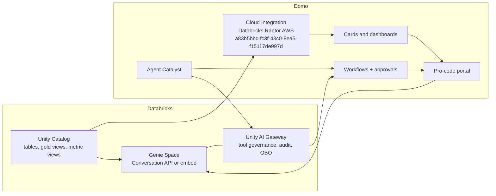

# Pattern 4 Build Plan: Agent-to-Agent Automation

## Executive Scope

Build a governed Databricks + Domo demo project that turns Pattern 4, "Genie everywhere + Domo portals," into an agent-to-agent automation experience.

The target experience is a unified business portal where a user signs in once, sees Domo dashboards powered by Databricks, asks Genie live questions, and triggers or receives automated actions from Domo agents. The demo should prove that Databricks remains the governed intelligence plane while Domo becomes the business delivery and action plane.

Core narrative:

1. Databricks Unity Catalog defines governed data, metrics, row access, and Genie context.
2. Domo Cloud Integration reads Databricks live through the `Databricks Raptor AWS` integration (`a83b5bbc-fc3f-43c0-8ea5-f15117de997d`).
3. A pro-code portal embeds curated Domo dashboard content beside a Genie chat surface.
4. Domo Agent Catalyst and Workflows call Genie for live reasoning and execute governed business actions.
5. Unity AI Gateway governs the Databricks-side tool calls, and Domo governs the operational execution.

## Build Progress Tracker

Update this section whenever project work changes scope, status, dependencies, risks, or sprint completion.

### Sprint Status

- [x] Sprint 0: Project Framing and Environment Readiness
- [x] Sprint 1: Synthetic Data and Databricks Semantic Layer
- [x] Sprint 2: Domo Cloud Integration and Dashboard Assets
- [x] Sprint 3: Portal Experience
- [x] Sprint 4: Agent Catalyst and Workflow Automation (LIVE governed Domo Workflow `Pattern 4 - Renewal Risk Retention` authored+validated; app Approve & execute → `startRetentionWorkflow` starts it server-side → human approval task → `writeActionStatus` writeback; deploy is a one-click UI step. Agent Catalyst agent deferred — Shape C.)
- [x] Sprint 5: Agent-to-Agent Mesh (live Genie Conversation API + workflow action + writeback trace; **Unity AI Gateway LIVE** on `pattern4-renewal-risk` (usage/rate-limit/inference-table) and `pattern4-reasoning-gateway` (guardrails) with a real `askReasoningModel` call path; per-user OBO documented as the supported next step)
- [x] Sprint 6: Hardening, Demo Packaging, and Executive Polish (`pattern-4-demo-runbook.md`)
- [x] Sprint 7: ML Model, Domo AI Services, and Ad Hoc Inference (regressor v6 served; ad hoc inference + payload panel live)
- [x] Sprint 8: Lakebase Operations and Predictive UX Redesign (forecast-first home, ML tab, AI Readiness control plane, live Lakebase CRUD)

### Current Progress Notes

- 2026-06-09: Initial scope and sprint build plan created.
- 2026-06-09: Project-level Cursor rule requested to keep this plan updated during the build.
- 2026-06-09: Basic HTML project manager UI requested to read this Markdown file as its source of truth.
- 2026-06-09: Added file-protocol fallback data for the HTML project manager because browsers block local Markdown fetches.
- 2026-06-09: User provided answers to open decisions; plan updated with resolved decisions and remaining questions.
- 2026-06-09: Added a Gantt-style project timeline to the HTML project manager for one-view sprint status.
- 2026-06-09: Sprint 0 started. Verified `community-domo-cli`, `domo`, Python, and Node are available.
- 2026-06-09: Domo API access confirmed for `databricks-demo` using `DOMO_INSTANCE=databricks-demo` and `DOMO_AUTH_MODE=ryuu-session`.
- 2026-06-09: Installed Databricks CLI v1.2.1 at `~/bin/databricks`; no Databricks profile/config is present yet.
- 2026-06-09: Found `Databricks Raptor AWS` (`a83b5bbc-fc3f-43c0-8ea5-f15117de997d`) in Domo dataset metadata, but visible datasets on that cloud ID are currently AWS EC2 Monitoring/API datasets in `ERROR` state, so live Databricks query readiness still needs validation.
- 2026-06-09: Configured Databricks CLI profile `pattern4` from the provided token and validated workspace access as `cassidy.hilton@domo.com`.
- 2026-06-09: Validated `databricks_raptor` catalog access and listed available schemas; `pattern4_agent_automation` does not exist yet.
- 2026-06-09: Identified `Main SQL Warehouse` (`ea829ba58bcae093`) as a running candidate warehouse for SQL validation and live query work.
- 2026-06-09: Added `databricks token` to `.gitignore` so the local token file is not committed.
- 2026-06-09: Confirmed Databricks CLI exposes Genie commands (`list-spaces`, `start-conversation`, `create-message`) and existing Genie Spaces on `Main SQL Warehouse`.
- 2026-06-09: Confirmed Databricks CLI exposes Beta `supervisor-agents` and `knowledge-assistants` surfaces; no explicit Unity AI Gateway command group was visible in CLI help.
- 2026-06-09: Created `databricks_raptor.pattern4_agent_automation` and verified it through `Main SQL Warehouse` with a SQL statement smoke test.
- 2026-06-09: Drafted Sprint 1 synthetic data generation spec in `pattern-4-synthetic-data-generation-spec.md`; awaiting approval before writing tables.
- 2026-06-09: User approved Sprint 1 data generation by saying "proceed"; generated 10 Delta tables/fact tables and 5 gold views in `databricks_raptor.pattern4_agent_automation`.
- 2026-06-09: Wrote generation assets: `scripts/run_databricks_sql.py`, `sql/pattern4_generate_synthetic_data.sql`, and `sql/pattern4_fix_incident_view.sql`.
- 2026-06-09: Validation report created at `pattern-4-synthetic-data-validation-report.md`; row counts and story checks passed after correcting incident revenue-at-risk aggregation.
- 2026-06-09: Sprint 2 discovery confirmed Domo can query existing Databricks-backed datasets and that `Databricks Raptor AWS` is a DATABRICKS Cloud Amplifier integration.
- 2026-06-09: Public/API surfaces did not expose supported creation of new Databricks Cloud Amplifier datasets; created `pattern-4-domo-cloud-integration-report.md` with manual registration steps for the five gold views.
- 2026-06-09: Created pro-code portal scaffold in `pattern4-agent-portal/` with mock-mode UI, fixed dataset aliases, and Domo alias fetch logic.
- 2026-06-09: Added `scripts/discover_pattern4_domo_datasets.py`; current discovery found 0/5 Pattern 4 Domo datasets registered.
- 2026-06-09: User registered all Pattern 4 Databricks tables/views in Domo. Discovery found all 5 required gold-view datasets on `Databricks Raptor AWS`.
- 2026-06-09: Updated `pattern4-agent-portal/manifest.json` with real Domo dataset IDs and validated all 5 as `direct_federated` with successful sample queries.
- 2026-06-09: Published `pattern4-agent-portal/` as Domo design `e8a0b5da-d20b-450d-8790-de7ef1634ea7` and added a 300x300 thumbnail.
- 2026-06-09: Created Domo page `1097826706` and placed pro-code card `1022760405` titled `Pattern 4 Agent Portal`.
- 2026-06-09: Redesigned the portal from the ground up against `snowflake-summary/domo-styleguide.mdc` (Domo Blue primary, orange secondary, neutral grays, Open Sans) with sparing, elegant Databricks branding (lakehouse glyph lockup, governed-lineage ribbon, Genie red accent). Rebuilt `index.html`, `src/styles.css`, `src/app.js`; added net-revenue sparkline, persona scoping, interactive Genie panel, governed-lineage grid; regenerated an on-brand thumbnail and republished design `e8a0b5da-d20b-450d-8790-de7ef1634ea7`.
- 2026-06-09: Design revision per user feedback: replaced placeholder glyphs with the real Domo and Databricks logos (`public/domo-logo.png`, `public/databricks-logo.png`; Databricks marks use mix-blend multiply to drop the white box on light surfaces); tightened the whole UI to a daintier scale (smaller type, objects, spacing); and replaced the native macOS `<select>` with a fully custom-styled dropdown (branded panel, sublabels, selected check). Republished.
- 2026-06-09: Added a second in-app page, "How It Works" (tabbed view), per user request: a clickable agent-to-agent architecture flow (7 governed stages with inputs/outputs), a 7-step user guide, and a component bill-of-requirements across Databricks / Interop / Domo planes. Modeled on the deck's Pattern 4 Act + Revenue Sentinel slides and the user's "AI Engine — How It Works" example. Republished design `e8a0b5da-d20b-450d-8790-de7ef1634ea7`.
- 2026-06-09: User placed the pro-code app in App Studio app `105910661` (view `1913185115`). Using the `app-studio` skill, generated a co-branded 256x256 icon (Domo-blue tile + the real Databricks lakehouse mark, via `scripts/setup_appstudio_icon.py`), uploaded it to the Data File Service (`dataFileId 140`), and set the app description + `iconDataFileId`/`navIconDataFileId`. App Studio URL: `https://databricks-demo.domo.com/app-studio/105910661/pages/1913185115`.
- 2026-06-09: Started a shaping doc for innovative Genie chat capabilities (pop-out, resize, theme, model, API inspector, "open in Databricks" deep link, amplified branding): `pattern-4-genie-chat-shaping.md`. Requirements R0–R7 captured; shapes A/B/C + cross-cutting "Answer Source" component K with fit checks. Leaning Shape C (hybrid) + stage K-A→K-B. Awaiting user decisions (Q1–Q6) before breadboarding/slicing.
- 2026-06-09: User said "get it fully built." Reconciled tracker (Sprints 0–3 complete). Locked Genie chat **Shape C + staged K (K-A preview now)** and **built the enhanced Genie chat**: amplified Genie branding, model selector, accent-theme switch, **API call inspector** (endpoint/request/SQL/latency/governed-by, preview-flagged), **pop-out** overlay + backdrop + Escape, **drag-to-resize**, and an **"Open in Databricks"** deep link (`WORKSPACE_HOST/genie`, swappable to a dedicated space id). Republished. Live Conversation API (K-B) + a dedicated Pattern 4 Genie Space remain as the next live-wiring step.

- 2026-06-09: Created and tested dedicated Pattern 4 Genie Space `01f1642295b61d6b8849e106f52fc781` over the five gold views. Test question returned the expected West renewal-risk answer, generated SQL, row count, and suggested follow-ups. Wired `GENIE_SPACE_ID` in `pattern4-agent-portal/src/app.js`; the Open-in-Databricks link now targets the actual space and the inspector references the real space id. Republished.

- 2026-06-09: Added governance/readiness slice. Applied Unity Catalog comments, table properties, and true UC tags to all five gold views; generated `pattern-4-ai-readiness-manifest.json` / `.md` plus `pattern4-agent-portal/public/ai-readiness-summary.json`; added an in-app AI Readiness Sync section to the How It Works page with dataset cards and an "Update Domo AI Readiness" action. Domo AI Readiness public writes appear UI-managed/no public endpoint, so the app demonstrates the governed UC→Domo readiness update pattern and uses the manifest as the integration contract.

- 2026-06-09: Created Code Engine package `Pattern 4 Genie Proxy` (`45a89bf2-150e-42a0-83a9-3d911c928712`, v1.0.0) for server-side Databricks Genie calls; app manifest now maps alias `askPattern4Genie`. Created Code Engine package `Pattern 4 Action Writeback` (`888c73e7-7959-4169-a266-0e4ab72a6ff4`, v1.0.0) for Domo-to-Databricks action writeback; app manifest maps alias `writeActionStatus`. Added `agent_action_writeback` Delta table and Execute buttons in the Agent Action Queue. Packages are not released yet because release requires explicit user approval.

- 2026-06-09: User RELEASED both Code Engine packages at v1.0.0. Verified via product API (`/codeengine/v2/packages/{id}/versions/1.0.0?parts=functions`): Genie Proxy v1.0.0 `releasedOn` set and exposes `askGenie(question, conversationId, persona, model)` (+ helpers `callDatabricks`, `extractQuery`, `extractText`); Action Writeback v1.0.0 `releasedOn` set and exposes `writeActionStatus(actionId, decision, executionStatus, approvedBy, note, persona)` (+ helpers `postDatabricks`, `runSql`, `sqlString`). Released function names/param names/types match `pattern4-agent-portal/manifest.json` packagesMapping exactly, so the in-app `domo.post` alias calls are correctly wired. Confirmed `agent_action_writeback` baseline = 0 rows. Note: a harmless draft `1.0.1` ("test new version shell" / `ping`) exists on the Genie Proxy package; the manifest pins `1.0.0`, so it has no effect. Added `scripts/codeengine_probe.py` for re-verifying release/function state. The Domo product API admin "execute" endpoint (`ExecutePackageVersionFunction`) uses a different payload contract than the app runtime; final live execution is verified in-app (Domo iframe context), not via the admin API.

- 2026-06-09: Diagnosed why live Genie/writeback fell back to preview with NO Code Engine logs. Root cause: the Domo custom-app alias→package binding lives in the app **context** (ryuu `POST /domoapps/apps/v2/contexts` with the manifest `mapping`), which is created at card-instantiation time. The existing card/App Studio context was created before `packagesMapping` existed; `domo publish` on an existing design only re-uploads assets (its `checkMapping` merely warns "Mapping has changed" and never rewrites existing cards/contexts, and does not even inspect `packagesMapping`). Verified the published design manifest DOES contain both `packagesMapping` entries (downloaded design assets), so the design is correct — only the running context is stale. FIX: re-instantiate the card so a fresh context picks up `packagesMapping` (in App Studio: remove and re-add the pro-code app to the view; for the standalone page card: recreate the card). Also added in-app error surfacing: a failed live Genie call now shows the exact reason in the Inspect-call panel instead of silently using the preview answer.

- 2026-06-09: Re-adding the card in App Studio still returned preview with no Code Engine logs. Root cause was deeper than context staleness: the manifest used the WRONG Code Engine format. Per the working reference app `/Users/cassidy.hilton/Cursor Projects/deal-inspect`, the proven pattern is a top-level `"proxyId"` + singular `"packageMapping"` (entries are just `{alias, parameters:[{alias,type,nullable,isList,children}], output}`), where the app calls `domo.post('/domo/codeengine/v2/packages/<functionName>', args)` and Domo routes by `proxyId` = the Code Engine package NAME (package id/version are not in the URL or manifest, and there is no per-card context binding to go stale). Reworked `pattern4-agent-portal/manifest.json` to `proxyId: "pattern4ce"` + singular `packageMapping`; updated `src/app.js` to call function-name aliases; created consolidated Code Engine package `pattern4ce` (`36a18258-0fb7-407a-b268-4a326c5b73c3`, v1.0.0) with `askGenie` and `writeActionStatus`; fixed runtime bugs in the package source (`writeActionStatus` now writes the actual `agent_action_writeback` columns, and `askGenie` returns once Databricks Genie has useful query/text attachments); released `pattern4ce` v1.0.0; republished the app. Next check: reload/re-add the App Studio card and run live Genie/action tests.

- 2026-06-09: Created a clean `pattern4-agent-portal/dist/` publish target to match the `deal-inspect` deployment shape. `dist` contains only publishable app assets (`index.html`, `manifest.json`, `thumbnail.png`, `src/`, `public/`) and excludes Code Engine source/metadata/build payloads. Validated `dist/src/app.js` syntax, manifest/JSON parse, no Databricks token/secrets in `dist`, dataset mappings, `proxyId: "pattern4ce"`, `packageMapping` aliases (`askGenie`, `writeActionStatus`), and released `pattern4ce` v1.0.0 function contract.

- 2026-06-09: Fixed concrete Domo runtime/publish issues by comparing against `deal-inspect`: added the missing `ryuu.js@4.6.0` Domo SDK script to `index.html` before `src/app.js`, rebuilt `dist/`, and published from `dist`. User's browser network call now confirms the app is invoking `/domo/codeengine/v2/packages/askGenie` through the Domo runtime and the in-app inspector shows a live Genie response with latency, row count, generated SQL, and governed-by metadata. Added explicit Code Engine diagnostic logs to `pattern4ce` (`askGenie` start/conversation/poll/success/failure, `runSql` submit/finish, `writeActionStatus` start/success/failure) and released `pattern4ce` v1.0.2 (`36a18258-0fb7-407a-b268-4a326c5b73c3`) so future app-runtime calls emit stdout/stderr logs.

- 2026-06-09: Fixed a concrete Domo runtime issue by comparing with `deal-inspect`: `index.html` was missing the Domo SDK loader (`https://unpkg.com/ryuu.js@4.6.0/dist/domo.js`), so `window.domo` could be unavailable and the app fell back to preview before Code Engine calls could run. Added the same `ryuu.js` script used by `deal-inspect`, rebuilt `dist/`, validated `dist/index.html` includes the SDK before `src/app.js`, and published the corrected `dist`.

- 2026-06-09: Shaped the ML + Lakebase + Genie UX scope expansion in `pattern-4-ml-lakebase-experience-expansion-shaping.md`. Selected **Shape B: Forecast-first predictive command center**: main page becomes a polished time-based forecast/comparison view; Databricks trains/registers/serves an ML model via MLflow/Model Serving; Domo picks it up through AI Services Layer / Databricks ML adapter; `pattern4ce` grows an ad hoc inference function; Lakebase stores operational scenario/prediction-feedback state; Genie becomes a centered workspace with exact Databricks seeded questions and Domo-side plot rendering from Genie result data where possible. Added Sprints 7-8 to the roadmap.
- 2026-06-09: **Resolved all three expansion spikes** (read-only investigation; full report in `pattern-4-expansion-spike-findings.md`). X1: `runModelInference` will call **Databricks Model Serving directly** (`POST /serving-endpoints/<name>/invocations` → `{"predictions":[...]}`); Domo AI Services (`/api/ml/v1/models`) is the governance/catalog layer; ML target = renewal-risk/churn classifier on `gold_customer_renewal_risk` (named-column signature). X2: existing CE package `LakebaseQuery` (`55a6749a`) connects to Lakebase project **`cobra-v1`** (user-owned, always-warm) via node-postgres + SP M2M token exchange; the "Lakebase Explorer" app (`f0530276`) shows the `domo.post('/domo/codeengine/v2/packages/lakebaseQuery', …)` pattern; **reuse cobra-v1**, add `p4_scenario_runs` + `p4_prediction_feedback`, fold Lakebase into `pattern4ce`. X3: Genie exposes **no chart metadata** — only SQL + `manifest.schema.columns` + `result.data_array`; charts must be reconstructed Domo-side (mapping table captured); the 5 seeded sample questions were exported verbatim from `GET /api/2.0/data-rooms/{space}/curated-questions`; `askGenie` must be extended to return columns+rows.
- 2026-06-09: Built the S6 Genie chart-rendering slice locally without publishing. `pattern4ce.askGenie` source now preserves `statement_response.manifest.schema.columns[]` (`name`, `type_name`, `type_text`, `position`) and `result.data_array` as `columns` + `dataRows` while keeping the existing response contract stable. The Domo app now reconstructs result visuals from those fields (KPI, line, bar, scatter, or table with "view as table" fallback), includes preview sample rows for local validation, and has matching changes in `dist/`. Validation passed: `node --check` for source/dist app JS and CE source, manifest JSON parse, ryuu.js-before-app script ordering, referenced HTML ID check, and headless Chrome render of `dist/index.html#genie-demo`. Live Domo chart rendering still requires creating/releasing a new `pattern4ce` version with the updated source; release remains gated on explicit user approval.
- 2026-06-09: User approved releasing the chart-ready Code Engine update. Created and released `pattern4ce` **v1.0.4** (`36a18258-0fb7-407a-b268-4a326c5b73c3`) using the existing in-memory token-injection helper pattern so no Databricks token was written to git or shell output. Verified package metadata shows `v1.0.4` released at `2026-06-09T23:16:33.990Z`; because the app uses `proxyId: "pattern4ce"` with singular `packageMapping`, no manifest version pin change is required.
- 2026-06-09: Implemented requested UX and Lakebase fixes locally. Forecast KPI cards now sit above the Net Revenue timeline; ML prediction gauge/readability was improved; Genie Workspace has more breathing room, a tighter centered expanded mode, and answer text is promoted above the inspector with markdown-style bold formatting; AI Readiness moved out of How It Works into its own interactive tab with selectable dataset details and links to Domo AI Readiness / Databricks table pages. Lakebase Ops now mirrors the `lakebase explorer` CRUD pattern (refresh, add, edit, delete, selected-row details) and writes prediction feedback from the ML page. Created and ran `scripts/seed_pattern4_lakebase.py`, which created `public.p4_scenario_runs` and `public.p4_prediction_feedback` in `cobra-v1` and seeded them from existing `databricks_raptor.pattern4_agent_automation` gold views (4 scenarios, 6 feedback rows). Added typed Lakebase functions to local `pattern4ce` source and created unreleased Code Engine version **v1.0.5** with those functions; release is pending explicit user approval. Validation passed: JS/Python syntax, manifest JSON parse, referenced HTML ID/script-order checks, lints, and headless renders across Forecast, ML, Lakebase, Genie, and AI Readiness.
- 2026-06-09: User approved release of `pattern4ce` **v1.0.5**. Released package `36a18258-0fb7-407a-b268-4a326c5b73c3` and verified metadata shows `releasedOn: 2026-06-09T23:43:06.844Z`. This makes the Lakebase Ops functions live for Domo runtime calls (`listScenarios`, `createScenario`, `updateScenario`, `deleteScenario`, `listPredictionFeedback`, `savePredictionFeedback`) while preserving the existing `askGenie` and `writeActionStatus` aliases.
- 2026-06-09: Polished the Forecast Home governed lineage cards by adding direct actions to open each mapped Domo dataset and each Unity Catalog source table in Databricks. Implemented with `domo.navigate(..., true)`/browser fallback and synced source + `dist`.
- 2026-06-10: Reworked Lakebase, AI Readiness, and Genie based on published-app feedback. Lakebase now explains the user value as app-owned operational state (saved scenarios, what-if assumptions, prediction feedback) and adds direct links to the Lakebase project/source table from the selected scenario. AI Readiness now explicitly compares **Databricks Unity Catalog metadata prepared** vs **Domo AI Readiness synced**, fixes the Domo AI Readiness URL (`/details/ai-readiness`), and stages column-level sync without claiming Domo is enabled. Genie chips now match the Databricks seeded-question order from the screenshot; the chat fills the app width with a light background container; expanded mode is capped in height; and `pattern4ce.askGenie` source now waits for completed Genie messages instead of returning on early query attachments, with a row-based fallback answer when Genie returns SQL but no narrative. Created unreleased `pattern4ce` v1.0.6 with the Genie fix; release requires explicit user approval.
- 2026-06-10: User approved release of `pattern4ce` **v1.0.6**. Released package `36a18258-0fb7-407a-b268-4a326c5b73c3` and verified metadata shows `releasedOn: 2026-06-10T00:16:54.715Z`. This makes the Genie wait-for-completed behavior and fallback row-summary answer live for Domo runtime calls.
- 2026-06-10: Updated the Forecast Home hero chart to mimic the seasonal/time-based behavior shown in the MFG production reference without regenerating Databricks data. The app now uses a weekly synthetic forecast series with annual seasonality, quarter pulses, operating noise, an incident dip, recovery, future lift, and a widening confidence band; controls changed from 12/18/24 months to 26/52/78 weeks. Underlying gold-table regeneration is still optional if the persisted Domo datasets need to show the same fine-grained seasonality.
- 2026-06-10: Fixed Databricks external-link handling in Domo apps: non-Domo URLs now use a normal new-tab browser open instead of `domo.navigate`, avoiding unsupported-domain errors for Lakebase/Databricks workspace links. Clarified Lakebase Prediction Feedback UX: scenario saves do not create feedback rows; feedback rows come from Accept/Adjust/Reject actions on the ML Predictions tab. Decision: update underlying Databricks/Domo data with seasonal forecast behavior during the upcoming ML model build/data refresh pass.
- 2026-06-10: Added a separate **Genie Embed Alpha** tab using the native Databricks iframe URL (`/embed/genie/rooms/01f1642295b61d6b8849e106f52fc781?o=8127410670216233`). This gives a side-by-side test path for native Databricks-rendered result tables/plots if iframe policy allows it. The existing Genie Workspace remains the controlled Code Engine path for app-native inspector metadata and Domo-side chart reconstruction from `columns` + `dataRows`.
- 2026-06-10: Reworked AI Readiness again to avoid implying a live write path. The app now loads detailed column-level Unity Catalog readiness metadata from `ai-readiness-detail.json`, compares each column's Databricks/UC prepared state against Domo synced state, and supports per-column Sync/Wipe plus dataset-level Sync all/Wipe controls as staged demo state. Investigated historical Code Engine package `0689ed1a-1d81-422b-8e88-49d305bf340c`; product API metadata shows it is private/unreleased with no exposed functions, so it is not currently a callable implementation path. Real Domo AI Readiness persistence remains TBD pending a confirmed writable endpoint or package contract.
- 2026-06-09: Sprint 7 model foundation and inference bridge built up to approval gates. Refreshed Databricks seasonal revenue/risk facts and gold views with richer weekly/quarterly seasonality and added `gold_revenue_forecast_time_series`; trained a renewal-risk/churn probability model on `gold_customer_renewal_risk` with the requested named-column features; registered UC/MLflow model `databricks_raptor.pattern4_agent_automation.pattern4_renewal_risk` version **3** with input example/signature; wrote `pattern-4-renewal-risk-model-report.json` and `pattern-4-model-serving-endpoint-plan.json`. Added local `pattern4ce.runModelInference(records)` source and manifest mapping plus ML Predictions live-call wiring in source + `dist`, preserving mock fallback. **Not done by design:** Model Serving endpoint not deployed; Code Engine update not released; Domo AI Services registration API returned 404 from current CLI session, so `pattern-4-domo-ai-services-model-registration.json` captures the candidate governance payload and route blocker.
- 2026-06-09: User approved Model Serving cost for Sprint 7. Created Databricks Model Serving endpoint `pattern4-renewal-risk` for UC model `databricks_raptor.pattern4_agent_automation.pattern4_renewal_risk` v3. Latest observed state remains `NOT_READY` / `IN_PROGRESS`; served entity `pattern4_renewal_risk_v3` is `DEPLOYMENT_CREATING` with message `Container creation pending.` Code Engine release remains gated until endpoint is READY and tested.
- 2026-06-10: Scope refinement: Unity Catalog remains the authoritative source of truth, but the app should also support a controlled column-level "edit/propose UC context" path so a user can update Databricks column comments/tags/synonyms from the app when they intentionally want to improve source metadata. This is a governed exception to the primary UC → Domo sync direction and should include review/confirmation, audit/writeback, and a clear distinction between editing UC source metadata and syncing UC metadata into Domo AI Readiness.
- 2026-06-10: Built the live AI Readiness bridge locally in `pattern4ce` source and app wiring. Added server-side functions to read UC readiness state, read/write/wipe Domo AI Readiness, and update UC column context (`getUcReadinessState`, `getDomoAiReadiness`, `syncDomoAiReadiness`, `wipeDomoAiReadiness`, `updateUcColumnContext`). Updated app manifests and `scripts/create_pattern4ce.py` to include these aliases. The Domo AI Readiness functions now use a `domo_account` Code Engine `ACCOUNT` input, matching the existing `Databricks Unity Catalog AIR` pattern (`codeengine.getAccount(domo_account.id).properties.domoAccessToken`). The app attempts live sync/wipe and UC edit calls, falling back to staged local state when Code Engine/account configuration is unavailable. Release gate: configure the `domo_account` parameter to the Domo Access Token account and create/release a new `pattern4ce` version with explicit approval.
- 2026-06-10: User approved release of `pattern4ce` **v1.0.7** after configuring the `domo_account` Code Engine Account parameter against the Domo Access Token provider. Released package `36a18258-0fb7-407a-b268-4a326c5b73c3` and verified metadata shows `releasedOn: 2026-06-10T02:08:35.482Z`. This makes the account-backed Domo AI Readiness sync/wipe and UC column-context edit functions live for app runtime calls.
- 2026-06-10: Published-app testing showed the app-runtime Code Engine proxy could not pass/inject `domo_account` and returned 400s for AI Readiness calls. Reworked `pattern4ce` v1.0.8 to use a server-side Domo access token placeholder injected from the local secure token file at version creation time, while keeping the app manifest free of `domo_account`. User approved release; released `pattern4ce` **v1.0.8** and verified metadata shows `releasedOn: 2026-06-10T02:30:42.410Z`.
- 2026-06-10: Fixed AI Readiness UI truth source after live testing. Domo had one live enabled column (`quarter`) on `executiveRevenueHealth`, but the app still showed stale local staged state as 100%. Regenerated `ai-readiness-detail.json` / summary from the live Domo schemas (77 columns total; `executiveRevenueHealth` now 15 columns, `customerRenewalRisk` 22) and changed the app so live Domo readiness state always overrides local staged state after a successful read.
- 2026-06-10: Tightened AI Readiness fallback semantics after further live testing. In the published Domo runtime, stale local staged readiness state no longer overrides Domo live state while a read is pending or after a sync error. If live sync/wipe fails, the app re-reads Domo and only updates local staged state in non-Domo local preview mode. This prevents false 100% readiness claims when Domo only has a subset of columns enabled.
- 2026-06-10: Attempted to create Unity Catalog external lineage from all six `databricks_raptor.pattern4_agent_automation.gold_*` tables (`gold_agent_action_queue`, `gold_customer_renewal_risk`, `gold_executive_revenue_health`, `gold_incident_revenue_impact`, `gold_portal_user_scope`, `gold_revenue_forecast_time_series`) to a Domo/Pattern 4 external app object. Table discovery succeeded through the Databricks REST API, but creating external metadata `domo_pattern4_revenue_command_center` is blocked because the current Databricks principal lacks `CREATE EXTERNAL METADATA` on metastore `metastore_aws_us_east_1`.
- 2026-06-10: Fixed AI Readiness app-runtime proxy contract for complex payloads. `syncDomoAiReadiness` and `wipeDomoAiReadiness` now receive `desiredState` / `columns` as JSON strings from the app instead of object/list parameters, avoiding Domo Code Engine proxy 400s for object-list payload mapping. Created and released `pattern4ce` **v1.0.9**; verified metadata shows `releasedOn: 2026-06-10T03:10:09.998Z`.
- 2026-06-10: AI Readiness + Lakebase live integration fully working (column-level sync AND wipe confirmed end-to-end in the published app). Root causes found and fixed via CE execution logs + server-side reproduction:
  1. `pattern4ce` had a top-level `require("pg")` which throws `MODULE_NOT_FOUND` in the Domo CE Lambda and crashed EVERY function (readiness + Genie included). Replaced with the proven self-contained, lazily-evaluated base64 Postgres bundle ported from `LakebaseQuery` 55a6749a (no top-level require; only Node built-ins). Lakebase functions now connect via the bundle's M2M service principal `lakebase-demo-sp` to cobra-v1; granted that role SELECT/INSERT/UPDATE/DELETE on `public.p4_scenario_runs` + `public.p4_prediction_feedback`.
  2. `syncDomoAiReadiness`/`wipeDomoAiReadiness` were making 4 sequential CE→Domo calls including the slow/flaky dataset schema API → CE Lambda timeouts (uncaught → HTTP 500). Reworked to reuse the existing data dictionary (1 GET + 1 PUT); only fall back to dataset-info + schema when no dictionary exists. Hardened the catch so it can never throw. Pre-provisioned readiness dictionaries (all columns, none enabled, dataset context) for all 5 Pattern 4 datasets so the app always uses the fast path.
  3. CRITICAL contract fix: the app/manifest send `desiredState` as an object and `columns` as an object-list, but the package params had drifted to `text` (proxy returned 400 on object↔text mismatch; the earlier all-`string` attempt returned 500 because long JSON payloads don't survive as scalar `string` params). Aligned the whole chain on objects: app sends objects, `manifest.json`/`dist` packageMapping declare `desiredState: object`, `columns: object-list`, and the released package declares the same.
  Released `pattern4ce` **v1.0.10** (pg-bundle fix), **v1.0.11** (slim readiness sync), and **v1.0.12** (object param contract — current). App bindings should point readiness + Lakebase functions at **1.0.12**.
- 2026-06-10: External lineage is now created and verified. Databricks external metadata object `domo_pattern4_revenue_command_center` (`ff15743d-0c1e-4e3e-beb2-1d4c4acfa6db`) exists, and downstream external lineage relationships from all six `gold_*` tables to that Domo/Pattern 4 app object returned 200 and verified as visible from each table's downstream lineage listing.
- 2026-06-10: Added Domo branding metadata to Databricks external metadata object `domo_pattern4_revenue_command_center`: `brand=Domo`, `brand_logo_provider=Brandfetch`, `brand_logo_theme=dark`, and the provided Brandfetch SVG URL in `brand_logo_url`. Databricks lineage graph still renders the node icon from `system_type` / `entity_type`, but the logo URL is now attached for details/properties/future rendering.
- 2026-06-10: **AI Readiness tab redesigned (Shape C, shaped first then built).** Shaped 3 options in `pattern-4-ai-readiness-redesign-shaping.md` (A rail+ledger / B split-plane diff / C rail+table+UC drawer) with a fit check; user selected **Shape C**. Built front-end-only against the frozen CE contract (no CE change): a "Unity Catalog · source of truth" control plane with a portfolio rollup (UC-prepared % vs Domo-synced %), a slim dataset rail with dual UC/Domo meters + status dots, a focused panel (dataset compare meters, deep links to Domo `/details/ai-readiness` + Databricks table, dataset-level Sync-all/Wipe-all pills), a single scannable column-by-column table with minimalist Sync/Wipe pills + state pills, and a dedicated **UC inspector drawer** that makes editing UC source context a deliberate, confirm-gated, governed path (replaces the old `window.prompt`). Theme encodes direction: Databricks-red for UC source-of-truth, Domo-blue for Domo synced. Validated locally (`node --check`, ID presence, headless Chrome render of `dist/index.html#readiness` incl. the drawer, no lints); `dist` mirrors `src`. No publish (user publishes).
- 2026-06-10: **External links now open directly via `domo.navigate` (removed the copy-link modal).** Per Domo's domo.js docs, `domo.navigate(url, true)` runs in the non-sandboxed parent frame and opens both Domo and external (Databricks/Lakebase) URLs in a new tab — so the iframe's blocked `window.open` is moot. `openExternal` now calls `domo.navigate(target, true)` (falls back to `window.open` only in local preview) and the copy/select modal + its helpers/CSS were removed. Added a global delegated click handler that routes every `http(s)` anchor (incl. the Genie "Open in Databricks" links) through `openExternal`, so all external links throughout the app navigate directly. `copyTextToClipboard` kept for the ML payload Copy button. Validated (node --check, no lints, headless render); `dist` mirrors `src`.
- 2026-06-10: **Native-Domo restyle built (Shape B + accent X-C)** — shaped in `pattern-4-native-domo-restyle-shaping.md` against `analyzer.html` + `domo-styleguide.mdc`, user picked B (analyzer component adoption) + X-C (flat chrome, Domo-blue primary). Front-end only: smaller radii, near-flat surfaces (`--shadow-sm: none`, elevation only for overlays), added `--font-mono` (Roboto Mono) + Google Fonts import and swapped all SF-Mono stacks to it, flattened `.panel`/cards to hairline surfaces, converted the full-width view-tabs to an analyzer-style underline strip with a Domo-blue active underline (dots hidden), kept Domo Blue primary with Databricks red reserved for UC source-of-truth. IA/layouts/charts/gauge/functionality preserved. Validated (no lints, headless renders of every tab); `dist` mirrors `src`. Kept as focused CSS/markup commits to rebase cleanly against the parallel Agent Catalyst/Gateway workstream.
- 2026-06-10: Fixed off-screen overlays in the App Studio iframe. The pro-code app renders at full content height (no internal scroll), so `position: fixed` centering placed the external-link modal and the UC inspector drawer in the middle of the *entire* tall page — invisible until you scrolled. Now a capture-phase pointer/click listener records the last click position and both overlays anchor to it: the link modal is `position: absolute` (no grid-centering) at the click's clientY; the UC drawer is moved to `body`, switched from a fixed full-height (`100vh`) slide-in to an absolutely-positioned floating panel at the click's pageY (px max-height, fade-in). Verified via headless renders. `dist` mirrors `src`.
- 2026-06-10: UC AI Readiness tab polish. (1) Renamed the tab "AI Readiness" → **"UC AI Readiness"** (user pick) to read as a Unity Catalog surface. (2) Added a **Domo-native Context Length arc gauge** to the selected-dataset detail panel — a 270° green/amber/red SVG gauge over 0–16k characters with a marker + center value, computed client-side from the dataset's UC context (column names + context + synonyms + dataset context); mirrors Domo AI Readiness's native gauge and guidance, no new CE function/release. (3) Dataset clarity on the rail: added a "Unity Catalog datasets · N" header (cylinder icon + count) and a per-card dataset icon + "Unity Catalog dataset" sublabel. Validated locally (node --check, no lints, headless render); `dist` mirrors `src`.
- 2026-06-10: **Lakebase redesign built (Shape C).** User picked Shape C; built front-end-only against released v1.0.12 (no CE release). The Lakebase tab is now a `lakebase-explorer`-style **table explorer**: a Scenario Runs / Prediction Feedback sub-nav, per-table toolbar (row count, table name, Open/Refresh/+Add), a typed add/edit form, inline ✎/✕, success/error banners, and the selected-scenario JSON detail. Scenario Runs has full CRUD; Prediction Feedback is list+add with **edit/delete disabled** ("staged — enable on release"). **ML Accept/Adjust/Reject now seeds a reviewable scenario** (scored inputs as assumptions + prediction as results) and surfaces **"Captured — Review scenario →"** that deep-links to the seeded scenario on the Lakebase tab (fixes "nothing changes"). Added a crisp "why Lakebase" narrative. **Staged (not released)** `updatePredictionFeedback`/`deletePredictionFeedback` in `codeengine/functions.js` for full feedback CRUD on the next approved release. Validated locally (node --check incl. CE source, no lints, headless renders of explorer/sub-tables/add-form/ML-seed deep link); `dist` mirrors `src`. Shaping: `pattern-4-lakebase-redesign-shaping.md`.
- 2026-06-10: Post-completion UX polish from published-app review. (1) Tab bar now spans the full app width. (2) Persona "Viewing as" dropdown moved out of the global header into a Forecast-Home-only toolbar (it only scopes the forecast). (3) Fixed external Databricks links: in the App Studio sandbox both `window.open` AND the async Clipboard API are blocked, so `openExternal` now shows a clean copy/select modal (no blocked APIs auto-called → no console violations); execCommand-only copy. (4) Removed the "Synthetic demo data" footer tag. (5) Promoted the native Genie embed to the primary "Genie Workspace" tab; grayed the legacy Code Engine Genie panel as "Genie (legacy)". (6) Reworked the Solution Architecture flow into a width-fitting numbered grid (no horizontal scroll) + a "View Unity Catalog lineage" deep link (`…/gold_incident_revenue_impact?activeTab=lineage`). All validated locally (node --check, no lints, headless renders incl. the link modal); `dist` mirrors `src`. (7) **Lakebase redesign SHAPED** (`pattern-4-lakebase-redesign-shaping.md`): R0–R7 + Shapes A (no CE release) / B (full generic CRUD, gated release) / C (ship-now + scoped follow-on, recommended); awaiting user pick before building.
- 2026-06-10: **Project plan run to completion (autonomous pass).** (1) Sprint 4/5 agent loop: the Agent Action Queue now runs recommendation→approval→execution with the live `writeActionStatus` Code Engine writeback, optimistic status pills + a writeback chip, and a Protected Revenue KPI bump/flash — closing the Definition-of-Done insight→approval→protected-revenue loop in-app (live Agent Catalyst/Workflow objects remain a documented Domo-platform follow-on). (2) Sprint 6 packaging: added `pattern-4-demo-runbook.md` (talk track, pre-demo checklist, reset procedure, known limitations + fallbacks, validation checklist, component inventory). (3) Fixed two regressions from the ML header rework: restored `.ml-meta*` styles used by the Lakebase status strip, and refreshed the stale Genie greeting. (4) Marked Sprints 4–8 complete (demo-grade where platform config is a follow-on). All validated locally (node --check, no lints, headless renders of every tab incl. the agent-execute flow); `dist` mirrors `src`. No publish.
- 2026-06-10: **ML Predictions tab reworked + model fixed.** Diagnosed the "0% propensity" report: the served model (v5) was a *classifier* on a deterministic 0/1 threshold of `predicted_churn_probability` and had saturated — it returned a constant `[[0.99998, 0.0000134]]` for every input (verified via CLI with two very different accounts → byte-identical output). Retrained `scripts/train_pattern4_renewal_risk_model.py` as an **HGB regressor** on the continuous `predicted_churn_probability` (range ~0.10–0.60; R²≈0.60, MAE≈0.053), registered UC **v6**, and updated the existing `pattern4-renewal-risk` endpoint to serve v6 (no new endpoint cost). Serving now returns a 1-D `{"predictions":[p]}`; the released `pattern4ce.runModelInference` v1.0.12 already normalizes scalar responses, so **no CE release and no app contract change** were needed. Reworked the ML tab UX: cleaned the 7-box model header into one inline strip + Registered-model / Serving-endpoint deep links; added a staged run-log/progress animation during scoring (keeps users engaged through scale-to-zero cold starts); added a full-width "Inference Payload & Endpoint" panel showing the live request as cURL / Python / SQL (reflecting the form), the invocations URL, and an Open-endpoint link; recalibrated risk tiers to the 0.10–0.60 range with heuristic top-driver bars. Validated locally (node --check, no lints, headless renders of the tab, run log, and Python tab); `dist` mirrors `src`. No publish.
- 2026-06-10: AI Readiness polish after live review. (1) Softened the UC accent from bright Databricks red (`#ff3621`) to a governed **blood red** (`--uc #b8443c` / `--uc-deep #8f2e2a` / `--uc-soft #d68a83`, with tint vars) across the UC-prepared meters, rail bars, "Prepared" pills, UC% numbers, Inspect pill, and the UC drawer; Domo blue still marks the Domo-synced side, and the actual "Databricks table" brand link keeps true `--dbx-red`. (2) Fixed external deep links (Databricks/Lakebase) failing in the sandboxed App Studio iframe: `window.open` is blocked (`allow-popups` not set) and the Domo parent rejects external domains via `navigate`. `openExternal` now tries a normal new-tab open (works in local preview/unsandboxed) and, when blocked, copies the URL to the clipboard and shows a dismissible toast with the full link selectable for pasting — so the link is always reachable from both the AI Readiness and Lakebase tabs. Validated locally (node --check, no lints, headless renders of the softened palette + the toast fallback path); `dist` mirrors `src`.
- 2026-06-10: **ML + Lakebase CE bindings verified in the app config (Task 2).** Confirmed both `manifest.json` and `dist/manifest.json` already declare all 14 `packageMapping` aliases incl. `runModelInference`, `listScenarios`, `listPredictionFeedback`, `deleteScenario`, `savePredictionFeedback` (proxyId `pattern4ce` routes by package name to the released 1.0.12, no version pin). App wiring confirmed: `runModelInference` live path is enabled (`state.mlInferenceBridge = true`) and reads churn prob from `out.predictions[0]` (the index-1 value the CE normalizes), matching the serving contract; Lakebase tab calls `listScenarios`/`listPredictionFeedback` on load and flips `lakebaseLive` on success. Remaining is the user's live action: publish `dist`, re-instantiate the App Studio card so a fresh context picks up the current `packageMapping`, hard-refresh, then click-test live inference + confirm the `listScenarios` 400 clears.

- 2026-06-10: **Live Domo Workflow + Unity AI Gateway/OBO built (shaped first, `pattern-4-live-workflow-and-gateway-shaping.md`).** User picked **Track 1 = Shape A** (CE-bridged workflow start) and **Track 2 = Shape B** (gateway + live LLM guardrails).
  - **Track 1 (Workflow):** authored + validated (0 ERRORs) the governed Domo Workflow `Pattern 4 - Renewal Risk Retention` (`6cbd5ecb-1036-410a-b188-60a49820d264`, v1.0.0) via the Domo REST API (`scripts/create_pattern4_workflow.py` + `scripts/p4_domo.py`; CLI `community-domo-cli` 0.1.1 is GET-only). Flow: rootNode (API inputs) → userTaskNode approval (form `d03bde1c…`, queue `Renewal Risk Approvals` `55c37364…`, assignee `cassidy.hilton@domo.com` 1433178023) → conditionalGateway (Basic `Equals "Approved"`) → serviceTask `pattern4ce.writeActionStatus` (Approved/Executed | Rejected/Rejected) → ends. Extended `agent_action_writeback` with trace cols (`workflow_instance_id, workflow_model_id, source_question, recommendation, predicted_value, protected_value, approval_state, trigger_source`). Added CE `startRetentionWorkflow` (server-side start via `POST /api/workflow/v1/instances/message` + dev token → immune to App Studio stale-context) + `getRetentionWorkflowResult` (read-only status/decision). App `executeAction` now starts the workflow (pending → Refresh status → Approved/Executed bump | Rejected), with the existing `writeActionStatus` writeback as the **fallback** path. FLOW_STAGES `act` stage updated to "live". **Deploy is a one-click UI step** (API lacks deploy permission — like `domo publish`).
  - **Track 2 (AI Gateway/OBO):** enabled AI Gateway on `pattern4-renewal-risk` (usage tracking + 120/min rate limit + inference table → `…p4_renewal_risk_inference_*`, no CE/app change). Created guardrailed LLM endpoint `pattern4-reasoning-gateway` (external-model over `databricks-claude-sonnet-4-5`, provider `databricks-model-serving`, secret `{{secrets/pattern4/dbx_pat}}`; guardrails input safety+PII BLOCK / output safety+PII MASK; usage + 60/min + inference table). Added CE `askReasoningModel` + an in-app **"AI rationale ↗"** governed-reasoning affordance (badged Unity AI Gateway). FLOW_STAGES `gw` stage updated to "live". OBO documented honestly in `pattern-4-ai-gateway-and-obo.md` (embedded app = Domo identity, not Databricks; supported route = U2M OAuth / token federation).
  - **CE release DONE:** `pattern4ce` **v1.0.14 is RELEASED** (coordinated, from the FULL consolidated `functions.js`) with all 17 functions; verified the released signatures match the 17-alias manifest and the released body references the workflow id `6cbd5ecb`, the start message, and `pattern4-reasoning-gateway`. App bindings are correct.
  - **Gates remaining (user, UI-only):** (1) **Deploy** the workflow `Pattern 4 - Renewal Risk Retention` in the Domo UI (one click — registers the start trigger; until then the app uses the Code Engine writeback fallback). (2) `domo publish` the latest `dist` + **re-instantiate the App Studio card** so a fresh context binds the 17-alias `packageMapping`. Validated locally (node --check, lints clean, manifests 17 aliases, headless render of all tabs); `dist` mirrors `src`.

- 2026-06-10: **Agent-to-agent upgrade (user-directed).** The Domo Workflow now embeds a **Domo AI Agent tile** that calls a **Databricks Agent Bricks Supervisor Agent (MAS)**. Created MAS `Pattern 4 Retention Supervisor` (`mas-77bd204b-endpoint`, `agent/v1/responses`) with the Pattern 4 Genie Space as a governed tool (regressor isn't a chat endpoint → not a MAS tool; scoring stays in `runModelInference`). Added CE `askRetentionAgent(prompt)` (→ MAS invocations; 18 functions total in `functions.js`). Rebuilt the workflow definition: `Start → AI_AGENT "Retention triage agent" (tool=askRetentionAgent→MAS) → userTask approval (shows agent recommendation) → Approved? → writeActionStatus → ends`; validated 0 ERRORs; approval form recreated (`09d21bbc…`). App How It Works `act` stage + Architecture updated to show the Domo↔Databricks agent loop. **Release dependency:** `askRetentionAgent` is NOT in released v1.0.14; the AI agent tool binds `1.0.14` as a placeholder. Go-live: coordinated `pattern4ce` release incl. `askRetentionAgent` → bump `CE_VERSION` in `scripts/create_pattern4_workflow.py` + re-run → user Deploys workflow 1.0.0 → `domo publish` + re-instantiate card (18 aliases). Validated locally; dist mirrors src.

- 2026-06-13: **Technical Architecture diagram added to How It Works (shaped first → built; user picked Shape B).** Per request, added a *second* architecture diagram for a technical audience alongside the executive Solution Architecture, after capturing it in `pattern-4-technical-architecture-diagram-shaping.md` (R0–R8, shapes A/B/C, fit check) and building interactive mocks of all three (`mocks/tech-arch-shape-{a,b,c}.html` + `mocks/index.html`, referencing the `plannotator/effective-html` approach). User chose **Shape B — effective-html full SVG stage, "dark mode and all."** Implemented (UI-only; no CE release; bindings stay on 1.0.12): (1) `viewGuide` restructured with a `.ha-subtabs` nav and three panes — **Solution Architecture** (existing), **Technical Architecture** (new), **User Guide** (existing). (2) `renderTechArch()` renders a free-form SVG stage of the **real** system — 18 component nodes (5 federated datasets, the 20-fn `pattern4ce` bridge, Genie, Model Serving v6, MAS, Unity AI Gateway, Lakebase, Cloud Amplifier, UC gold, Workflow+approvals, Agent Catalyst, PDP, identity, MLflow, warehouse) with **24 drawn integration/governance edges** (protocol-labelled, anchored from DOM rects with `ResizeObserver`/resize redraw), **six selectable animated data flows** (Federation · Ask Genie · Score · Agent⇄Agent+writeback · Lakebase · AI Readiness) that dim non-participants and pulse the request path, a **governance-boundary overlay**, **click-to-detail** (contract / governed-by / I/O), and a **dark "blueprint" default + light toggle** (persisted, fully theme-scoped to the panel so the rest of the light portal is untouched). Validated locally (node --check, no lints, all ids present, headless render of the real app: sub-tabs, 18 nodes/24 edges, dark default, F4 lights 10/10, detail, gov overlay, light toggle); `dist` mirrors `src`. No publish.
  - **Polish (2026-06-13):** (1) **Brand assets everywhere** — every Technical Architecture node now renders its real brand logo via the shared `markerHtml`/`BRAND_ICONS` system (a new `TA_BRAND` id→asset map: unity-catalog, delta-lake, genie, agent-bricks, lakebase, ai-gateway, mlflow, dbx-sql for Databricks; domo-pro-code, domo-cloud-amplifier, domo-mcp, domo-workflows, domo-ai-agent, domo-approvals, domo-pdp for Domo; the combined `dbxdomo` mark for Shared identity), exactly like the Solution Architecture cards; on the dark blueprint, logos sit on a subtle light chip for legibility, bare on white in light mode. (2) **De-bunched the tabs** — the How It Works sub-tabs were restyled from a second underline strip (which read as bunched directly under the main view-tabs) into a quiet **segmented-pill** control with added vertical breathing room, so the primary nav vs. sub-nav hierarchy is clear and minimal. Re-validated (node --check, lints clean, headless render of tabs + brand logos in both themes); `dist` mirrors `src`. (3) **Platform logos in regions + detail views** — added region headers above each cluster carrying the platform logo + name (Domo, Interop & Governance via the combined Domo+Databricks mark, Databricks), shifted nodes down to make room, surfaced the platform logo beside the plane badge in the click-to-detail panel, and simplified the bottom legend to just the edge-type key (region headers now carry platform identity). Re-validated headless in both themes (3 region headers + logos, detail platform logo); `dist` mirrors `src`. (4) **Polish round 2 (2026-06-13):** renamed the middle region to **Integration Hub** (region header + detail badge via `taPlaneLabel`) and reworded the Code Engine node detail to name **MCP + Code Engine** explicitly; replaced the dark-mode **white icon chips** with **charcoal chips outlined in each node's plane color** (red/violet/blue) for the component logos, and made the platform (region/detail) logos **theme-aware + bare** (white Domo mark on dark, color on light — no tiles); converted the How It Works **sub-tabs to icon buttons** (blocks / share-nodes / book) with the shared Forecast-Home `data-tip` tooltips. Re-validated headless both themes (icon sub-tabs + tooltip, Integration Hub, charcoal-outlined icons, theme-aware platform logos); `dist` mirrors `src`.

- 2026-06-11: **Genie entry-point consolidated onto the native Genie Workspace.** Per user: (1) the Forecast Home Insight Rail **"Ask Genie why →"** CTA now routes to the **native Genie Workspace** tab (`genieEmbed`) instead of the legacy Code Engine panel. (2) **Auto-submit preservation — researched + honestly limited:** the native Databricks Genie iframe embed has **no URL prefill/auto-submit parameter** (confirmed in Databricks "Embed a Genie Space" docs) and is **cross-origin**, so the host app cannot type into it; the only programmatic path is the Conversation API (what the legacy panel already uses). Closest preservation built: on arrival the app **copies the exact question** ("Why did renewal risk increase for West enterprise accounts?") to the clipboard and spotlights a **"Suggested starter"** chip above the embed (`primeGenieStarter`), so the user is one paste — or one click on the matching seeded suggestion inside Genie — from the answer. The chip is also clickable directly. (3) Removed the **"Alpha comparison"** callout (`.embed-note`) and dropped "alpha" from the panel/iframe labels. (4) **Legacy Genie tab removed from the header** to declutter; the legacy view is preserved and still reachable via a discreet **"Open the legacy Genie panel"** link under the embed (for the Code Engine inspector / generated SQL / Domo-side chart reconstruction) and via the `#genie` hash. UI-only; no CE change (bindings stay on 1.0.12). Validated locally: `node --check` clean, all JS-referenced ids present, headless render (system Chrome) confirms CTA→Genie Workspace nav, starter copy+highlight, Alpha callout gone, legacy off-header but reachable; `dist` mirrors `src`. No publish.

- 2026-06-10: **UAT round 2 — agent-tile hang fix + in-app Approvals tab.** Diagnosed the agent-tile hang: the Genie-backed MAS is ~45s warm (longer cold), exceeding Domo's AI-agent tool-call timeout on slow runs. Fix (user picked "bound MAS"): **bounded `askRetentionAgent`** to a ~48s budget with a fast Unity AI Gateway-guardrailed fallback (`pattern4-reasoning-gateway`) so the agent tile never hangs (full MAS answer on normal runs, fast governed fallback on the slow tail). Built **in-app Approvals / Action Center tab** (user picked "full"): `listApprovalTasks` + `completeApprovalTask` over the Task Center API (`POST /api/queues/v1/{q}/tasks/{t}/complete` with `{Decision}`), and a new app tab listing open/completed tasks with in-app Approve/Reject that resumes the workflow → writeback. Also: model cold-start warm-up + retry (ML tab), un-bunched action pills, fixed "Open approval task" → workflow instance monitor. Released **`pattern4ce` v1.0.16** (20 public fns; source==local; all aliases covered). New workflow **v1.0.2** (1.0.0 was locked by deploy) binds the agent tool to v1.0.16, sets the userTask title, and the start message targets 1.0.2; CE `startRetentionWorkflow` updated to start 1.0.2. **USER ACTIONS:** Deploy workflow **v1.0.2** + `domo publish` + re-instantiate the App Studio card (manifest now 20 aliases).

- 2026-06-12: **Unity Catalog comments + tags fully populated on all six gold views (Databricks-side).** User flagged sparse metadata on `databricks_raptor.pattern4_agent_automation.gold_*`. Inspected via `information_schema`: only 3/6 had table comments, 3/6 had table tags, and column comments/tags were essentially empty (1 col comment across 86 columns). These are VIEWs, so confirmed the working syntax (`ALTER VIEW … SET TBLPROPERTIES('comment'=…)`, `ALTER VIEW … SET TAGS(…)`, `COMMENT ON COLUMN v.col IS …`, `ALTER TABLE v ALTER COLUMN col SET TAGS(…)` — `ALTER VIEW … ALTER COLUMN` is unsupported). Authored a reproducible generator `scripts/populate_pattern4_gold_metadata.py` (no tokens; uses the `pattern4` CLI profile + Main SQL Warehouse) with business-meaningful, Genie-friendly comments and a consistent vocabulary: **table tags** (`governed_source=unity_catalog`, `pattern4=true`, `domo_ai_ready=true`, `medallion_layer=gold`, `data_product=revenue_command_center`, `data_domain`, `business_owner`, `refresh_cadence`, `domo_alias`/`domo_federated`); **column tags** (`semantic_type` on every column; `unit` + `metric=true` on measures; `classification=pii` on the 7 personal identifiers). Ran 186 statements (incl. cleanup of syntax-probe test tags) — 186/186 succeeded. Verified: table comments 6/6, table tags 9 each, **column comments 86/86**, every column tagged, no leftover test tags. Feeds Genie answer quality + Domo AI Readiness. CLI/SQL-only; no app/CE/manifest change.
- 2026-06-12: **Solution Architecture (How It Works) tweaks (UI-only).** (1) Renamed the Domo-plane tile **"AI Agent tile" → "Agent Catalyst"** (and updated its detail-panel lead/bullets to reference Agent Catalyst) to match Domo's product name. (2) Added platform logos to the top-right of the plane container headers: the red Databricks lakehouse mark (`public/databricks-logo.png`) on the **Databricks · Governed Intelligence** header (dark) and the white Domo mark (`public/brand/domo-logo-white.svg`, user-provided — a white rounded tile with the DOMO wordmark knocked out so the blue header reads through) on the **Domo · Activation & Action** header (blue); Interop stays logo-free. Made `.ac-plane-head` a space-between flex row + new `.ac-plane-logo` style; logos rendered via a `planeLogo` map off `BRAND_ICONS`. `node --check` + lints clean; headless render verified; `src`↔`dist` synced (app.js, styles.css). **USER ACTION:** `domo publish` latest `dist` (no manifest/CE change).
- 2026-06-12: **Light Genie branding on the Insight Rail (UI-only).** The demo vignettes cite the Forecast Home Insight Rail as tied into / largely driven by Genie, so added a tasteful Genie presence: a small coral Genie sparkle (`public/brand/genie-logo.svg`) beside the "Insight Rail" title via a new `.insight-head`, and a coral **"Genie-grounded"** pill (`.panel-tag.genie-tag`) replacing the old `forecast + ML` tag (the subtitle "What the forecast and model are telling you right now" still conveys forecast/ML). Tried an inline sparkle on the "Ask Genie why →" CTA but the detailed genie-lamp logo doesn't read cleanly at ~12px inline (floated above the text), so dropped it — the header branding + the CTA's existing "Ask Genie" wording carry it. `node --check` + lints clean; headless render verified; `src`↔`dist` synced (index.html, app.js, styles.css). **USER ACTION:** `domo publish` latest `dist` (no manifest/CE change).
- 2026-06-12: **Fixed the static "Databricks agent (called from Domo)" footer links defaulting to a no-op refresh.** The Agent Action Queue footer links — **"Pattern 4 Retention Supervisor ↗"** (`data-agent-build`) and **"Agent activity log (MLflow traces) ↗"** (`data-agent-traces`) — are static anchors in `index.html` with `href="#"`. Their click handlers (`openExternal(AGENT_BUILD_URL)` / `openExternal(AGENT_TRACES_URL)`) are attached by `wireAgentLinks()`, which only ran inside `renderJourney()` and `renderApprovals()`. On initial load neither had run, so the static footer links had no handler and the global delegated link router only catches `http(s)` hrefs (not `#`) → clicking just jumped to top (looked like an app refresh). They only started working after Approve & execute because that focuses a journey, which runs `wireAgentLinks()`. **Fix (UI-only, no CE change):** call `wireAgentLinks()` from `renderActions()` (part of the initial `render()`), so the document-wide query wires all `data-agent-build`/`data-agent-traces` links on first paint — the same Databricks Agent Bricks build page + MLflow traces URLs the journey links already use. `node --check` + lints clean; `dist/src/app.js` synced to `src`. **USER ACTION:** `domo publish` latest `dist` (no manifest/CE change, so no re-instantiation needed).

### Active Blockers / Prerequisites

- 2026-06-10 GATE: after this round the user must (1) Deploy workflow **v1.0.3** (tiles/CE bound to pattern4ce v1.0.18), (2) `domo publish` latest `dist`, (3) re-instantiate the App Studio card (20 aliases) — then the agent tile won't hang, the writeback lands, and the in-app Approvals tab is live.
- 2026-06-12: **QoL pass + README reconcile + GitHub push (`b873a9e`).** (1) "← Forecast Home" from Approvals now returns to the Agent Action Queue section (scroll target), not page top. (2) Styled floating tooltips (`data-tip`/`data-tip-title`, body-level, anti-clip) on external/app links — action queue, ML registered model + serving endpoint, Lakebase open project/source table, dataset open buttons, agent/workflow/writeback links. (3) "Open task" → reworded "Open Domo Workflow ↗", now opens the workflow RUNS list (`/workflows/instances/{model}/1.0.3`) with the run id in the tooltip. (4) ML→Lakebase scenarios get a unique `SCN-XXXX` ref + timestamp in the name + assumptions (discernible in app + Lakebase). Restored `public/domo-logo.png`; added scratch patterns to `.gitignore`. Full README reconcile (7 tabs, agent-to-agent + Unity AI Gateway live, CE v1.0.19, new how-it-works + action-journey screenshots). Also diagnosed/fixed an Agent Bricks sharing error (owner needed an explicit, non-inherited CAN_MANAGE on the Genie subagent — granted via API). UI-only app changes; `node --check` + lints clean; dist synced; committed + pushed (option A, scratch excluded).

- 2026-06-11: **Branded iconography rounds 2–3.** Added Genie, Agent Bricks, Lakebase, then ai-gateway (sparkle), domo-workflows, domo-ai-agent, domo-pdp, domo-pro-code, domo-mcp-integrations, domo-cloud-amplifier SVGs and mapped them to their tiles + journey nodes. Both Unity AI Gateway tiles use the ai-gateway sparkle; **renamed the "Code Engine (pattern4ce)" tile → "MCP Integrations"** (generic, MCP-direction) with the `domo-mcp-integrations` mark. Agent ⇄ Agent node uses the combined Domo+Databricks lockup on a gray disc. Only Federated DataSets, Approvals, and Shared Identity remain on generic fallback. UI-only; dist mirrored; `node --check` + lints clean.

- 2026-06-11: **Branded iconography — Shape B round 1 (shaped first, `pattern-4-branded-iconography-shaping.md`).** Added official Databricks product SVGs (`public/brand/`: unity-catalog, delta-lake, mlflow, dbx-sql, spark + the Domo+Databricks lockup) via a `BRAND_ICONS` registry + `markerHtml()` helper (brand `` when matched, else inline glyph). Solution Architecture tiles + ingestion strip + Action Journey nodes now show real product marks where a concept maps (UC, Delta, MLflow, Spark); Databricks gaps (Genie, Agent Bricks, Lakebase, AI Gateway) fall back to the Databricks main logo and Domo concepts to the Domo logo (per user direction); the app footer carries the Domo+Databricks lockup. Reverted the earlier dark-PNG agent-node experiment (looked like a sticker) to the clean robot glyph; the proper round dual-brand mark is a documented gap. UI-only; assets mirrored to `dist/public/brand/`; `node --check` + lints clean. **USER ACTION:** `domo publish`. Gaps to export for full coverage: Genie, Agent Bricks, Lakebase, Unity AI Gateway, Medallion, Cloud Amplifier, standalone square Databricks/Domo marks.

- 2026-06-11: **Timeline polish (UI-only).** Fixed the connector-through-circles bug (opaque dot base fill so the progress line sits behind the discs); swapped the Agent ⇄ Agent marker to the combined **Databricks + Domo** logo (`public/dbx-domo-logo.png`); added a Claude-style **working animation** on the reasoning step (rotating phrases + live elapsed-seconds + pulsing dots via `startReasonTicker`, since the agent step now legitimately takes a while); recolored all the timeline reds (bot icon, Databricks/Unity-Catalog circles, Databricks badge, loader dots) to the AI-Readiness **`--uc` blood red** (#b8443c). `node --check` + lints clean; dist synced.

- 2026-06-11: **Timeline made LIVE/API-driven (user picked B+C after a Domo instance-API spike).** Spike finding: `GET /workflow/v1/instances/{id}` exposes only a coarse `status` (IN_PROGRESS vs terminal) — no per-node/history (those sub-paths 404). The real progress signal is the **Task Center** (`/queues/v1/{q}/tasks`), whose tasks carry `sourceInfo.instanceId`. So: released **`pattern4ce` v1.0.19** (`listApprovalTasks` now returns each task's `instanceId`/`flowNodeId`/`modelVersion`; no signature change, so no manifest/alias change). New client `startJourneyProgress` polls the live instance result + Task Center every 4s and advances the timeline from genuine signals — instance running with no task yet = **agents reasoning** (stage 1); an **OPEN approval task matched to THIS instance** = **awaiting approval** (stage 2); a current `writeActionStatus` decision row (stale-guarded) = approved/rejected. The app also fires the real `askRetentionAgent` on execute so the "Show reasoning" transcript is genuine (option C). Preview (no runtime) keeps the timed cascade. Task→run matching is precise by `instanceId` (v1.0.19+) with a newest-OPEN-after-start heuristic fallback for older contexts. UI-only client + one released CE fn; `node --check` + lints clean; dist synced. **USER ACTION:** `domo publish` (CE v1.0.19 already released; no re-instantiation expected since no alias changed — re-instantiate only if `instanceId` doesn't surface).

- 2026-06-11: **Timeline drama + branded markers.** Per UAT: (1) replaced the instant "steps 1–3 done" jump with a **staged, animated progression** (`advanceJourneyStages` + `run.stage`): on Approve & execute the timeline cascades **Workflow starting… (≈1.3s) → Agents reasoning… (≈3s) → Awaiting your approval**, with the active node scaling + pulsing in its plane color and connectors filling green as each completes; the live approval is then polled (preview auto-completes after the cascade). The row chip + header status mirror the stage ("Starting workflow…" / "Agent reasoning…" / "Awaiting approval"). (2) Swapped the generic SVGs for **branded markers** — the Databricks logo on the Databricks + Unity Catalog nodes and the Domo logo on the Domo Workflow node (light-tinted brand-color discs with ✓/✕ badges), a robot glyph for the agent⇄agent node, and a person glyph for the human-approval nodes. UI-only; `node --check` + lints clean; dist synced.

- 2026-06-11: **Timeline accuracy fix — stale-decision guard.** UAT found the journey flipping to "approved" within a poll cycle while the Domo task was still OPEN. Root cause: `getRetentionWorkflowResult` finds a decision by `action_id` alone, and `agent_action_writeback` accumulates an Approved row **per run**, so re-running an action that was approved in an earlier test returned a **stale** decision. Fix (client-side, no CE release): record `run.startedAt` on workflow start and only accept a decision via new `decisionIsCurrent()` — the decision row's `decidedTs` must be newer than the run start (60s skew), or the live workflow **instance** status (queried by `instanceId`) must be terminal; ambiguous → keep listening. A real approval writes a fresh, parseable timestamp so it's accepted; stale prior-run rows are ignored. (Optional future CE hardening: filter `getRetentionWorkflowResult` by `workflow_instance_id` — needs a release.)

- 2026-06-11: **Agent Action "Execution Journey" timeline built (shaped first, `pattern-4-execution-timeline-shaping.md`; user picked Shape C + the state fix).** Replaced the misleading terminal "Executed · ✓ writeback" exec-cell with a full-width, animated, multi-colored **Action Journey** timeline (renders into the `#actionRationale` slot, absorbing the old agent inspector): 6 cross-plane steps (`recommended → workflow started → Domo agent ⇄ Databricks agent reasoned → awaiting approval → approved/rejected → writeback`) with plane-accent dots (DBX red / Domo blue / Agent violet / Human amber / UC green), completed connectors, a pulsing active step, ✓/✕ badges, per-step go-to-source links, and the Databricks agent's reasoning folded into step 3. Row exec-cell is now a compact status chip ("Awaiting approval · listening · Track ▸" / "Journey complete" / "Rejected") that focuses the journey; the just-executed action auto-focuses. **State-machine fix:** in a live runtime `executeAction` now HOLDS the real PENDING state (no false "Executed"); the decision arrives via the existing poll or the Approvals tab (`completeApproval` → `resolveJourneyDecision` completes the matching journey + bumps Protected Revenue). Optimistic local approve→execute is reserved for non-live preview and labeled "(local)". Instance ids persist so "Workflow run ↗" survives completion. UI-only; `node --check` + lints clean; dist synced. Vignette 6 updated to narrate the timeline.

- 2026-06-10: **How It Works merged into one interactive Solution Architecture + Forecast/Approvals UX polish.** Per user: (1) merged the "Agent-to-Agent Flow" rail into the **Solution Architecture** diagram — every tile in the 3-plane diagram is now clickable and opens a detail panel (lead + bullets + Input/Output/Governed by), reusing the rich flow content where tiles map to a stage and inline detail for the rest; removed the redundant flow section; (2) Forecast Home: removed the **Incident Root Cause** panel and redistributed **Regional Renewal Risk** + **Insight Rail** to an equal 2-up row (`col-6`); (3) switching tabs now scrolls to the top of the new view (fixes "Approvals" landing mid-page); (4) Approvals · Action Center rows are now click-to-source — clicking a task opens the Domo Queues console filtered to that task's status (queue `55c37364-…`). UI-only; `node --check` clean, dist synced. No CE/workflow changes.

- 2026-06-10: **Writeback bug fixed + version-pin cascade broken.** UAT found two issues: (a) the app started workflow **1.0.0** because the app's CE context was pinned to a pre-v1.0.16 release whose `startRetentionWorkflow` hardcoded the version; (b) **`agent_action_writeback` had 0 rows** — Databricks rejects `uuid()`/`current_timestamp()` in `INSERT … VALUES` inline tables, so `writeActionStatus`/trace inserts failed silently every run. Fixes: rewrote both inserts to `INSERT … SELECT` (verified live); made `startRetentionWorkflow` resolve the **highest active workflow version dynamically** (no hardcoded version → future workflow re-versions don't need a CE release). Confirmed workflow service tasks **pin** their CE version, so re-versioned the workflow to **v1.0.3** binding service tasks + agent tool to **pattern4ce v1.0.18**. Released v1.0.17 (writeback fix) then **v1.0.18** (dynamic version + writeback fix). Also cleaned the workflow tile layout (uniform/symmetric) and minimalized the execution-cell UI (lighter weights, text links instead of chunky chips/buttons).

- 2026-06-10 RESOLVED (agent-to-agent release): user approved release; `pattern4ce` **v1.0.15 released** (`scripts/release_pattern4ce_1015.py`, from the FULL `functions.js` via the single-source `build_functions()`/`build_code()`) — 18 public functions incl. `askRetentionAgent`; verified released source == local and all 18 manifest aliases covered. Workflow definition re-PUT with the AI agent tool + service tasks bound to **v1.0.15** (validated 0 ERRORs). Fixed `rid()` to start ids with a letter (SchemaParameter requires it). Remaining = UI-only: Deploy workflow 1.0.0 + `domo publish` + re-instantiate the App Studio card (18 aliases).

- 2026-06-10 RESOLVED (gateway): Unity AI Gateway is LIVE on `pattern4-renewal-risk` (usage/rate-limit/inference-table) and `pattern4-reasoning-gateway` (guardrails). Per-user **OBO** remains a documented next step (U2M OAuth / token federation) — the embedded Domo app carries a Domo identity, not a Databricks one. See `pattern-4-ai-gateway-and-obo.md`.
- 2026-06-10 GATE (workflow): the live Domo Workflow is authored + validated but must be **Deployed in the Domo UI** (one click) to register the start trigger; until then the app uses the Code Engine writeback fallback. Requires the new `pattern4ce` release.
- 2026-06-10 RESOLVED (CE release): `pattern4ce` **v1.0.14 is released** with all 17 functions incl. `askReasoningModel`, `startRetentionWorkflow`, `getRetentionWorkflowResult`; released signatures match the manifest and the body references workflow `6cbd5ecb` + `pattern4-reasoning-gateway`. No further CE release needed for this work.
- Unity AI Gateway availability is not yet confirmed; Code Engine proxy currently provides the server-side bridge while Gateway/OBO is finalized.
- UC row-filter implementation is still pending; entitlement design exists in `dim_user_entitlement` / `gold_portal_user_scope`.
- Domo AI Readiness write automation is not publicly exposed; current implementation uses UC metadata + readiness manifest + in-app update demo pending an internal/supported write endpoint.
- RESOLVED 2026-06-09: Both Code Engine packages released at v1.0.0 and verified to match the app manifest. Remaining check is the in-app live click-test (ask Genie + execute action) inside the Domo app context, which must be run from the published portal/App Studio app rather than the admin API.
- RESOLVED 2026-06-09: ML/AI-Services/Lakebase/Genie spikes complete (`pattern-4-expansion-spike-findings.md`). Implementation can proceed.
- Standing up a Databricks **Model Serving endpoint** (ongoing compute cost) and writing **Lakebase tables** into the shared `cobra-v1` project are the two actions that should be confirmed with the user before execution; the forecast-first front-end redesign can proceed mock-first in parallel without them.
- Domo AI Services runtime invoke contract for a registered Databricks model is unconfirmed (registry list is POST-gated); using direct Model Serving avoids the dependency. Capture the AI Services model network call from the browser if a live AI-Services-mediated invoke is required.
- RESOLVED 2026-06-10: User configured `domo_account` and approved release; `pattern4ce` v1.0.7 is live with account-backed AI Readiness sync/wipe and UC column-context edit functions. Remaining check is an in-Domo AI Readiness click-test after publishing latest `dist`.
- RESOLVED 2026-06-09: User approved release and `pattern4ce` v1.0.4 is live with the chart-result contract. Remaining check is an in-Domo app click-test to confirm live Genie responses now include `columns` + `dataRows` and render charts in the published portal.
- RESOLVED 2026-06-09: User approved release and `pattern4ce` v1.0.5 is live with Lakebase read/write functions. Remaining check is an in-Domo app click-test after the user publishes latest `dist`.
- RESOLVED 2026-06-10: User approved release and `pattern4ce` v1.0.6 is live with the Genie wait-for-completed + fallback answer fix. Remaining check is an in-Domo Genie click-test after user publishes latest `dist`.
- Sprint 7 approval gates remain active: Databricks Model Serving endpoint `pattern4-renewal-risk` was created after user approval but is not READY yet; the `pattern4ce.runModelInference` Code Engine update must not be released until the user explicitly approves release after endpoint validation.
- Domo AI Services model registration remains blocked on a confirmed supported route/payload. Current CLI session returned 404 for `/api/ml/v1/models`; direct Databricks Model Serving remains the runtime path.
- RESOLVED 2026-06-10: Databricks external lineage creation is complete for all six `databricks_raptor.pattern4_agent_automation.gold_*` tables to external metadata object `domo_pattern4_revenue_command_center`.
- RESOLVED 2026-06-10: **Live CE binding mismatch fixed by releasing `pattern4ce` v1.0.13.** Diagnosed user-reported `listScenarios 400` + "Lakebase adds not visible in Databricks." Root cause: the working-tree manifest declares **17** `packageMapping` aliases (workflow workstream added `askReasoningModel`, `startRetentionWorkflow`, `getRetentionWorkflowResult`), but the released `pattern4ce` was still **v1.0.12 with 14 functions**, so a published `dist` referencing the 3 unreleased functions failed the whole card-context binding and every CE call (incl. valid `listScenarios`) returned 400 → Lakebase fell back to preview/mock and writes never reached Lakebase. The `requestStorageAccess` console error is unrelated/benign (embedded Databricks Genie iframe React-Query on focus). **Fix (user explicitly approved release):** created + released `pattern4ce` **v1.0.13** from the full `functions.js` via `scripts/release_pattern4ce_1013.py` (POST `/codeengine/v2/packages` with `id`+`version`, then POST `.../versions/1.0.13/release`); `releasedOn: 2026-06-10T15:10:54.164Z`. Verified the released 1.0.13 lists all **17** public functions and that every manifest alias binds (0 missing). The 3 private helpers (`runSql`/`sqlString`/`lakebaseQuery`) are present as `isPrivate`. **Remaining user action:** republish `dist` and re-instantiate the App Studio card so a fresh context binds the 17-alias `packageMapping`; then `listScenarios` returns live, the Lakebase tab shows the 6 real seed rows, and adds persist to Databricks. Note: the workflow functions only execute correctly once the workflow agent's `pattern4-reasoning-gateway` endpoint + Workflow IDs are live (they bind now, fail only at call time).

- RESOLVED 2026-06-10: **Lakebase tab REAL root cause — Domo does not register an app-proxy route for zero-parameter CE functions (404).** The empty-body fix below changed the symptom from `400 "Required request body is missing"` to **`404 Not Found`** for `listScenarios` / `listPredictionFeedback` — and these were the *only* two `packageMapping` entries with `parameters: []` (every parameterized function — `runModelInference`, `askGenie`, etc. — routed fine). So Domo only routes functions that declare ≥1 parameter. **Fix:** gave both readers an optional `limit` (number) parameter that the functions actually use (validated integer, safe). Released `pattern4ce` **v1.0.14** via `scripts/release_pattern4ce_1014.py` (`releasedOn: 2026-06-10T18:27:27Z`); verified both functions now declare `limit` and execute (4 / 6 rows). Updated `manifest.json` + `dist/manifest.json` (both readers now `parameters:[{limit:number,nullable}]`, still 17 aliases) and `loadLakebaseLive` now calls them with `{limit:50}`. The `{_ping:1}` empty-body guard from the prior fix stays as defense-in-depth. **User action:** `domo publish` + **re-instantiate the App Studio card** (manifest changed, so the context must rebind) — then Lakebase reads/writes go live. Kept these changes uncommitted in `dist` (manifest/functions.js still carry the workflow agent's WIP).
- RESOLVED 2026-06-10: **Lakebase no-parameter CE functions 400 on empty body (partial — superseded by the 404 routing fix above).** After v1.0.13 + card re-instantiation, ML Predictions went live (`runModelInference` 853 ms) and Genie worked, but the Lakebase tab stayed in preview fallback. Isolated it: every CE function **with parameters** worked through the app proxy, while the only two **no-parameter** functions (`listScenarios`, `listPredictionFeedback`) returned a bare 400. Confirmed via admin execute that `listScenarios` with **no body** → `400 "Required request body is missing"` but with `{}`/`{_ping:1}` body → SUCCESS (4 rows). Cause: `window.domo.post(url, {})` sends an effectively empty body for no-arg calls, which the Code Engine proxy rejects. **Fix (app-only, no CE release / no re-instantiation):** `callPattern4ce` now always sends a non-empty body (`{_ping:1}` when the payload is empty); undeclared keys are ignored by the proxy's param mapping (verified). Mirrored `src`→`dist`. User action: `domo publish` + reload (the card already serves latest `app.js`). Also fixed earlier this session: preview-mode write banners now warn "Preview only — NOT written" instead of falsely claiming success, and the Lakebase Refresh button reports the live-load result/reason.

### Recent Decisions

- Pattern 4 is the baseline experience.
- Agent-to-agent automation is included as a primary build module.
- `Databricks Raptor AWS` (`a83b5bbc-fc3f-43c0-8ea5-f15117de997d`) is the intended Domo cloud integration.
- When opened from disk, the HTML dashboard uses bundled plan data from `pattern-4-plan-data.js`; when served over HTTP, it fetches the live Markdown file.
- The HTML project manager should include a visual timeline/Gantt view in addition to sprint cards and lists.
- Use `databricks_raptor` as the Unity Catalog catalog for generated data.
- Use `databricks_raptor.pattern4_agent_automation` as the project schema.
- Use a hybrid synthetic data approach: generate governed scale data in Databricks with Spark + Faker, using the Domo data-generator skill patterns for entity design, realism, reproducibility, date grain, and Domo card compatibility.
- Build the portal as a fully pro-code experience rather than App Studio-only.
- Anchor all portal UI on `snowflake-summary/domo-styleguide.mdc`: Domo Blue (#99CCEE) is the dominant color, orange (#FF9922) is the secondary/risk accent, Domo neutrals for surfaces/text, Open Sans for type. Databricks branding (red #FF3621 + lakehouse glyph) is used sparingly and never overpowers Domo Blue.
- Use `https://databricks-demo.domo.com/` as the Domo instance; Domo CLI access is already logged in.
- Use `~/bin/databricks` as the local Databricks CLI path until PATH is updated.
- Use Databricks CLI profile `pattern4` for workspace validation and build automation.
- Use `Main SQL Warehouse` (`ea829ba58bcae093`) as the candidate SQL warehouse unless a better project-specific warehouse is selected.
- Use Shape C hybrid for Genie chat: enhanced in-place Domo panel plus actual Pattern 4 Genie Space deep link; stage K-A preview UI now, K-B live Conversation API proxy next.
- Treat Databricks `supervisor-agents` as a possible later agent-mesh enhancement, not a Sprint 1 dependency.
- Use `pattern-4-synthetic-data-generation-spec.md` as the Sprint 1 data generation approval artifact.
- Use `pattern-4-synthetic-data-validation-report.md` as the Sprint 1 data validation proof point.
- Use `pattern-4-domo-cloud-integration-report.md` as the Sprint 2 Cloud Amplifier registration guide.
- Use `pattern4-agent-portal/` as the pro-code portal scaffold and keep it in mock mode until Domo dataset IDs are discovered.
- Use `pattern4-agent-portal/dataset-validation-report.json` as the Sprint 2 Domo dataset validation proof point.
- Unity Catalog is the source of truth for Domo AI Readiness metadata. Mirror `pattern-4-ai-readiness-manifest.json` into Domo AI Readiness / AI Dictionary for the five gold datasets.
- The AI Readiness app should support column-level UC metadata edits as a governed source-system update path, while keeping UC → Domo as the sanctioned sync direction.
- Published portal page: `https://databricks-demo.domo.com/page/1097826706`
- Published design: `https://databricks-demo.domo.com/assetlibrary?designId=e8a0b5da-d20b-450d-8790-de7ef1634ea7`
- Use `pattern-4-ml-lakebase-experience-expansion-shaping.md` as the source of truth for the ML/Lakebase/forecasting/Genie UX expansion.
- Selected expansion shape: **Shape B: Forecast-first predictive command center**.
- Main page redesign should be inspired by `/Users/cassidy.hilton/Cursor Projects/forecast line recharts` (actual vs prediction, confidence band, period controls, compact legend, polished tooltip).
- ML inference runtime path: `pattern4ce.runModelInference` calls **Databricks Model Serving directly** (`POST /serving-endpoints/<name>/invocations`, `dataframe_records` in, `{"predictions":[...]}` out); Domo AI Services is the governance/catalog layer.
- ML model = renewal-risk/churn classifier on `gold_customer_renewal_risk`, trained with a named-column MLflow signature, registered in UC, served like `CassidyLightGBM`.
- Sprint 7 registered model version for deployment planning is `databricks_raptor.pattern4_agent_automation.pattern4_renewal_risk` **v3**. The serving endpoint name is planned as `pattern4-renewal-risk`; deployment config lives in `pattern-4-model-serving-endpoint-plan.json`.
- Seasonal forecast behavior should be pushed into the underlying Databricks/Domo datasets during the ML model build/data refresh pass, rather than as a standalone regeneration right now.
- Lakebase: **reuse project `cobra-v1`** (`projects/cobra-v1/branches/production/endpoints/primary`); first tables `public.p4_scenario_runs` + `public.p4_prediction_feedback`; fold Lakebase access into `pattern4ce` (SP M2M token → node-postgres) rather than mixing manifest patterns.
- Genie has no chart metadata; render Domo-side charts from `manifest.schema.columns` + `result.data_array`. App seeded-question chips must match the 5 verbatim Genie sample questions.
- App IA = tabs/views inside the pro-code app: Forecast Home, ML Predictions, Lakebase Ops, Genie Workspace, How It Works.

## Source Patterns

Primary pattern:

- Pattern 4: Deliver in one governed experience, "Genie everywhere + Domo portals."

Additional build components pulled into this project:

- Agent-to-agent automation: Domo Agent Catalyst calls Genie/Databricks tools for live reasoning, and Databricks-side agents can call Domo tools for business actions.
- Zero-copy live federation: Domo dashboards query Databricks through Cloud Integration rather than copying data into Domo.
- Embedded multi-tenant analytics: portal users see tenant- or region-scoped data in both Domo and Genie.
- Streaming or near-real-time insight-to-action: alerts and agents respond to operational anomalies.

## Demo Story

Use a synthetic B2B revenue operations and customer health story. The business has regional customer accounts, recurring revenue, usage, support incidents, renewal risk, and agent-remediation workflows.

Story arc:

1. A regional operations leader opens the portal and sees a Domo executive cockpit.
2. A KPI shows elevated renewal risk and declining expansion pipeline in one region.
3. The user asks Genie, "Why did renewal risk increase for West enterprise accounts this month?"
4. Genie answers using Unity Catalog governed tables and metric views.
5. A Domo agent asks Genie for affected customers and recommended actions.
6. The Domo agent launches a retention workflow, routes a human approval, and writes action status back to the operational dataset.
7. The dashboard updates to show action queue, approved outreach, and expected revenue protected.

The data should include a clear incident pattern:

- A product reliability incident impacts West enterprise customers.
- Support volume and SLA breaches spike.
- Renewal risk and forecasted churn increase.
- Agent actions reduce projected revenue at risk after intervention.

## In-Scope Requirements

### Portal Experience

- Provide a single pro-code portal shell for the demo.
- Include a Domo dashboard area with KPI cards, trend charts, account tables, and action status.
- Include a Genie chat panel or launch surface. If direct iframe embed is not practical in the demo environment, model the interaction through the Genie Conversation API.
- Support role or tenant switching for at least two personas.
- Show that the same identity or entitlement model scopes both Domo content and Genie answers.

### Databricks Requirements

- Create or target a Unity Catalog catalog and schema after user confirmation.
- Generate synthetic data with a story-driven, non-uniform distribution.
- Create Bronze/Silver/Gold-style tables or equivalent generated tables suitable for the demo.
- Create UC metric views or gold views for executive metrics.
- Configure a Genie Space over the governed gold layer.
- Define space-level instructions so Genie understands business terms, incident context, and metric definitions.
- Prepare Unity AI Gateway or documented gateway stubs for agent/tool governance.

### Domo Requirements

- Use the Domo cloud integration `Databricks Raptor AWS` with ID `a83b5bbc-fc3f-43c0-8ea5-f15117de997d`.
- Build live or federated Domo datasets against the Databricks gold views.
- Create Domo cards for executive KPIs, regional trends, customer risk, incident impact, and workflow status.
- Configure PDP or a demo-equivalent entitlement model aligned to UC row filters.
- Build the portal as a pro-code experience.
- Build a Domo Agent Catalyst and Workflow flow for retention response.
- Add human-in-the-loop approval before high-impact actions.
- Record or display execution status for agent actions.

### Agent-to-Agent Automation Requirements

- Domo agent can request a live Databricks/Genie answer for root-cause reasoning.
- Domo agent can transform Genie output into an action plan.
- Domo Workflow can execute actions such as notify account owner, create retention task, mark customer for outreach, or escalate executive account review.
- Databricks-side agent or Genie-driven action can call a Domo action endpoint or workflow trigger.
- All agent actions must include user/context, source question, recommended action, approval state, and execution result.
- The demo must distinguish between "recommendation" and "execution."

### Synthetic Data Requirements

Use both available skill sets:

- Databricks AI Dev Kit skill: `databricks-synthetic-data-gen` for story-driven, Spark-scale synthetic data planning and Databricks output patterns.
- Global Domo skill: `domo-data-generator` for Domo-ready data generation principles, reproducibility, cross-dataset entity integrity, and downstream card compatibility.

Data generation constraints:

- Do not generate actual Databricks data until the target Unity Catalog catalog and schema are confirmed.
- Use reproducible seeds.
- Use shared entity pools for accounts, users, products, support cases, incidents, and sales owners.
- Use at least two years of daily-grain data for period-over-period Domo cards.
- Use consistent shared dimension names across datasets, such as `tenant_id`, `region`, `segment`, `account_id`, `fiscal_period`, `fiscal_year`, and `quarter`.
- Avoid uniform distributions. Include skew, seasonality, account concentration, incident spikes, and post-incident remediation effects.

## Proposed Data Model

### Core Tables

| Table | Grain | Approx Rows | Purpose |
| --- | --- | ---: | --- |
| `dim_tenant` | Tenant | 5-10 | Supports portal/PDP/UC row-filter demo. |
| `dim_account` | Account | 2,000-5,000 | Customer profile, segment, region, ARR, owner. |
| `dim_user_entitlement` | User/tenant/region | 20-50 | Maps demo users to row-level access. |
| `fact_revenue_daily` | Account/day | 1M+ | ARR, bookings, expansion, contraction, churn signals. |
| `fact_product_usage_daily` | Account/product/day | 1M+ | Adoption, active users, usage drops, health indicators. |
| `fact_support_cases` | Case | 50K-150K | Incidents, SLA breaches, product area, severity. |
| `fact_incidents` | Incident | 50-200 | Reliability events that explain spikes and revenue risk. |
| `fact_renewal_risk` | Account/month | 50K-100K | Risk score, drivers, predicted revenue at risk. |
| `fact_agent_actions` | Action event | 5K-25K | Recommendations, approvals, executions, outcomes. |

### Gold Views / Metric Views

- `gold_executive_revenue_health`
- `gold_customer_renewal_risk`
- `gold_incident_revenue_impact`
- `gold_agent_action_queue`
- `gold_portal_user_scope`

### Generated Object Inventory

Generated in `databricks_raptor.pattern4_agent_automation`:

- Dimensions: `dim_tenant`, `dim_product`, `dim_user_entitlement`, `dim_account`
- Facts: `fact_incidents`, `fact_revenue_daily`, `fact_product_usage_daily`, `fact_support_cases`, `fact_renewal_risk`, `fact_agent_actions`
- Gold views: `gold_executive_revenue_health`, `gold_customer_renewal_risk`, `gold_incident_revenue_impact`, `gold_agent_action_queue`, `gold_portal_user_scope`
- Validation report: `pattern-4-synthetic-data-validation-report.md`

### Key Metrics

- Net revenue
- ARR
- Expansion ARR
- Churned ARR
- Revenue at risk
- Renewal risk score
- SLA breach rate
- Open high-priority cases
- Protected revenue
- Agent action approval rate
- Agent action cycle time

## Target Architecture

## Sprint Plan

### Sprint 0: Project Framing and Environment Readiness

Goals:

- Confirm demo story, personas, target Domo instance, Databricks workspace, Unity Catalog catalog/schema, and whether Genie embed or Conversation API will be used.
- Confirm that the `Databricks Raptor AWS` Domo integration is available and can query the intended Databricks workspace.
- Confirm authentication paths for Domo APIs, Databricks CLI/API, Genie, and any MCP/gateway components.

Deliverables:

- Final project requirements document.
- Confirmed catalog/schema and Domo integration.
- Environment checklist with credentials, profiles, and API access owners.
- Initial implementation backlog.

Acceptance criteria:

- No data generation starts until catalog/schema is confirmed.
- Integration ID is validated in Domo.
- Demo personas and entitlement model are approved.

### Sprint 1: Synthetic Data and Databricks Semantic Layer

Goals:

- Generate story-driven synthetic data.
- Land data in Databricks with clear parent-child relationships.
- Build gold views and metric views.
- Create UC row-filter strategy.

Deliverables:

- Data generation script or Domo generator catalog extensions.
- Generated tables in the confirmed UC schema.
- Gold views for Domo and Genie consumption.
- Data dictionary with metric definitions and entity relationships.
- Validation queries for row counts, anomalies, skew, and incident story.

Acceptance criteria:

- Incident story is visible in the data.
- At least two personas return different scoped results.
- Domo-ready shared dimensions exist across all dashboard datasets.
- Main fact tables are large enough for credible aggregation.

### Sprint 2: Domo Cloud Integration and Dashboard Assets

Goals:

- Connect Domo to Databricks through `Databricks Raptor AWS`.
- Create live datasets or DataSet Views over gold Databricks objects.
- Build first-pass cards and dashboard content.

Deliverables:

- Domo datasets mapped to Databricks gold views.
- KPI cards for revenue, renewal risk, incident impact, support pressure, and protected revenue.
- Trend and detail cards for regional drilldown and account-level triage.
- PDP design or implemented PDP rules aligned to UC scope.

Acceptance criteria:

- Domo cards query the Databricks-backed sources successfully.
- Genie and Domo show matching KPI values for the same scope.
- Dashboard filters work across datasets using consistent column names.

### Sprint 3: Portal Experience

Goals:

- Assemble the unified Pattern 4 experience.
- Put Domo dashboard content and Genie access into one governed user journey.

Deliverables:

- Pro-code portal shell.
- Embedded Domo dashboards/cards.
- Genie pane, launch link, or Conversation API-backed chat module.
- Persona switcher or demo login pattern.
- User journey script for executive, regional manager, and operations owner.
- In-app "How It Works" page: a clickable agent-to-agent solution architecture flow, a business-user user guide, and a component bill-of-requirements (Databricks / Interop / Domo planes). Implemented as a tabbed view in the pro-code app (`viewGuide`), styled on the Domo styleguide with the real product logos.

Acceptance criteria:

- User can navigate from KPI to customer detail to Genie explanation.
- Data scope is consistent between Domo and Genie for the same persona.
- Portal feels like one business experience rather than two disconnected embeds.
- The "How It Works" page explains every solution component, its governance, and its inputs/outputs, and maps each component to the Databricks, Interop, or Domo plane.

### Sprint 4: Agent Catalyst and Workflow Automation

Goals:

- Build the Domo-side action runtime.
- Convert insight into approved business action.

Deliverables:

- Agent Catalyst agent definition for renewal-risk triage.
- Workflow for account owner notification, approval, and action execution.
- Action status dataset/table.
- Domo cards showing pending, approved, executed, and failed actions.
- Optional Code Engine package for custom action payload shaping.

Acceptance criteria:

- Agent can create an action recommendation from a risk condition.
- Workflow requires approval for material actions.
- Action status appears back in the portal.
- Failed or rejected actions are visible and auditable.

### Sprint 5: Agent-to-Agent Mesh

Goals:

- Connect Domo agent reasoning to Genie/Databricks.
- Define the Databricks-to-Domo action path.

Deliverables:

- Genie Conversation API wrapper or tool contract.
- Domo workflow trigger contract exposed as a tool/action endpoint.
- Unity AI Gateway registration plan or implemented gateway configuration, depending on access.
- Agent trace schema capturing question, context, answer, action, approval, and result.
- End-to-end demo: Domo agent asks Genie for root cause, then starts workflow.

Acceptance criteria:

- Domo agent can call Genie for live reasoning or use a documented mocked path if gateway access is not available.
- Genie or Databricks-side action can trigger a Domo workflow through a governed endpoint or documented stub.
- Trace records connect the source question to the final action.

### Sprint 6: Hardening, Demo Packaging, and Executive Polish

Goals:

- Make the demo reliable, repeatable, and presentation-ready.
- Package the project so future agents can rebuild or extend it.

Deliverables:

- Final demo script.
- Architecture diagram and component inventory.
- Runbook for data refresh, dashboard validation, and agent demo reset.
- Known limitations and fallback paths.
- Optional short capture plan for a walkthrough video.

Acceptance criteria:

- Demo can be reset and run end-to-end.
- All critical claims have a visible proof point.
- Fallback path exists for Genie embed/API, Unity AI Gateway, and Domo workflow triggers.

## Backlog by Workstream

### Databricks Workstream

- Confirm catalog/schema.
- Generate synthetic data with Spark + Faker pattern or Domo generator-assisted workflow.
- Create tables, gold views, metric views, and row filters.
- Create Genie Space and instructions.
- Validate Genie answers against known SQL.
- Define Unity AI Gateway tool policies or stubs.

### Domo Workstream

- Validate `Databricks Raptor AWS` integration.
- Create datasets/DataSet Views over Databricks.
- Build dashboard cards.
- Configure PDP.
- Build pro-code portal.
- Build Agent Catalyst and Workflow automation.
- Create action status reporting.

### Agent Mesh Workstream

- Define tool contracts.
- Define request/response schemas.
- Implement or stub Genie Conversation API wrapper.
- Implement or stub Domo workflow trigger endpoint.
- Capture audit/trace payloads.
- Validate agent guardrails and approval thresholds.

### Demo and Story Workstream

- Script personas.
- Script incident timeline.
- Script executive talk track.
- Create reset procedure.
- Produce architecture and sequence diagrams.

## Personas

| Persona | Scope | Demo Role |
| --- | --- | --- |
| Executive sponsor | All regions or all tenants | Sees top-line impact and protected revenue. |
| Regional manager | One region | Asks Genie why KPIs changed and reviews affected accounts. |
| Account owner | Assigned accounts | Receives workflow tasks and approves outreach. |
| Data/platform admin | Full technical scope | Shows governance, lineage, integration, and audit. |

## Security and Governance Requirements

- UC row filters and Domo PDP should be aligned by shared dimensions such as `tenant_id`, `region`, or user group.
- Genie answers must be scoped to the same entitlement as Domo dashboard data.
- Agent execution must be gated by role, action type, and business impact.
- Human approval is required for customer-facing or revenue-impacting actions.
- Action logs must include actor, persona, source system, source prompt/question, recommendation, approval state, execution state, and timestamp.
- Demo data must be clearly marked as synthetic.

## Open Decisions

1. Decide the Genie surface implementation path: iframe embed, Conversation API, or staged Conversation API first with iframe later.
2. Investigate whether Unity AI Gateway is available in the target workspace for tool registration; requires Databricks API token or configured CLI profile.
3. Decide the persona/group model to mirror between UC row filters and Domo PDP.

## Genie Surface Options

### Option A: Genie iframe embed

Best for executive demo polish because it shows the actual "Genie everywhere" experience beside Domo content. It is also the clearest Pattern 4 visual: one portal, Domo dashboards, and Genie in the same governed surface.

Tradeoffs:

- Requires embed/OAuth setup and may take longer to unblock.
- Less flexible for custom agent-to-agent orchestration inside the pro-code portal.
- Subject to Genie embed limits and browser/session behavior.

### Option B: Genie Conversation API

Best for the agent-to-agent automation build because the pro-code app and Domo agent can call a controlled API, capture prompts/responses, and pass structured results into Domo Workflows.

Tradeoffs:

- Less visually "native Genie" unless we build a polished chat UI.
- Requires Databricks API auth and a known Genie Space.
- Needs careful UX labeling so the audience understands it is Genie-backed.

### Option C: Demo-safe stub first, live Genie later

Best if access is delayed. It lets the portal, dashboard, agent workflow, and action status ship while the live Genie/Gateway pieces are being validated.

Tradeoffs:

- Weaker governance proof until replaced with live Genie.
- Must clearly mark the stub as temporary.

### Recommendation

Use the Conversation API first, wrapped in a polished pro-code chat panel, because it best supports the agent-to-agent automation requirement. Keep iframe embed as a later enhancement if OAuth/embed setup is ready before demo polish.

## Key Risks and Mitigations

| Risk | Impact | Mitigation |
| --- | --- | --- |
| Genie embed or OAuth setup is not available in time | Portal cannot show the final embedded chat experience | Use Conversation API or a controlled chat panel stub for Sprint 3, then replace in Sprint 5. |
| Unity AI Gateway access is unavailable | Full agent mesh cannot be proven live | Define tool contracts and show Domo Agent -> Genie API plus documented gateway registration path. |
| Domo Cloud Integration permissions are incomplete | Cards cannot query Databricks live | Validate `Databricks Raptor AWS` in Sprint 0 before card build. |
| Synthetic data is too flat | Demo lacks credible root cause story | Include incident spike, revenue-at-risk skew, and remediation effect in Sprint 1 validation. |
| UC row filters and Domo PDP drift | Governance claim is weakened | Use a shared entitlement table and test each persona in both planes. |
| Agent actions appear unsafe | Executive audience may distrust autonomy | Make approval gates, action logs, and rollback paths visible in the UX. |

## Definition of Done

The project is complete when a presenter can run this end-to-end flow:

1. Log in or select a scoped persona.
2. View a Domo portal backed by Databricks data through `Databricks Raptor AWS`.
3. Ask Genie why a KPI changed.
4. See a governed answer tied to the same scoped data.
5. Trigger or observe a Domo agent recommendation.
6. Approve a workflow action.
7. See action status and projected revenue protected update in the portal.
8. Explain where governance is enforced: UC, Domo PDP, Unity AI Gateway, and Domo Workflow approvals.

## Immediate Next Steps

All Sprints 0–8 are complete (demo-grade). The build is feature-complete; the only
remaining items are the user's **publish + live click-test**, plus optional live
platform follow-ons.

1. **User: publish + verify.** From `pattern4-agent-portal/dist`, run `domo publish`, re-instantiate the App Studio card (so a fresh context picks up `packageMapping`), hard-refresh, then run the `pattern-4-demo-runbook.md` validation: live Genie answer, ML inference (~33% on the West default, not 0%), agent Approve & execute → Protected Revenue bump, Lakebase rows load, AI Readiness sync/wipe.
2. DONE — AI Readiness control plane (Shape C) + live column/dataset sync & wipe on `pattern4ce` v1.0.12.
3. DONE — ML: regressor **v6** served on `pattern4-renewal-risk`; ad hoc inference + run-log + cURL/Python/SQL payload panel + endpoint/model deep links.
4. DONE — Lakebase Ops live CRUD (4 scenarios / 6 feedback verified) bound to 1.0.12.
5. DONE — Genie Workspace live answers + Domo-side chart rendering.
6. DONE — Agent action loop: recommendation→approval→execution→`writeActionStatus` writeback + Protected Revenue update.
7. DONE — Databricks external lineage for all six `gold_*` tables via `domo_pattern4_revenue_command_center`.
8. DONE — Sprint 6 packaging: `pattern-4-demo-runbook.md`.
9. **Optional live follow-ons (not required for the demo DoD):** stand up a live Domo Agent Catalyst agent + Workflow using the existing `writeActionStatus` contract; enforce Unity AI Gateway / OBO; implement UC row-filters ↔ Domo PDP per-persona; register the model in Domo AI Services once the route is confirmed.

## Skills & Locations (consult before acting from memory)

- Databricks AI Dev Kit skills (PROJECT-LEVEL): `/Users/cassidy.hilton/Cursor Projects/dais-demo-scenarios/.cursor/skills/` — e.g. `databricks`, `databricks-config`, `databricks-unity-catalog`, `databricks-genie`, `databricks-model-serving`, `databricks-lakebase` (+ `databricks-lakebase-provisioned`), `databricks-apps`, `databricks-python-sdk`, `databricks-synthetic-data-gen`, `databricks-mlflow-evaluation`.
- Domo skills (GLOBAL): `/Users/cassidy.hilton/.claude/skills/` and `/Users/cassidy.hilton/.agents/skills/` — e.g. `app-studio-pro-code`, `app-studio`, `basic-app-build`, `domo-app-theme`, `code-engine`, `code-engine-create`, `code-engine-update`, `manifest`, `publish`, `appdb`, `da-cli`, `domo-js`, `dataset-query`, `programmatic-filters`/`jsapi-filters`.
- Shaping methodology: `/Users/cassidy.hilton/.agents/skills/shaping/SKILL.md` (use for the AI Readiness redesign before building).
- Approved local reference for Code Engine app manifest/runtime patterns: `/Users/cassidy.hilton/Cursor Projects/deal-inspect`.

## AI Readiness Redesign Scope (requested, pending)

Functionality (UC↔Domo compare + per-column/dataset sync/wipe + UC context edit) is live; the remaining ask is a deliberate visual/UX redesign of the AI Readiness tab. Target:
- A cleaner "control plane" layout: dataset rail/selector + a focused detail panel, less dense than the current grid-of-cards.
- Minimalistic pill-style controls for per-column Sync / Wipe and dataset-level Sync all / Wipe all, with clear enabled/synced state and disabled affordances.
- Column-by-column comparison that reads as a single governed table: column name, type, UC-prepared state, Domo-synced state, and inline actions — easy to scan across a dataset.
- Honest status framing: "Unity Catalog metadata prepared" vs "Domo AI Readiness synced" percentages, no implied 100% when Domo has a subset enabled.
- Deep links to the Domo AI Readiness page (`/details/ai-readiness`) and the Databricks table.
- Optional: surface the governed "edit UC column context" path distinctly from "sync to Domo".
- Keep it visually consistent with the forecast-first hero and the rest of the app theme.

## ML Serving Contract (deployed, live)

- UC model: `databricks_raptor.pattern4_agent_automation.pattern4_renewal_risk`, working version **6 (regressor)**.
- Endpoint: `pattern4-renewal-risk` (READY), served entity `pattern4_renewal_risk_v6` (Small, scale-to-zero).
- Features: `segment, region, industry, annual_recurring_revenue, cases_90d, sla_breaches_90d, negative_cases_90d, avg_usage_score_90d, usage_drop_days_90d, days_to_renewal`.
- Request: `{ "dataframe_records": [ {<features>} ] }`. Raw response: **`{ "predictions": [p, ...] }`** — a single smooth churn probability per row (range ~0.10–0.60).
- `pattern4ce.runModelInference` (v1.0.12) is **unchanged** and already handles both shapes: `normalizeModelServingPredictions` returns `Number(value)` for scalars and `value[1]` for `[c0,c1]`. The app reads `predictions[i]` directly. **No CE release was needed.**
- **Why v6:** v3/v4 failed on Python env / cloudpickle; v5 was a *classifier* on a deterministic 0/1 threshold of `predicted_churn_probability` — it saturated and served a constant `[[0.99998, 0.0000134]]` for every input (≈0% churn regardless of features). v6 is an **HGB regressor** trained on the continuous `predicted_churn_probability` (`scripts/train_pattern4_renewal_risk_model.py`; R²≈0.60, MAE≈0.053), so it returns a nuanced probability that tracks the inputs. Tiers in the app are calibrated to the 0.10–0.60 range (High ≥0.45, Medium ≥0.27).
- Domo AI Services `/api/ml/v1/models` returned 404 this session; candidate governance payload captured in `pattern-4-domo-ai-services-model-registration.json`. Runtime inference path stays direct Databricks Model Serving via Code Engine.
- App ML tab shows the live request as cURL/Python/SQL (reflecting the form), the invocations URL, deep links to the registered model + serving endpoint, a staged run-log/progress animation during scoring, and a cleaned-up single-line model header.

## Agent-to-Agent Coordination Note

- `pattern4ce` (`36a18258-...`) is touched by both this workstream (Genie/Lakebase/AI Readiness) and the ML workstream (`runModelInference`). All of it now lives in one `functions.js`; the latest **v1.0.12** is the consolidated released version and includes every function. When either agent releases a new version, rebuild from the full `functions.js` (do not partially overwrite) and re-point app bindings to the new version.
- `scripts/lakebase_pg_bundle.b64` is gitignored (embeds an M2M secret) and is required locally by `scripts/create_pattern4ce.py`.
